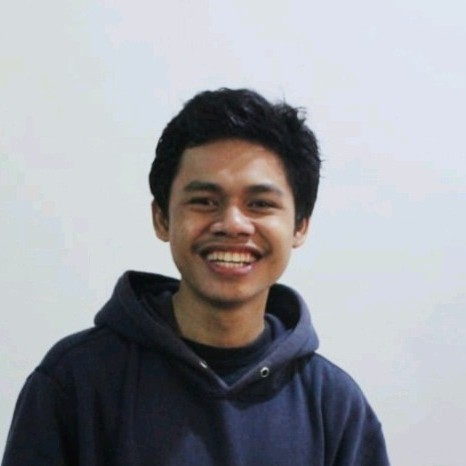

# Muhammad Agfian Fadilah { align=center }

#### [:octicons-mail-16: agfianfd@gmail.com](mailto:agfianfd@gmail.com) | [:fontawesome-brands-square-github: agfianf](https://github.com/agfianf) | [:fontawesome-brands-linkedin: magfianf](https://www.linkedin.com/in/magfianf/) |  [:material-web: agfianf.github.io](https://agfianf.github.io/) { align=center }

!!! info "Summary"
    
    { width=150px; align=left }
    
    an AI Engineer with over 4 years of expertise in machine learning, computer vision, and MLOps to deliver innovative, high-impact AI solutions across aquaculture, agriculture, and digital imaging sectors. Utilize proficiency in Python, PyTorch, FastAPI, Azure, and Docker to optimize workflows, enhance system performance, and reduce costs. Demonstrated success in leading projects like a satellite pond monitoring platform with 82% mAP and an FFB assessment system achieving ~87% accuracy, cutting training times by 85%, to drive scalable, results-oriented advancements.

---

### :material-laptop: Experience

???+ quote "PT Multidaya Teknologi Nusantara"
    

        <a class="c-name" href="https://efishery.com/id/">PT Multidaya Teknologi Nusantara</a>
        Bandung, Indonesia
    

    

        AI Engineer - Full Time
        Oct 2022 - Oct 2024 · 2 yrs
    

    _PT Multidaya Teknologi Nusantara is Asia's first aquaculture technology startup, a leading Indonesian company with $200M in Series D funding_

    **MLOps and Backend Standardization:**
    
    - Led end-to-end deployment of MLOps pipelines using ClearML, CVAT, and on-premise Azure blob storage, reducing model training time from 2 weeks to 1–2 days.
    - Developed reusable YOLOv8 training and deployment templates in ClearML, standardizing experimentation and deployment across projects using ONNX.
    - Standardized Python coding practices for FastAPI backend development, improving team collaboration and reducing meetings by 30%.
    - Led development of a monitoring system for ML/AI services using Prometheus and Grafana.
    
    **Satellite Pond Monitoring Platform:**
    
    - Led the development of an AI-powered pond management platform integrating computer vision, GIS, and REST API for satellite-based pond monitoring.
    - Collected and managed 700,000 pond spatial records using YOLOv8 segmentation and PostGIS.
    - Created a scanning system to detect ponds in Google Maps Satellite within specified areas.
    - Trained and deployed a YOLOv8 instance segmentation model achieving 82% mAP Mask for pond segmentation.
    - Developed an AI-assisted annotation tool by integrating Streamlit and Geoman, scaling daily pond data collection from approximately 100 to 800 ponds/day.
    - Built a near real-time monitoring API (updated every 5 days) using Sentinel-2 data to classify pond activity based on historical water condition trends.
    - Developed a cost-efficient reverse-geocoding API for Indonesia, saving approximately $150/month.
    
    **Automation of Document Processing:**
    
    - Designed an automated bank document redaction system using Camelot, processing approximately 300-page files in 60 seconds (down from one week manually).
    - Led the creation of a universal OCR API using PaddlePaddleOCR and FastAPI, accelerating proof-of-concept development by approximately 30%.

???+ quote "Binsho Solutions"
    

        <a id="binsho-solutions" class="c-name" href="https://binshosolutions.com/">Binsho Solutions</a>
        Malaysia
    

    

        AI Engineer - Part Time
        Jan 2021 - Present · 4 yrs ++
    

    _Joined as the first AI Engineer responsible for translating and refining business goals into appropriate machine learning objectives. Binsho is a startup company that provides smart technologies to the Palm Oil industry with the goal of Industry 4.0 revolution in mind._

    **MLOps and Workflow Optimization**
    
    - Developed an on-premise MLOps system using ClearML, CVAT, MinIO, FiftyOne, and Streamlit, integrated with PyTorch Lightning, TIMM, and Ultralytics.
    - Created reusable training templates for image classification, object detection, and instance segmentation, increasing experiment throughput from 1 to approximately 10 per week.
    - Reduced production deployment time to under 5 minutes.
    - Built an image data curation system using Streamlit and FiftyOne, improving data quality by approximately 25%.

    **AI System for Fresh Fruit Bunch (FFB) Assessment:**

    - Developed an AI system to assess FFB maturity and attributes, achieving accuracy by ~87% and reducing processing time from approximately 2 minutes to ~30 seconds using TensorRT and NVIDIA Triton Server.
    
    **Monitoring and Alert System:**
    
    - Created an on-premise monitoring and alert system using Prometheus, Grafana, and Lark Message API, enhancing error recovery speed by approximately 35%.
    
    **Backend Core Business Application Revamp:**
    
    - Led the redesign and development of backend v2, reducing startup time from 10 minutes to approximately 5 seconds with a modular, scalable architecture.
    - Implemented RED metrics monitoring and an alert system, enabling faster error detection and scalable deployments across multiple sites.

???+ quote "PT DycodeX Teknologi Nusantara"
    

        <a class="c-name" href="https://www.dycodex.com/">PT DycodeX Teknologi Nusantara</a>
        Bandung, Indonesia
    

    

        AI Engineer - Part Time
        Feb 2021 - Oct 2022 · 1 yr 10 mos
    

    _AIoT-focused software house in Indonesia, later acquired by PT Multidaya Teknologi Nusantara._

    - **Mask Classification Model:** Optimized a lightweight mask classification model for edge devices (COVID-19), achieving ~93% Accuracy with efficient deployment.
    - **Data Annotation System:** Accelerated annotation workflows using self-hosted CVAT in Azure VM with AI Assisted, reducing completion time from 3 weeks to 1 week.
    - **Face Recognition Desktop App:** Developed a standalone desktop app for face recognition devices, enabling user management and firmware updates using PyQt (QML) and SQLite3.
    - **Real Time OCR 7-Segment Edge Device:** Led the development of an OCR solution for 7-segment displays on edge devices using Edge Impulse, deployed on Raspberry Pi 4, achieving 100% accuracy on test datasets.
    - **Realtime Falling Lansia Detection System:** Mentored a project using accelerometer-based wearable devices (necklace) with Edge Impulse, improving model accuracy from 65% to ~95%.

???+ quote "PT Sugihart Digital Imaging"
    

        <a class="c-name" href="https://www.instagram.com/sugihartdigital/?hl=id">PT Sugihart Digital Imaging</a>
        Bekasi, Indonesia
    

    

        Machine Learning Programmer - Full Time
        Jan 2020 - Jan 2021 · 1 yr
    

    
    _Early-stage startup specializing in computer vision projects._

    - **People Counting System:** Built a real-time people counting solution for multi-camera CCTV monitoring using YOLOv4 optimized with TensorRT and IOU Tracker, improving inference speed and reducing memory usage.
    - **Facial Recognition Attendance System:** Developed a facial recognition-based attendance system deployed in 10 kiosk servers, leveraging RetinaFace and ArcFace for high-accuracy detection and recognition.
    - **Intelligent Door Lock System (PoC):** Designed a PoC intelligent door lock system with face recognition and thermal imaging using Raspberry Pi 4, Jetson Nano and MLX thermal sensors, including power and electrical system design with Eagle PCB.
    - **Led Data Annotation:** Implemented a self-hosted CVAT tool, improving annotation efficiency and quality control for training datasets.

---

### :material-chart-arc: Skills

| **Category**                          | **Technologies**                                                                                   |
|:--------------------------------------|:--------------------------------------------------------------------------------------------------|
| **Programming Languages & Scripting** | `Python`, `Rust`, `Bash Script`, `SQL`                                                            |
| **Geospatial Technologies**           | `PostGIS`, `Google Maps API`, `Sentinel-2`, `Shapely`, `Geopandas`                                |
| **AI/ML Frameworks**                  | `PyTorch`, `PyTorch Lightning`, `ONNX`, `TensorRT`, `Triton Inference Server`, `Ultralytics`, `PaddleOCR`, `ClearML`, `Scikit-Learn`, `OpenCV`, `Pandas`, `FiftyOne`, `Plotly` |
| **Databases & Data Storage**          | `PostgreSQL`, `MongoDB`, `Redis`, `MinIO`, `S3 Bucket (AWS S3)`, `SQLAlchemy`                     |
| **Web Application**       | `FastAPI`, `Streamlit`, `Pydantic`, `RabbitMQ`, `Celery`, `PyTest`, `Gradio`                      |
| **DevOps & Infrastructure**           | `Docker`, `Prometheus`, `Grafana`, `CI/CD Github Actions`, `Azure`                                |
| **Dev Tools & Environments**  | `Git`, `Jupyter Notebook`, `VSCode`, `Ubuntu`, `uv`                                               |
| **Hardware & Embedded Systems**       | `Raspberry Pi`, `Jetson Nano`                                                                     |
| **Project Management Tools and Communication** | `JIRA`, `Notion`, `Google Workspace`, `Affine`, `Slack`, `Lark`, `Discord`                   |

---

### :material-school: Education

    <a class="c-name" href="https://telkomuniversity.ac.id/">Telkom University</a>
    Bandung, Indonesia

    Bachelor’s Degree Engineering Physics
    2015 - 2019 · 4 yr 3 mos

- Awarded a full scholarship for 4 year Bachelor’s program based on outstanding semester grades
- Awarded 3rd place for the best students in Faculty Engineering
- Final Projects: `Convolutional Neural Networks Based on Raspberry Pi for a Prototype of Vocal Cord Abnormalities Identification`

---

### :octicons-file-directory-open-fill-16: Projects
- [**:material-github: Color Correction**](https://agfianf.github.io/color-correction/)
    
    - Developed an automated color correction system that adjusts image colors using a 24-patch color checker card. Integrated YOLOv8 for precise detection of the color checker card and utilized OpenCV for advanced image processing to apply color correction matrices.
    - **Tech Stack**: `Python`, `OpenCV`, `YOLOv8`, `FastAPI`, `Docker`, `Scikit-learn`

---
### :octicons-git-merge-16: Open Source Contributions
- [**:material-github: PaddleOCR: Fix for Ambiguous Boolean Evaluation Error in PaddleOCR**](https://github.com/PaddlePaddle/PaddleOCR/pull/11287)

    - Resolved ambiguous boolean evaluation in PaddleOCR's text detection (Python 3.11), preventing ValueError and restoring stable functionality of the text detection-only pipeline.

---
### :fontawesome-solid-medal: Achivements
- **Runner Up Remotely Operated Vehicle (ROV) Technogine 2019 Competition**
    - Responsible to lead the team for winning the competition (4 members)
    - Responsible for designing electrical and programs for robots.

---
### :material-certificate: Certifications

- [2025 | Foundation of Generative AI - Udacity](https://www.udacity.com/certificate/e/ab60ea62-b7bc-11ef-acc3-fbedadd56ebf)
- [2022 | Getting Started with AI on Jetson Nano - NVIDIA](https://learn.nvidia.com/certificates?id=mi2VjetmSkCQThO5Qwo6Lg)
- [2021 | Cloud Practitioner Essentials](https://www.dicoding.com/certificates/MRZMGRM60ZYQ)
- [2020 | Deep Learning Specialization](https://www.coursera.org/account/accomplishments/specialization/certificate/2K3KHUQWE5D7)
- [2020 | Deep Learning Nanodegree - Udacity](https://www.udacity.com/certificate/HSSPZ7R4)
- [2020 | Computer Vision Nanodegree - Udacity](https://www.udacity.com/certificate/RCA64PH3) 
- [2020 | Getting Started with AWS Machine Learning - Coursera](https://www.coursera.org/account/accomplishments/verify/Q7XFQ5VVQTLH)

<!--

 

 

 

 

 

-->