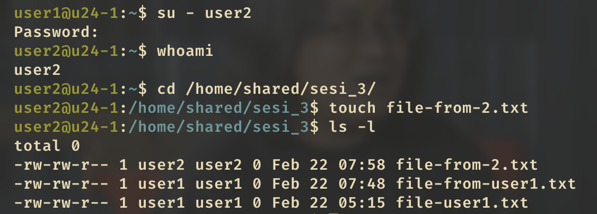

---

draft: false
date: 
    created: 2025-02-22
    updated: 2025-02-22
categories:
    - devops
tags:
    - devops
    - digital-skola
    - linux

comments: true

---

# Task Sesi 3

Berikut adalah task yang harus diselesaikan pada sesi 3: Linux and Unix Administration

## Project A


!!! warning "whoami"

    ```bash
    whoami
    # output: u24-1
    ```

    from here i execute the command as `u24-1` as one of the member `sudoers`.

- Buat 3 pengguna baru bernama `user1`, `user2`, dan `user3`
    
```bash
# Solusi 

sudo useradd user1
sudo useradd user2
sudo useradd user3
```

- Buat grup baru bernama `devops`

```bash
sudo groupadd devops
```

- Masukkan `user1` dan `user2` ke dalam grup `devteam`
        
```bash
sudo usermod -aG devteam user1
sudo usermod -aG devteam user2
```
- Buat direktori baru `/home/shared` dengan nama `sesi_3`
        
```bash
mkdir -p /home/shared/sesi_3
```

- Set kepemilikan (ownership) folder `sesi_3` kepada grup `devteam`
        
```bash
sudo chown :devteam /home/shared/sesi_3
```

- Set permission akses shingga hanya grup `devteam` yang dapat **read**, **write**, dan **execute** folder `sesi_3`, sedangkan pengguna lain tidak memiliki akses. 

- :warning: _Asumsi pengguna lain adalah diluar `devteams`, termasuk `root`_
        
```bash
sudo chmod 070 /home/shared/sesi_3

ls -ld /home/shared/sesi_3
# output: d---rwx--- 2 root devteam 4096 Feb 22 05:15 /home/shared/sesi_3/
```

- ini artinya `root` as `owner` **_di-configure_** agar tidak bisa akses ke folder ini, so sad. its okay, life must go on.
- others cannot access this folder
- `devteam` can access this folder

???+ tip "Result of the project A"

    { width="500" }

    `u24-1` is not part of `devteam` cannot access the folder

    ---

    { width="500" }

    `user1` login and try to access and create file in the folder

    ---

    { width="500" }

    `user2` login and try to access and create file in the folder. as you can see there is file from `user1` and `user2`. Nice!

    ---
    
    { width="500" }

    `user3` is not part of `devteam` cannot access the folder. Apalagi buat file. so sad.
    
    ---

    { width="500" }

    `root` is not part of `devteam` and **we configure owner has no permission** (no rwx) to that folder **but** can access still read, write, and execute the folder. this is the power of `root` (super user) :fire::fire::fire:


## Project B

### Task
Project ini melakukan konfigurasi dan instalasi NGINX. Lakukan verifikasi bahwa NGINX sudah berjalan dengan baik dengan `netstat` , `curl` dan `ps aux | grep nginx`. Lalu jelaskan hasilnya.

### Result

???+ tip "Result of the project B"

    **`curl http://localhost`**

    { width="500" }

    Pada saat melakukan `curl http://localhost` (pada port:80) kita mendapatkan output dari NGINX seperti diatas yang merupakan isi dari file `/usr/share/nginx/html/index.html`

    ---

    **`netstat -tuln`**

    Perintah ini akan menampilkan semua port yang sedang digunakan oleh aplikasi yang berjalan pada server kita.

    { width="500" }
    
    ```bash
    Proto Recv-Q Send-Q Local Address           Foreign Address         State
    # IPv4
    tcp        0      0 0.0.0.0:80              0.0.0.0:*               LISTEN
    
    # IPv6
    tcp6       0      0 :::80                   :::*                    LISTEN
    ```

    Pada saat melakukan `netstat -tuln` kita mendapatkan informasi bahwa NGINX sudah berjalan pada port 80 untuk IPv4 (0.0.0.0) dan IPv6 (::::) dengan status `LISTEN` yang artinya siap menerima request :fire:.

    ---

    **`ps aux | grep nginx`**

    `ps aux` adalah perintah untuk menampilkan semua proses yang sedang berjalan pada server kita. Pada saat melakukan `ps aux | grep nginx` kita mendapatkan informasi bahwa NGINX sudah berjalan dengan baik dengan 2 proses yaitu `master` dan `worker` process.

    { width="500" }

    ```bash
    root        9297  0.0  0.1  10508  3096 ?        Ss   08:13   0:00 nginx: master process /usr/sbin/nginx -g daemon on; master_process on;
    ...
    www-data   10028  0.0  0.2  11920  4116 ?        S    08:20   0:00 nginx: worker process
    ...
    ```

    Pada saat melakukan `ps aux | grep nginx` kita mendapatkan informasi bahwa NGINX sudah berjalan dengan baik dengan 2 proses yaitu `master` dan `worker` process. 

    - `master` process dilakukan pada PID `9297` dan `worker` process dilakukan pada PID `10024..10031`. PID artinya adalah `Process ID` yang merupakan nomor unik untuk setiap proses yang berjalan pada server kita.

    - `master` process di execute oleh `root` user dan `worker` process di execute oleh `www-data` user.

    ---

    #### Summary

    - curl menunjukkan bahwa NGINX sudah berjalan dengan baik dan dapat diakses melalui port 80
    - netstat menunjukkan bahwa NGINX sudah berjalan pada port 80 untuk IPv4 dan IPv6 dengan status LISTEN
    - ps aux menunjukkan bahwa NGINX sudah berjalan dengan baik dengan 2 proses yaitu master dan worker process

