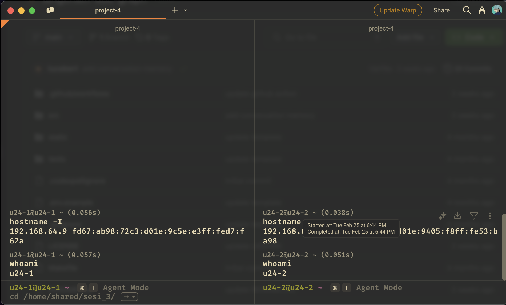
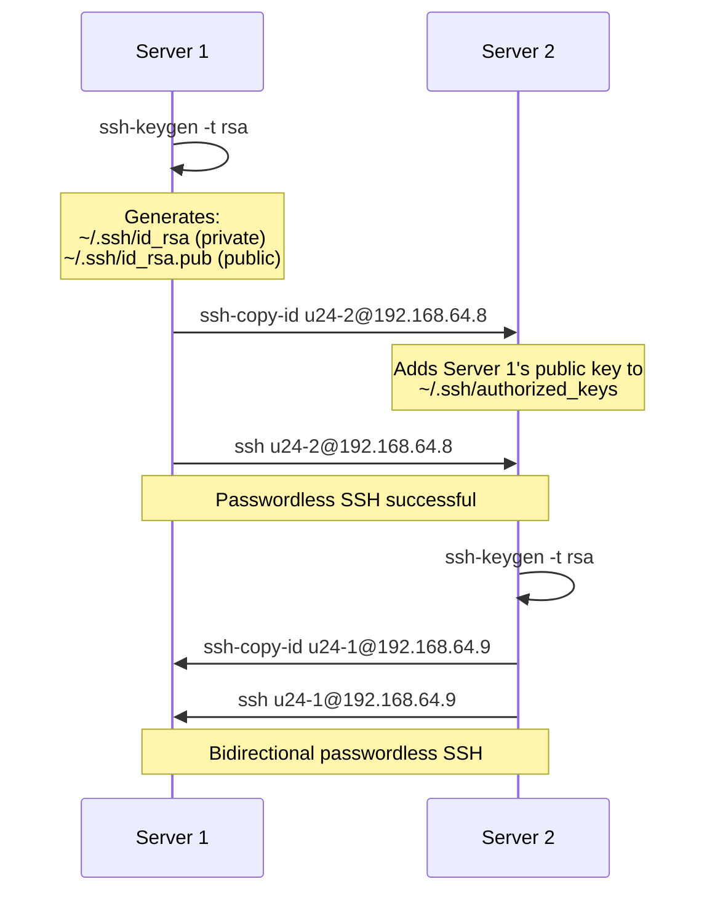
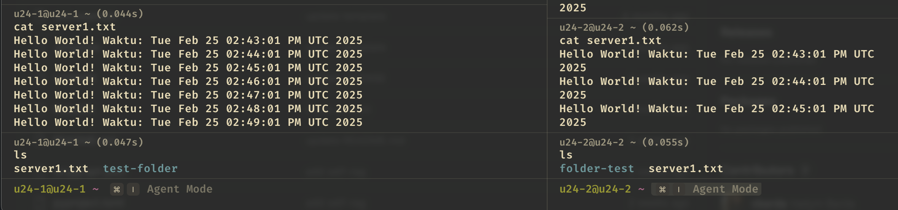
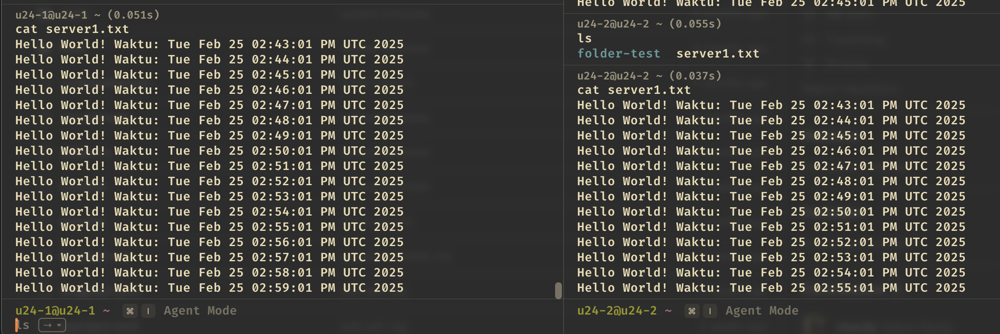

---

draft: false
date: 
    created: 2025-02-25
    updated: 2025-02-25
categories:
    - devops
tags:
    - devops
    - digital-skola
    - linux
    - homework

comments: true

---

# Task Sesi 4: Linux and Unix Administration 2


## Project Challenge

!!! info "Project Challenge"

    1. Set up 2 servers on VirtualBox
    2. Configure the 2 servers to connect via SSH without a password
    3. Create a file named server1.txt on server1
    4. Create a cron job to automate sending the server1.txt file from server1 to server2 at a specified interval

<!-- more -->

## Step 1: Setup Two Servers

Since i am using MacOS i will use [UTM](https://mac.getutm.app/) to set up my virtual machine. I will use Ubuntu 24.04 LTS as my server. For details my server setup:

|                 | Server 1         | Server 2         |
|-----------------|------------------|------------------|
| **user**        | u24-1            | u24-2            |
| **server-name** | u24-1            | u24-2            |
| **IP**          | `192.168.64.9`   | `192.168.64.8`   |
| **OS**          | Ubuntu 24.04 LTS | Ubuntu 24.04 LTS |
| **RAM**         | 2 GB             | 2 GB             |

??? quote "Setup Server Already success"
    
    

    left side is server1 and right side is server2. Both server successfully setup and i can access both server using SSH.

## Step 2: Configure Passwordless SSH

### Workflow



### On Server 1

1. Generate an SSH key pair:

    ```bash
    ssh-keygen -t rsa
    ```

    ???+ abstract "More Detail"
        
        this command will generate 2 key (files):
        
        - private key: `~/.ssh/id_rsa`
            
            `private key` is secret key, should be kept secret. **`DO NOT SHARE THIS KEY`**

        - public key: `~/.ssh/id_rsa.pub`

            `public key` is the key that you can share to other server. This key will be used to verify your identity.

2. Copy the public key to Server 2:

    ```bash
    ssh-copy-id u24-2@192.168.64.8
    ```

    ??? abstract "or manually copy the public key to server2"
        

        ```bash
        cat ~/.ssh/id_rsa.pub
        # output:
        # ssh-rsa AAAAB3NzaC1y..../FgWNXulrHoe7rew== u24-1@u24-1
        ```

        Copy the output and paste it to `~/.ssh/authorized_keys` on server2

        ```bash
        # login to server2
        ssh u24-2@192.168.64.8

        # we are on server2 right now
        mkdir -p ~/.ssh # if not exist
        # paste the public key to ~/.ssh/authorized_keys
        echo "ssh-rsa AAAAB3NzaC1yc2E...banyak karakter...user@server1" >> ~/.ssh/authorized_keys
        ```


### On Server 2


It same as above: Generate an SSH key pair and copy the public key to Server 1

```bash
ssh-keygen -t rsa
ssh-copy-id u24-1@192.168.64.9
```

## Step 3: Create `server1.txt` on Server1

On Server 1, I created a dynamic file that updates every minute:

```bash
crontab -e
```
Add this line:

```bash
*/1 * * * * echo "Hello World! Waktu: $(date)" >> /home/u24-1/server1.txt
```

This appends a timestamped message to /home/u24-1/server1.txt every minute.

## Step 4: Automate File Transfer with Cron

On Server 1, set up a cron job to copy server1.txt to Server 2 every 5 minutes:

```bash
crontab -e
```

Add this line:

```bash
*/5 * * * * scp /home/u24-1/server1.txt u24-2@192.168.64.8:/home/u24-2
```

- scp securely copies the file over SSH.
- If the transfer fails (e.g., Server 2 is down), check /var/log/syslog for errors.


??? quote "Full Crontab Configurate"

    ```bash
    */1 * * * * echo "Hello World! Waktu: $(date)" >> /home/u24-1/server1.txt
    */5 * * * * scp /home/u24-1/server1.txt u24-2@192.168.64.8:/home/u24-2
    ```

!!! tip "Result"

    

    left side is server1 and cron job that will append `Hello World! Waktu: $(date)` to `server1.txt` every minute. and cron job that will copy `server1.txt` file from Server 1 to Server 2 every 5 minutes.

    right side is server2 and will see the result of `server1.txt` file that copied from server1. after waiting another 5 minutes, the condition will be like this:

    