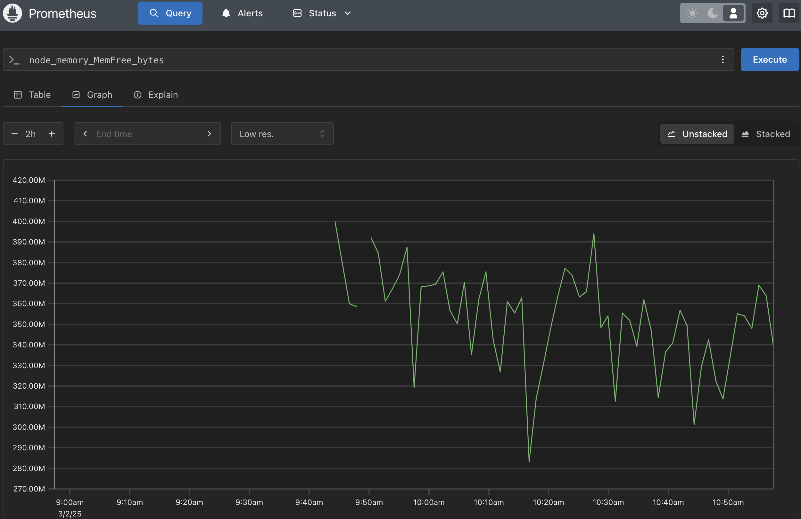

---

draft: false
authors:
  - me
date: 
    created: 2025-03-02
    updated: 2025-03-03
categories:
    - devops
tags:
    - devops
    - digital-skola
    - docker
    - rust
    - homework


comments: true

---

# Task 11: Monitoring Server Memory Usage with Prometheus Node Exporter

In this guide, we’ll explore how to monitor memory usage on a server using Prometheus and Node Exporter.
<!-- more -->

!!! info "Project Challange"

    Install node exporter and prometheus on your server and monitor the memory usage.

## 1. Know What Metrics you want to Monitor

Before we dive into the setup, let’s establish what metrics we want to monitor. In this article, we’ll focus on tracking memory usage on our server using Prometheus and its Node Exporter. Understanding memory usage is critical for maintaining system performance and preventing issues like slowdowns or crashes due to resource exhaustion.

- **What is Server Memory (RAM)?**

Server memory, or Random Access Memory (RAM), is the volatile storage that a computer uses to hold data and instructions that the CPU needs to access quickly. Unlike permanent storage (e.g., SSDs or HDDs), RAM is temporary and gets wiped when the system restarts. In a server environment, RAM acts as the working space for running applications, processing tasks, and managing system operations.

- **Why is Server Memory Important?**

RAM is essential for server performance because it directly impacts how efficiently processes are executed. Insufficient memory can lead to reliance on slower swap space (virtual memory on disk), causing performance bottlenecks. Monitoring memory usage helps administrators detect when resources are nearing capacity, allowing proactive measures like scaling resources or optimizing applications to avoid downtime.

- **Types of Server Memory Metrics and Their Uses**

When monitoring memory, several key metrics come into play, each serving a distinct purpose:

- **Total Memory:** The total amount of RAM available on the server (e.g., `node_memory_MemTotal_bytes` in Node Exporter). This is the baseline for all calculations.
- **Used Memory:** The portion of RAM actively consumed by applications and processes, excluding cache and buffers. It indicates real application demand.
- **Free Memory:** The unallocated RAM (`node_memory_MemFree_bytes`), showing what’s immediately available. However, this can be misleading in Linux as free memory is often minimal due to caching.
- **Buffers and Cache:** Memory used for disk I/O buffering and caching (`node_memory_Buffers_bytes` and `node_memory_Cached_bytes`). This can be reclaimed by the system when needed, making it a flexible resource.
- **Available Memory:** The most practical metric (`node_memory_MemAvailable_bytes`), representing the RAM that applications can use, including reclaimable cache. It’s key for assessing true capacity.
- **Swap Memory:** Virtual memory on disk (`node_memory_SwapTotal_bytes` and `node_memory_SwapFree_bytes`). High swap usage signals that physical RAM is exhausted, often degrading performance.

By monitoring these metrics with Prometheus Node Exporter, we can gain a comprehensive view of memory utilization and set up alerts to catch potential issues before they escalate.


Let’s examine the memory usage on our server with a simple command:

```bash
free -h

# output:
               total        used        free      shared  buff/cache   available
Mem:            31Gi       24Gi       340Mi       23Mi       6.4Gi       6.1Gi
Swap:          2.0Gi       2.0Gi       0.0Ki
```

This output provides a snapshot of memory utilization, which we’ll later compare with Prometheus metrics.

## 2. Setup Prometheus and Node Exporter

I’m using two servers for this setup: 

- Server 1 (local) runs Prometheus to collect data. 
- Server 2 (IP: 10.8.0.10) runs Node Exporter to expose metrics from itself.

Here’s a summary of the setup:

| Server   | Role          | IP Address | Description                       |
|----------|---------------|------------|-----------------------------------|
| Server 1 | Prometheus    | Localhost  | Collects and stores metrics       |
| Server 2 | Node Exporter | 10.8.0.10  | Exposes memory and system metrics |

### 2.1 Install Node Exporter on Server 2

We’ll install Node Exporter on Server 2 using Docker Compose for its simplicity and ease of management.

???+ quote "docker-compose.nodeexporter.yml"
    
    ```yaml
    version: '3.8'

    services:
        node-exporter:
            image: prom/node-exporter:v1.9.0
            ports:
                - "9101:9100"
            volumes:
                - /proc:/host/proc:ro # (1)
                - /sys:/host/sys:ro # (2)
                - /:/rootfs:ro # (3)
            command:
                - '--path.procfs=/host/proc'
                - '--path.sysfs=/host/sys'
                - '--collector.filesystem.ignored-mount-points=^/(sys|proc|dev|host|etc)($$|/)' # (4)
                - '--collector.cpu' # (5)
                - '--collector.meminfo'
                - '--collector.filesystem'
                - '--collector.netdev'
                - '--no-collector.arp' # (6)
                - '--no-collector.bcache'
                - '--no-collector.bonding'
                - '--no-collector.conntrack'
                - '--no-collector.diskstats'
                - '--no-collector.entropy'
                - '--no-collector.filefd'
                - '--no-collector.hwmon'
                - '--no-collector.zfs'
            deploy: # (7)
                resources:
                    limits:
                    cpus: '0.2'
                    memory: 128M
            logging: # (8)
                driver: "json-file"
                options:
                    max-size: "10m"
                    max-file: "3"
    ```

    1. **Mounting /proc**: This volume mounts the host's `/proc` filesystem to the container, allowing Node Exporter to access process information.
    2. **Mounting /sys**: This volume mounts the host's `/sys` filesystem to the container, enabling access to system information.
    3. **Mounting /**: This volume mounts the root filesystem of the host to the container, allowing Node Exporter to access filesystem metrics.
    4. **Ignoring Certain Mount Points**: This command-line argument tells Node Exporter to ignore specific mount points (like `/sys`, `/proc`, etc.) when collecting filesystem metrics.
    5. **Enabling CPU Collector**: This command-line argument enables the CPU collector, allowing Node Exporter to gather CPU-related metrics.
    6. **Disabling ARP Collector**: This command-line argument disables the ARP collector, which is not needed in most cases.
    7. **Resource Limits**: This section sets resource limits for the container, ensuring it doesn't consume too much CPU or memory.
    8. **Logging Options**: This section configures logging options for the container, including log rotation settings.

### 2.2 Install Prometheus on Server 1

We’ll install Prometheus on Server 1 using Docker Compose (i love you docker compose) for its simplicity and ease of management.

=== "Structure repository"
    
    ```bash
    .
    ├── docker-compose.prometheus.yml
    ├── prometheus.yml
    ```
=== "docker-compose.prometheus.yml"

    ```yml
    # docker-compose.prometheus.yml
    version: '3.8'

    services:
    prometheus:
        image: prom/prometheus:v3.2.1
        ports:
        - "9090:9090"
        volumes:
        - ./prometheus.yml:/etc/prometheus/prometheus.yml
        - prometheus_data:/prometheus
        command:
        - '--config.file=/etc/prometheus/prometheus.yml'
        - '--storage.tsdb.path=/prometheus'
        - '--storage.tsdb.retention.time=90d'
        - '--storage.tsdb.wal-compression'
        deploy:
        resources:
            limits:
            cpus: '0.5'
            memory: 1G
        logging:
        driver: "json-file"
        options:
            max-size: "10m"
            max-file: "3"

    volumes:
    prometheus_data:
    ```
=== "prometheus.yml"

    ```yml
    global:
    scrape_interval: 15s

    scrape_configs:
    - job_name: 'prometheus'
        static_configs:
        - targets: ['localhost:9090']

    - job_name: 'node-exporter'
        static_configs:
        - targets: ['10.8.0.10:9101']
    ```

=== "Run"
    
    ```bash
    docker-compose -f docker-compose.prometheus.yml up -d
    ```


## 3. Results

Now we can access prometheus on my server 1 by `http://localhost:9090`


///caption
_source: my own_
///
This prometheus dashboard shows the total memory on the server. Based on the graph, we can see that the total memory is 31GB.

---


///caption
_source: my own_
///
This prometheus dashboard shows the total avail memory on the server. Based on the graph, we can see that the avail memory is around 6.1GB.

---


///caption
_source: my own_
///
This prometheus dashboard shows the total free memory on the server. Based on the graph, we can see that the free memory is between 0.3GB and 0.4GB.

---


///caption
_source: my own_
///
This prometheus dashboard shows the total memory usage on the server. Based on the graph, we can see that the memory usage is around 24GB.
To get this in percentage, we can use this formula:

```bash
100 * (total memory - avail memory) / total memory

# illustration:
# 100 * (31 - 6.1) / 31 ≈ 80.3%
```

??? question "Question" 
    
    **But... why we use avail memory instead of free memory?**

    In Linux, `free memory` (0.3-0.4 GB in our case) is just the unused RAM, which looks tiny because the system uses spare memory for cache (6.4 GB) to boost performance. But `available memory` (6.1 GB) is smarter: it counts both free RAM and cache that can be reused by apps, _giving a true picture of what’s usable_. 


Thanks for reading!

