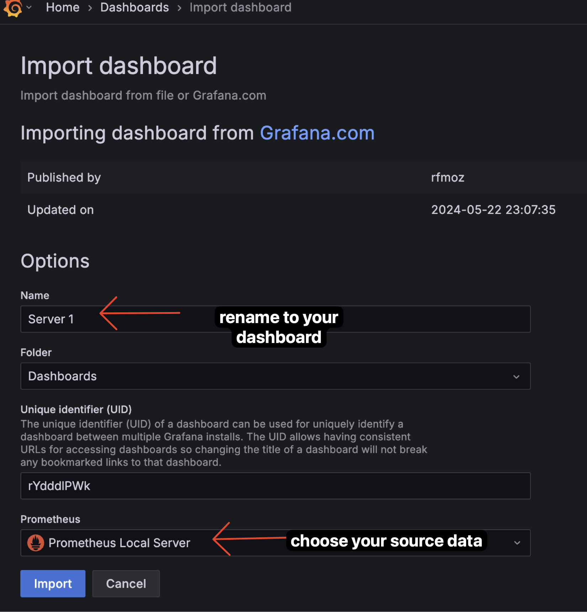
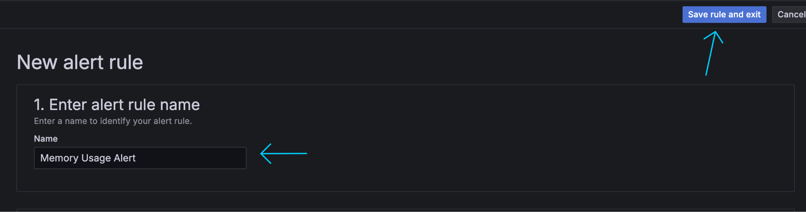

---

draft: false
authors:
  - me
date: 
    created: 2025-03-03
    updated: 2025-03-03
categories:
    - devops
tags:
    - devops
    - digital-skola
    - prometheus
    - grafana
    - homework
    - monitoring


comments: true

---

# Task 12: Hands-On Monitoring & Alerting with Node Exporter, Prometheus, and Grafana Dashboards

In this guide, we’ll explore how to monitor cpu and memory usage on a server using Node Exporter as exposer, prometheus as collector, and Grafana as visualizer/Dashboard. At the end, we will create an alert based on usage.

<!-- more -->

!!! info "Project Challange"

    Buat 1 Monitoring CPU & Memory Usage Menggunakan tools Grafana untuk visualisasi dan Prometheus sebagai collector. Gunakan Node Exporter sebagai exposer.

    Buat alert untuk cpu/memory usage dan notification di kirim ke discord.

!!! warning "Note"

    - This guidance is part of my project  [Monitoring Server Memory Usage with Prometheus Node Exporter](008-project-nodeexporter.md). Please review that document first.
    - This update will add a "CPU Usage" section to the metrics, integrate a dashboard in Grafana, and configure an alert in Grafana.


## Architecture Overview


///caption
source: my own
///

## 1. Know What Metrics you want to Monitor

Before we dive into the setup, let’s establish what metrics we want to monitor. In this article, we’ll focus on tracking cpu and memory usage on our server using Prometheus and its Node Exporter. Understanding memory and cpu usage is critical for maintaining system performance and preventing issues like slowdowns or crashes due to resource exhaustion.

- memory

for memory explanation, i just write about that in [Monitoring Server Memory Usage with Prometheus Node Exporter](008-project-nodeexporter.md). Please read that first.

- cpu

To monitor CPU usage effectively, we’ll use Node Exporter to expose system metrics and Prometheus to collect them, focusing on the `node_cpu_seconds_total` metric. This metric tracks the total time the CPU spends in various modes (like user, system, and idle) allowing us to calculate usage as a percentage. 

A simple yet powerful PromQL query, `100 - (avg(rate(node_cpu_seconds_total{mode="idle"}[3m])) * 100)`, gives us the average CPU usage across all cores over a 3-minute window by subtracting idle time from the total. High CPU usage can indicate heavy workloads or potential bottlenecks, making this metric essential for maintaining server performance.

## 2. Setup Prometheus and Node Exporter

I’m using two servers for this setup: 

- Server 1 (local) runs Prometheus to collect data and Grafana to visualize it.
- Server 2 (IP: 10.8.0.10) runs Node Exporter to expose metrics from itself.

Here’s a summary of the setup:

| Server   | Role          | IP Address     | Description                       |
|----------|---------------|----------------|-----------------------------------|
| Server 1 | Prometheus    | Localhost:9090 | Collects and stores metrics       |
| Server 1 | Grafana       | Localhost:3000 | Vizualises metrics                |
| Server 2 | Node Exporter | 10.8.0.10      | Exposes memory and system metrics |

### 2.1 Install Node Exporter on Server 2

We’ll install Node Exporter on Server 2 using Docker Compose for its simplicity and ease of management.

???+ quote "docker-compose.nodeexporter.yml"
    
    ```yaml title="docker-compose.nodeexporter.yml" linenums="1"

    version: '3.8'

    services:
        node-exporter:
            image: prom/node-exporter:v1.9.0
            ports:
                - "9101:9100"
            volumes:
                - /proc:/host/proc:ro # (1)
                - /sys:/host/sys:ro # (2)
                - /:/rootfs:ro # (3)
            command:
                - '--path.procfs=/host/proc'
                - '--path.sysfs=/host/sys'
                - '--collector.filesystem.ignored-mount-points=^/(sys|proc|dev|host|etc)($$|/)' # (4)
                - '--collector.cpu' # (5)
                - '--collector.meminfo'
                - '--collector.filesystem'
                - '--collector.netdev'
                - '--no-collector.arp' # (6)
                - '--no-collector.bcache'
                - '--no-collector.bonding'
                - '--no-collector.conntrack'
                - '--no-collector.diskstats'
                - '--no-collector.entropy'
                - '--no-collector.filefd'
                - '--no-collector.hwmon'
                - '--no-collector.zfs'
            deploy: # (7)
                resources:
                    limits:
                        cpus: '0.2'
                        memory: 128M
            logging: # (8)
                driver: "json-file"
                options:
                    max-size: "10m"
                    max-file: "3"
    ```

    1. **Mounting /proc**: This volume mounts the host's `/proc` filesystem to the container, allowing Node Exporter to access process information.
    2. **Mounting /sys**: This volume mounts the host's `/sys` filesystem to the container, enabling access to system information.
    3. **Mounting /**: This volume mounts the root filesystem of the host to the container, allowing Node Exporter to access filesystem metrics.
    4. **Ignoring Certain Mount Points**: This command-line argument tells Node Exporter to ignore specific mount points (like `/sys`, `/proc`, etc.) when collecting filesystem metrics.
    5. **Enabling CPU Collector**: This command-line argument enables the CPU collector, allowing Node Exporter to gather CPU-related metrics.
    6. **Disabling ARP Collector**: This command-line argument disables the ARP collector, which is not needed in most cases.
    7. **Resource Limits**: This section sets resource limits for the container, ensuring it doesn't consume too much CPU or memory.
    8. **Logging Options**: This section configures logging options for the container, including log rotation settings.

### 2.2 Install Prometheus and Grafana on Server 1

We’ll install Prometheus on Server 1 using Docker Compose (i love you docker compose) for its simplicity and ease of management.

=== "Structure repository"
    
    ```bash title="Structure repository"

    .
    ├── docker-compose.monitoring.yml
    ├── prometheus.yml
    ```
=== "docker-compose.monitoring.yml" 

    ```yaml title="docker-compose.monitoring.yml" linenums="1"
    version: '3.8'

    services:
        prometheus:
            image: prom/prometheus:v3.2.1
            ports:
                - "9090:9090"
            volumes:
                - ./prometheus.yml:/etc/prometheus/prometheus.yml
                - prometheus_data:/prometheus
            command:
                - '--config.file=/etc/prometheus/prometheus.yml'
                - '--storage.tsdb.path=/prometheus'
                - '--storage.tsdb.retention.time=90d'
                - '--storage.tsdb.wal-compression'
            deploy:
                resources:
                    limits:
                        cpus: '0.5'
                        memory: 1G
            networks:
                - monitoring
            logging:
                driver: "json-file"
                options:
                    max-size: "10m"
                    max-file: "3"

        grafana:
            image: grafana/grafana:11.5.2
            ports:
                - "3000:3000"
            volumes:
                - grafana_data:/var/lib/grafana
                - ./grafana-provisioning/datasources:/etc/grafana/provisioning/datasources
            environment:
                - GF_SECURITY_ADMIN_USER=adminuser
                - GF_SECURITY_ADMIN_PASSWORD=admin123
                - GF_AUTH_ANONYMOUS_ENABLED=false
            depends_on:
                - prometheus
            deploy:
                resources:
                    limits:
                        cpus: '0.5'
                        memory: 512M
            networks:
                - monitoring
            logging:
                driver: "json-file"
                options:
                    max-size: "10m"
                    max-file: "3"
    volumes:
        prometheus_data:
        grafana_data:

    networks:
        monitoring:
            driver: bridge

    ```

=== "prometheus.yml"

    ```yaml title="prometheus.yml" linenums="1"

    global:
        scrape_interval: 15s

    scrape_configs:
    - job_name: 'prometheus'
        static_configs:
        - targets: ['localhost:9090']

    - job_name: 'node-exporter'
        static_configs:
        - targets: ['10.8.0.10:9101']
    ```

=== "Run"
    
    ```bash title="Run"

    docker-compose -f docker-compose.monitoring.yml up -d
    ```

## 3. Check Prometheus

Now we can access prometheus on my server 1 by `http://localhost:9090`

??? abstract "Step Check Prometheus"

    
    ///caption
    _source: my own_
    ///
    This prometheus dashboard shows the total memory on the server. Based on the graph, we can see that the total memory is 31GB.

    ---

    
    ///caption
    _source: my own_
    ///
    This prometheus dashboard shows the total avail memory on the server. Based on the graph, we can see that the avail memory is around 6.1GB.

    ---

    
    ///caption
    _source: my own_
    ///
    This prometheus dashboard shows the total free memory on the server. Based on the graph, we can see that the free memory is between 0.3GB and 0.4GB.

    ---

    
    ///caption
    _source: my own_
    ///
    This prometheus dashboard shows the total memory usage on the server. Based on the graph, we can see that the memory usage is around 24GB.
    To get this in percentage, we can use this formula:

    ```bash
    100 * (total memory - avail memory) / total memory

    # illustration:
    # 100 * (31 - 6.1) / 31 ≈ 80.3%
    ```

    ??? question "Question" 
        
        **But... why we use avail memory instead of free memory?**

        In Linux, `free memory` (0.3-0.4 GB in our case) is just the unused RAM, which looks tiny because the system uses spare memory for cache (6.4 GB) to boost performance. But `available memory` (6.1 GB) is smarter: it counts both free RAM and cache that can be reused by apps, _giving a true picture of what’s usable_. 


## 3. Setup Grafana

Please access grafana on `http://localhost:3000` and login with username = `adminuser` and password=`admin123`. We setup this on `docker-compose.monitoring.yml` file in Environment section.

### 3.1 Add Datasource

??? abstract "Step Add Datasource"
    
    { width=600 }
    { width=600 }
    { width=600 }
    { width=600 }
    { width=600 }

### 3.2 Add Dashboard

#### 3.2.1 Create Custom Dashboard

Create a custom dashboard for monitoring cpu and memory usage. Why we need this? becuase sometime we need to create a custom dashboard for our needs. For example, in this case, we need to monitor cpu and memory usage.

??? abstract "Step Create Custom Dashboard"

    1. Go to Grafana and go this menu to create a new dashboard.<br>
    { width=250 }

    2. Create a new dashboard by clicking on the "New" button and selecting "New Dashboard".
    { width=500 }
    
    3. Add  by clicking on "Add" -> "Vizualization".
    { width=500 }

    4. Here i add new panel for "CPU core usage". So much configuration here, but you can just follow the image. I use Horizontal bar gauge for this panel. With setting like this:
    { width=600 }

    5. This is the result:
    { width=600 }

if you want to use my template, you can use this json below. Copy this json and import to grafana.
??? quote "Custom Dashboard JSON"

    ```json title="template.json" linenums="1"
    {
        "annotations": {
            "list": [
                {
                    "builtIn": 1,
                    "datasource": {
                    "type": "grafana",
                    "uid": "-- Grafana --"
                    },
                    "enable": true,
                    "hide": true,
                    "iconColor": "rgba(0, 211, 255, 1)",
                    "name": "Annotations & Alerts",
                    "type": "dashboard"
                }
                ]
            },
            "editable": true,
            "fiscalYearStartMonth": 0,
            "graphTooltip": 0,
            "id": 1,
            "links": [],
            "panels": [
                {
                "datasource": {
                    "type": "prometheus",
                    "uid": "ceeoh02726i9sa"
                },
                "description": "this tracking cpu usage",
                "fieldConfig": {
                    "defaults": {
                    "color": {
                        "mode": "thresholds"
                    },
                    "mappings": [],
                    "max": 100,
                    "thresholds": {
                        "mode": "absolute",
                        "steps": [
                        {
                            "color": "green",
                            "value": null
                        },
                        {
                            "color": "red",
                            "value": 80
                        }
                        ]
                    },
                    "unit": "percent"
                    },
                    "overrides": []
                },
                "gridPos": {
                    "h": 6,
                    "w": 4,
                    "x": 0,
                    "y": 0
                },
                "id": 2,
                "options": {
                    "minVizHeight": 75,
                    "minVizWidth": 75,
                    "orientation": "horizontal",
                    "reduceOptions": {
                    "calcs": [
                        "lastNotNull"
                    ],
                    "fields": "",
                    "values": false
                    },
                    "showThresholdLabels": false,
                    "showThresholdMarkers": true,
                    "sizing": "auto"
                },
                "pluginVersion": "11.5.2",
                "targets": [
                    {
                    "datasource": {
                        "type": "prometheus",
                        "uid": "ceeoh02726i9sa"
                    },
                    "editorMode": "code",
                    "expr": "100 - (avg(rate(node_cpu_seconds_total{mode=\"idle\"}[3m])) * 100)",
                    "legendFormat": "__auto",
                    "range": true,
                    "refId": "A"
                    }
                ],
                "title": "CPU Usage",
                "type": "gauge"
                },
                {
                "datasource": {
                    "type": "prometheus",
                    "uid": "ceeoh02726i9sa"
                },
                "description": "this tracking cpu usage",
                "fieldConfig": {
                    "defaults": {
                    "color": {
                        "mode": "thresholds"
                    },
                    "mappings": [],
                    "max": 100,
                    "thresholds": {
                        "mode": "absolute",
                        "steps": [
                        {
                            "color": "green",
                            "value": null
                        },
                        {
                            "color": "#EAB839",
                            "value": 70
                        },
                        {
                            "color": "red",
                            "value": 90
                        }
                        ]
                    },
                    "unit": "percent"
                    },
                    "overrides": []
                },
                "gridPos": {
                    "h": 6,
                    "w": 4,
                    "x": 4,
                    "y": 0
                },
                "id": 3,
                "options": {
                    "minVizHeight": 75,
                    "minVizWidth": 75,
                    "orientation": "horizontal",
                    "reduceOptions": {
                    "calcs": [
                        "lastNotNull"
                    ],
                    "fields": "",
                    "values": false
                    },
                    "showThresholdLabels": false,
                    "showThresholdMarkers": true,
                    "sizing": "auto"
                },
                "pluginVersion": "11.5.2",
                "targets": [
                    {
                    "datasource": {
                        "type": "prometheus",
                        "uid": "ceeoh02726i9sa"
                    },
                    "editorMode": "code",
                    "expr": "100 - (100 * (node_memory_MemAvailable_bytes / node_memory_MemTotal_bytes))",
                    "legendFormat": "__auto",
                    "range": true,
                    "refId": "A"
                    }
                ],
                "title": "RAM Usage",
                "type": "gauge"
                },
                {
                "datasource": {
                    "type": "prometheus",
                    "uid": "ceeoh02726i9sa"
                },
                "description": "this tracking ram usage",
                "fieldConfig": {
                    "defaults": {
                    "color": {
                        "mode": "palette-classic"
                    },
                    "custom": {
                        "axisBorderShow": false,
                        "axisCenteredZero": false,
                        "axisColorMode": "text",
                        "axisLabel": "",
                        "axisPlacement": "auto",
                        "barAlignment": 0,
                        "barWidthFactor": 0.6,
                        "drawStyle": "line",
                        "fillOpacity": 16,
                        "gradientMode": "none",
                        "hideFrom": {
                        "legend": false,
                        "tooltip": false,
                        "viz": false
                        },
                        "insertNulls": false,
                        "lineInterpolation": "linear",
                        "lineStyle": {
                        "fill": "solid"
                        },
                        "lineWidth": 1,
                        "pointSize": 5,
                        "scaleDistribution": {
                        "type": "linear"
                        },
                        "showPoints": "auto",
                        "spanNulls": false,
                        "stacking": {
                        "group": "A",
                        "mode": "none"
                        },
                        "thresholdsStyle": {
                        "mode": "dashed"
                        }
                    },
                    "mappings": [],
                    "max": 100,
                    "min": 0,
                    "thresholds": {
                        "mode": "absolute",
                        "steps": [
                        {
                            "color": "green",
                            "value": null
                        },
                        {
                            "color": "#EAB839",
                            "value": 70
                        },
                        {
                            "color": "red",
                            "value": 90
                        }
                        ]
                    },
                    "unit": "percent"
                    },
                    "overrides": []
                },
                "gridPos": {
                    "h": 8,
                    "w": 16,
                    "x": 8,
                    "y": 0
                },
                "id": 5,
                "options": {
                    "legend": {
                    "calcs": [],
                    "displayMode": "list",
                    "placement": "bottom",
                    "showLegend": true
                    },
                    "tooltip": {
                    "hideZeros": false,
                    "mode": "single",
                    "sort": "none"
                    }
                },
                "pluginVersion": "11.5.2",
                "targets": [
                    {
                    "datasource": {
                        "type": "prometheus",
                        "uid": "ceeoh02726i9sa"
                    },
                    "editorMode": "code",
                    "expr": "100 - (100 * (node_memory_MemAvailable_bytes / node_memory_MemTotal_bytes))",
                    "legendFormat": "__auto",
                    "range": true,
                    "refId": "A"
                    }
                ],
                "title": "RAM Usage",
                "type": "timeseries"
                },
                {
                "datasource": {
                    "type": "prometheus",
                    "uid": "ceeoh02726i9sa"
                },
                "description": "this tracking cpu usage",
                "fieldConfig": {
                    "defaults": {
                    "color": {
                        "mode": "thresholds"
                    },
                    "mappings": [],
                    "max": 100,
                    "thresholds": {
                        "mode": "absolute",
                        "steps": [
                        {
                            "color": "green",
                            "value": null
                        },
                        {
                            "color": "red",
                            "value": 80
                        }
                        ]
                    },
                    "unit": "percent"
                    },
                    "overrides": []
                },
                "gridPos": {
                    "h": 11,
                    "w": 8,
                    "x": 0,
                    "y": 6
                },
                "id": 1,
                "options": {
                    "displayMode": "gradient",
                    "legend": {
                    "calcs": [],
                    "displayMode": "list",
                    "placement": "bottom",
                    "showLegend": false
                    },
                    "maxVizHeight": 300,
                    "minVizHeight": 16,
                    "minVizWidth": 8,
                    "namePlacement": "auto",
                    "orientation": "horizontal",
                    "reduceOptions": {
                    "calcs": [
                        "lastNotNull"
                    ],
                    "fields": "",
                    "values": false
                    },
                    "showUnfilled": true,
                    "sizing": "auto",
                    "valueMode": "color"
                },
                "pluginVersion": "11.5.2",
                "targets": [
                    {
                    "datasource": {
                        "type": "prometheus",
                        "uid": "ceeoh02726i9sa"
                    },
                    "editorMode": "code",
                    "expr": "100 - ((rate(node_cpu_seconds_total{mode=\"idle\"}[3m])) * 100)",
                    "legendFormat": "core {{cpu}}",
                    "range": true,
                    "refId": "A"
                    }
                ],
                "title": "CPU Usage / Core",
                "type": "bargauge"
                },
                {
                "datasource": {
                    "type": "prometheus",
                    "uid": "ceeoh02726i9sa"
                },
                "description": "this tracking cpu usage",
                "fieldConfig": {
                    "defaults": {
                    "color": {
                        "mode": "palette-classic"
                    },
                    "custom": {
                        "axisBorderShow": false,
                        "axisCenteredZero": false,
                        "axisColorMode": "text",
                        "axisLabel": "",
                        "axisPlacement": "auto",
                        "barAlignment": 0,
                        "barWidthFactor": 0.6,
                        "drawStyle": "line",
                        "fillOpacity": 27,
                        "gradientMode": "none",
                        "hideFrom": {
                        "legend": false,
                        "tooltip": false,
                        "viz": false
                        },
                        "insertNulls": false,
                        "lineInterpolation": "linear",
                        "lineWidth": 1,
                        "pointSize": 5,
                        "scaleDistribution": {
                        "type": "linear"
                        },
                        "showPoints": "auto",
                        "spanNulls": false,
                        "stacking": {
                        "group": "A",
                        "mode": "none"
                        },
                        "thresholdsStyle": {
                        "mode": "off"
                        }
                    },
                    "mappings": [],
                    "max": 100,
                    "min": 0,
                    "thresholds": {
                        "mode": "absolute",
                        "steps": [
                        {
                            "color": "green",
                            "value": null
                        },
                        {
                            "color": "red",
                            "value": 80
                        }
                        ]
                    },
                    "unit": "percent"
                    },
                    "overrides": []
                },
                "gridPos": {
                    "h": 9,
                    "w": 16,
                    "x": 8,
                    "y": 8
                },
                "id": 4,
                "options": {
                    "legend": {
                    "calcs": [],
                    "displayMode": "list",
                    "placement": "bottom",
                    "showLegend": true
                    },
                    "tooltip": {
                    "hideZeros": false,
                    "mode": "single",
                    "sort": "none"
                    }
                },
                "pluginVersion": "11.5.2",
                "targets": [
                    {
                    "datasource": {
                        "type": "prometheus",
                        "uid": "ceeoh02726i9sa"
                    },
                    "editorMode": "code",
                    "expr": "100 - (avg(rate(node_cpu_seconds_total{mode=\"idle\"}[3m])) * 100)",
                    "legendFormat": "avg-cpu",
                    "range": true,
                    "refId": "A"
                    }
                ],
                "title": "Average CPU Usage",
                "type": "timeseries"
                }
            ],
            "preload": false,
            "refresh": "",
            "schemaVersion": 40,
            "tags": [],
            "templating": {
                "list": []
            },
            "time": {
                "from": "now-30m",
                "to": "now"
            },
            "timepicker": {},
            "timezone": "browser",
            "title": "Node Server",
            "uid": "ceeoiutz61e68c",
            "version": 8,
            "weekStart": ""
    }

    ```

#### 3.2.2 Create Dashboard by Import
or, alternatively, you can use others dashboard from grafana.com. Here we can use [https://grafana.com/grafana/dashboards/1860-node-exporter-full/](https://grafana.com/grafana/dashboards/1860-node-exporter-full/) for vizualization full node exporter.

??? abstract "Step Create Dashboard by Import"

    1. Go to grafana dashboard sites and choose the dashboard you want to use. In this case, i choose [https://grafana.com/grafana/dashboards/1860-node-exporter-full/](https://grafana.com/grafana/dashboards/1860-node-exporter-full/). **Copy ID** from the dashboard.
    { width=600 }

    2. After you copy the ID, go to your grafana Dashboad and click on the "New"  and choose "Import".
    { width=600 }

    3. Paste the ID you copied before and click "Load".
    { width=600 }

    4. Config that you can configure, and click "Import". This step we will rename the dashboard and choose the datasource. And Click "Import".
    { width=600 }

    5. This the result :fire::fire::fire:
    { width=600 }


### 3.3 Add Alert

Oke, after we have a dashboard, now we can add alert to our dashboard. We can add alert to our dashboard by clicking on the "Alert" tab on the top of the dashboard.

#### 3.3.1 Add Contact Point
First, we need to add contact point to our grafana. We can add contact point by clicking on the "Alerting" tab on the left side of the dashboard and choose "Contact points".

??? abstract "Step Add Contact Point"
    
    { width=600 }
    { width=600 }
    { width=600 }
    { width=600 }
    { width=600 }
    { width=600 }

#### 3.3.2 Create Alert Rules

Next, we need to create alert rules. We can create alert rules by clicking on the "Alerting" tab on the left side of the dashboard and choose "Alert rules".

??? abstract "Step Create Alert Rules"

    { width=600 }
    { width=600 }
    { width=600 }
    { width=600 }
    { width=600 }
    { width=600 }

#### 3.3.3 Result Alert

Here’s an overview of the alert we configured in Grafana based on the provided rules. The alert is designed to monitor system metrics and trigger under specific conditions. In this case, we observe the following:

- The alert enters a `firing` state when the Memory usage reaches 80.5%. This occurs because the condition is set to `IS_ABOVE = 80`, meaning the alert activates whenever the Memory usage exceeds 80%.
- The alert remains in a `normal` state for memory usage at 80.5%. This is due to the rule being set to `IS_ABOVE = 81`, so the alert does not trigger since the memory usage is below the defined threshold of 81%.

This demonstrates how Grafana evaluates the alert rules: it compares real-time metric values (e.g., CPU and memory usage) against the specified thresholds and updates the alert status accordingly (`firing` for active alerts and `normal` when conditions are not met).

???+ success "Alert Capture"

    1. When condition rule `IS_ABOVE = 81`, the alert will be in `normal` state because actual mem usage is 80.5%
    { width=600 }

    2. When i change the condition rule from `IS_ABOVE = 81` to `IS_ABOVE = 80`, the alert will be in `firing` state because actual mem usage is 80.5%
    { width=600 }
    { width=600 }

    3. Here sample message that i got in discord from the alert grafana.
    { width=600 }


## 4. Conclusion

However, i cannot cover all of the features in this project, but i hope this project can help you to understand how to use prometheus and grafana for monitoring your server. Thanks for reading!
