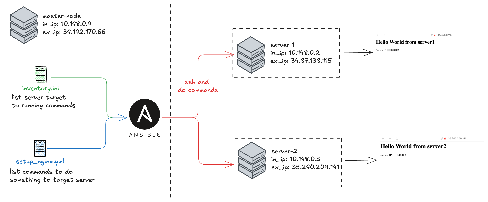
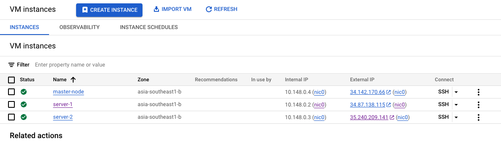
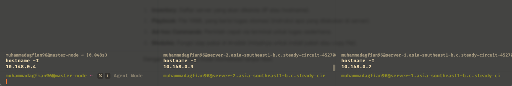
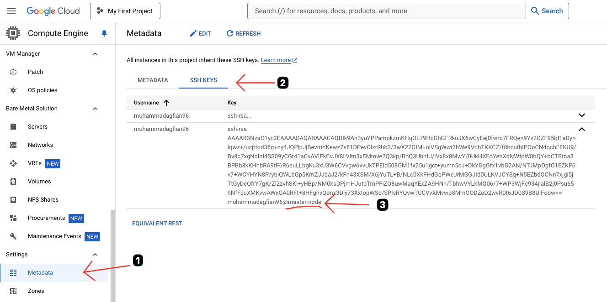
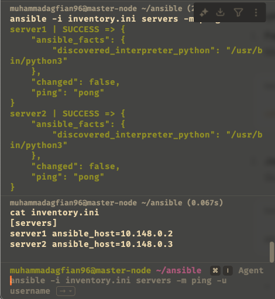
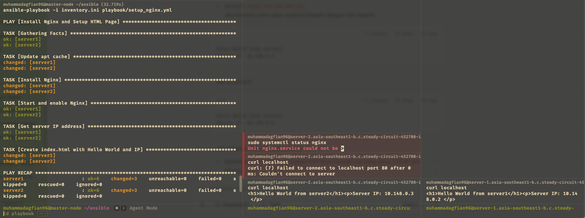
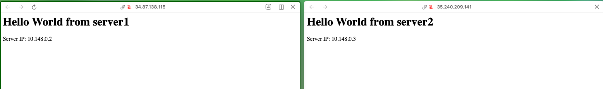
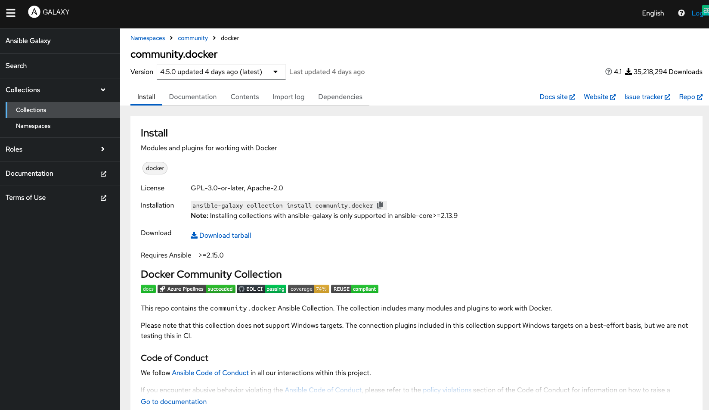

---

draft: false
authors:
  - me
date: 
    created: 2025-03-08
    updated: 2025-03-08
categories:
    - devops
tags:
    - devops
    - gcp
    - ansible
    - vm

comments: true

---

# Hands-On Setup NginX with Ansible

I will do hands-on Ansible with this project. 

<!-- more -->

!!! info "Project Challange"

    1. Siapkan 3 server untuk ansible di virtualbox, 1 Control Node dan 2 Managed Node
    2. Install Ansible di Control Node

!!! warning "Notes"

    I change the project to use 3 VM in GCP, 1 Control Node and 2 Managed Node


## Overview



I have `master-node` here as control node and `server-1` and `server-2` as managed node. Master node will be used to install Ansible and run the playbook. `server-1` and `server-2` will be used to setup nginx.

##  Setup VM Instance in GCP


///caption
List of VM instances created in GCP.
///


///caption
Successfully ssh into 3 VM instances in GCP.
///


| | master-node | server-1 | server-2 |
|:---|:---|:---|:---|
| **Internal IP** | 10.148.0.4 | 10.148.0.2 | 10.148.0.3 |
| **External IP** | 34.142.170.66 | 34.87.138.115 | 35.240.209.141 |
| **OS** | Ubuntu 24.04 LTS | Ubuntu 24.04 LTS | Ubuntu 24.04 LTS |
| **Network** | Allow HTTP | Allow HTTP | Allow HTTP |

### Setup Powerless SSH

**Generate SSH Key on Master Node:**  

```bash
ssh-keygen -t rsa -b 4096
cat ~/.ssh/id_rsa.pub
```

**Paste the Public Key to GCP Metadata SSH Keys:**  

Copy the public key to your clipboard and paste it in the GCP Metadata SSH Keys (like the image below).


///caption
Setup passwordless SSH by generating SSH key on master node and registering the public key to Metadata Compute Engine on GCP.
///

!!! success "Success Setup Passwordless SSH :fire:"

    Now `master-node` can SSH to `server-1` and `server-2` without password :fire::fire::fire:

## Introduction to Ansible

Ansible is open-source automation tool that can be used to manage configuration, deploy applications, and run tasks on single or multiple servers. The way it works is by using SSH to connect to the target servers and execute tasks defined in a playbook.

There are several key concepts in Ansible that you need to understand before getting started:

- **Inventory:** A file that contains a list of servers to be managed by Ansible. This file can be in INI or YAML format.
- **Playbook:** A YAML file that defines the tasks to be executed on the target servers. Playbooks are the heart of Ansible automation.
- **Module:** A script that performs a specific task (e.g., installing a package or managing a service). Ansible has many built-in modules that you can use in your playbooks.


## Setup Ansible on Master Node

#### Steps:  
1. **Update Package List:**  
    ```bash
    sudo apt update
    ```

2. **Install Ansible:**
    ```bash
    sudo apt install ansible -y
    ```  

3. **Check Ansible Version:**  

    ```bash
    ansible --version
    
    # or
    
    command -v ansible
    ``` 

## Create Inventory and Playbook

```bash
# Project Structure
~/ansible/
├── inventory.ini
└── playbook/
    └── install_nginx.yml
```

### Inventory File

Inventory file is a file that contains a list of servers to be managed by Ansible. This file can be in `INI` or `YAML` format. In this example, we will use the `INI` format.

```ini title="inventory.ini" linenums="1"
[servers]
server1 ansible_host=10.148.0.2
server2 ansible_host=10.148.0.3
``` 

???+ abstract "Details `.ini` file"
    
    - **[servers]**: This is a group name that contains the servers you want to manage.
    - **server1 ansible_host=...**: This line defines a server in the group. `server1` is the alias you will use in your playbook, and `ansible_host` is the actual IP address of the server.

### Playbook File

```yaml title="setup_nginx.yml" linenums="1"
---
- name: Install Nginx and Setup HTML Page
  hosts: servers
  become: yes
  tasks:
    - name: Update apt cache
      apt:
        update_cache: yes

    - name: Install Nginx
      apt:
        name: nginx
        state: present

    - name: Start and enable Nginx
      service:
        name: nginx
        state: started
        enabled: yes

    - name: Get server IP address
      command: hostname -I
      register: server_ip
      changed_when: false

    - name: Create index.html with Hello World and IP
      copy:
        content: "<h1>Hello World from {{ inventory_hostname }}</h1><p>Server IP: {{ server_ip.stdout }}</p>"
        dest: /var/www/html/index.html
        mode: '0644'
```

???+ abstract "Details `setup_nginx.yml` file"
    
    **Playbook Header**

    ```yaml title="setup_nginx.yml | Header" linenums="1"
    ---
    - name: Install Nginx and Setup HTML Page
      hosts: servers
      become: yes
    ```

    - **Purpose**: Defines the playbook and its target
    - **Components**:

        - `name`: Playbook title for identification
        - `hosts`: Targets the "servers" group from inventory file
        - `become: yes`: Grants sudo privileges for all tasks

    ---
    **Tasks Section**

    **Task 1: Update APT Cache**
    
    ```yaml title="setup_nginx.yml | Task 1" linenums="1"
    - name: Update apt cache
      apt:
        update_cache: yes
    ```

    - **Purpose**: Refreshes the package manager's cache
    - **Module**: `apt`
    
    - **Parameters**:
        - `update_cache: yes`: Triggers refresh of APT package lists

    **Task 2: Install Nginx**
    
    ```yaml title="setup_nginx.yml | Task 2" linenums="1"
    - name: Install Nginx
      apt:
        name: nginx
        state: present
    ```

    - **Purpose**: Installs Nginx web server
    - **Module**: `apt`
    - **Parameters**:
        - `name: nginx`: Specifies the package to install
        - `state: present`: Ensures Nginx is installed (won’t remove if already present)

    **Task 3: Start and Enable Nginx**
    
    ```yaml title="setup_nginx.yml | Task 3" linenums="1"
    - name: Start and enable Nginx
      service:
        name: nginx
        state: started
        enabled: yes
    ```

    - **Purpose**: Configures Nginx service
    - **Module**: `service`
    - **Parameters**:
        - `name: nginx`: Targets the Nginx service
        - `state: started`: Ensures Nginx is running now
        - `enabled: yes`: Makes Nginx start automatically on boot

    **Task 4: Get Server IP Address**
    
    ```yaml title="setup_nginx.yml | Task 4" linenums="1"
    - name: Get server IP address
      command: hostname -I
      register: server_ip
      changed_when: false
    ```
    
    - **Purpose**: Retrieves server's IP address
    - **Module**: `command`
    - **Parameters**:
        - `hostname -I`: Runs command to get IP(s)
        - `register: server_ip`: Saves output to `server_ip` variable
        - `changed_when: false`: Marks task as not changing system state

    **Task 5: Create Custom HTML Page**
    
    ```yaml title="setup_nginx.yml | Task 5" linenums="1"
    - name: Create index.html with Hello World and IP
      copy:
        content: "<h1>Hello World from {{ inventory_hostname }}</h1><p>Server IP: {{ server_ip.stdout }}</p>"
        dest: /var/www/html/index.html
        mode: '0644'
    ```

    - **Purpose**: Creates Nginx welcome page
    - **Module**: `copy`
    - **Parameters**:
        - `content`: Defines HTML with dynamic values:
            - `{{ inventory_hostname }}`: Inserts server’s hostname
            - `{{ server_ip.stdout }}`: Inserts IP from Task 4
        - `dest: /var/www/html/index.html`: Sets file path for HTML
        - `mode: '0644'`: Sets permissions (read/write for owner, read for others)

    **Workflow Summary**

    1. Refreshes package cache
    2. Installs Nginx
    3. Starts Nginx and enables it on boot
    4. Captures server IP
    5. Creates HTML page with hostname and IP


---

## **Run the Playbook** 
Now it's time to run the automation!  

#### Steps: 
1. **Ensure You Are in the Ansible Directory:**  
    ```bash
    cd ~/ansible/
    ```  
2. **Ping the Servers:**  
    
    ```bash
    ansible -i inventory.ini servers -m ping
    ```  
    This command checks if Ansible can connect to the servers. If successful, you will see a "pong" response.
    
    
    ///caption
    Picture show that ansible can connect to the servers and get a pong response.
    ///

2. **Run the Playbook:**  
    ```bash
    ansible-playbook -i inventory.ini playbook/install_nginx.yml
    ```  

    
    ///caption
    The picture show that ansible can connect to the servers and run the playbook to install nginx.
    ///

    master-node (left) successfully run the playbook to install nginx on server1 (left) and server2 (middle). I running `curl http://localhost` to managed node to check if nginx is running and successfully return the HTML page created by the playbook.


---


## **Verify the Nginx Installation**

#### Steps:
1. **Open a Web Browser:**  

    - Go to `http://<server1_external_ip>` and `http://<server2_external_ip>`.
    - You should see the "Hello World" message with the server's IP address.

    
    ///caption
    Successfully open the web browser and see the Hello World message with the server's IP address. :fire::fire::fire:
    ///

2. **Check Nginx Status:**  

    ```
    ssh muhammadagfian96@10.48.0.2
    curl http://localhost
    ```

    - This command checks if Nginx is running on server1.
    

## What's Next?

Learning Ansible is a great way to automate tasks and manage configurations. You can explore more advanced features like roles, templates, and dynamic inventories to enhance your automation skills.

### Ansible Galaxy

[Ansible Galaxy](https://galaxy.ansible.com/ui/repo/published/community/docker/) is an online platform provided by the Ansible community to share automation content like roles and collections. It’s like an "app store" for Ansible, where you can find and download pre-built code for specific tasks, such as installing Docker.

- **Roles:** A bundle of tasks, variables, and files packaged to perform a specific function, like installing Nginx.
- **Collections:** Larger packages that can include multiple roles, modules, or plugins for more complex needs.

### Example: Steps to Install Docker Collection



1. **Install Ansible Galaxy:**  
    ```bash
    ansible-galaxy collection install community.docker
    ```
2. **Verify Installation:**  
    ```bash
    ansible-galaxy collection list
    ```

3. **Create a Playbook:**  
    ```yaml title="playbook/install_docker.yml" linenums="1"
    ---
    - name: Install Specific Docker Version
      hosts: servers
      become: yes
      tasks:
        - name: Install Docker 20.10
          community.docker.docker_host:
            state: present
            version: "20.10"
    ```

    ???+ abstract "Details `install_docker.yml` file"

        - **hosts: servers**: Target the "servers" group.
        - **become: yes**: Use sudo.
        - **Task**:
            - **Module**: `community.docker.docker_host`. So it means that this module is from the `community.docker` collection. We don't need to manually install from scratch.
            - **Parameters**:
                - **state: present**: Ensure Docker is installed.
                - **version: "20.10"**: Specify the Docker version (change as needed, e.g., "24.0").

4. **Run the Playbook:**  
    ```bash
    ansible-playbook -i inventory.ini playbook/install_docker.yml
    ```

### Why use Ansible Galaxy?

- Saves time since we don’t need to write code from scratch.
- Community-supported, so the code is usually tested and reliable.

## Conclusion

In this project, i learned how to set up Ansible, create an inventory file and playbook, and run the playbook to install Nginx on multiple servers. I also learned about Ansible Galaxy and how to use it to install Docker.