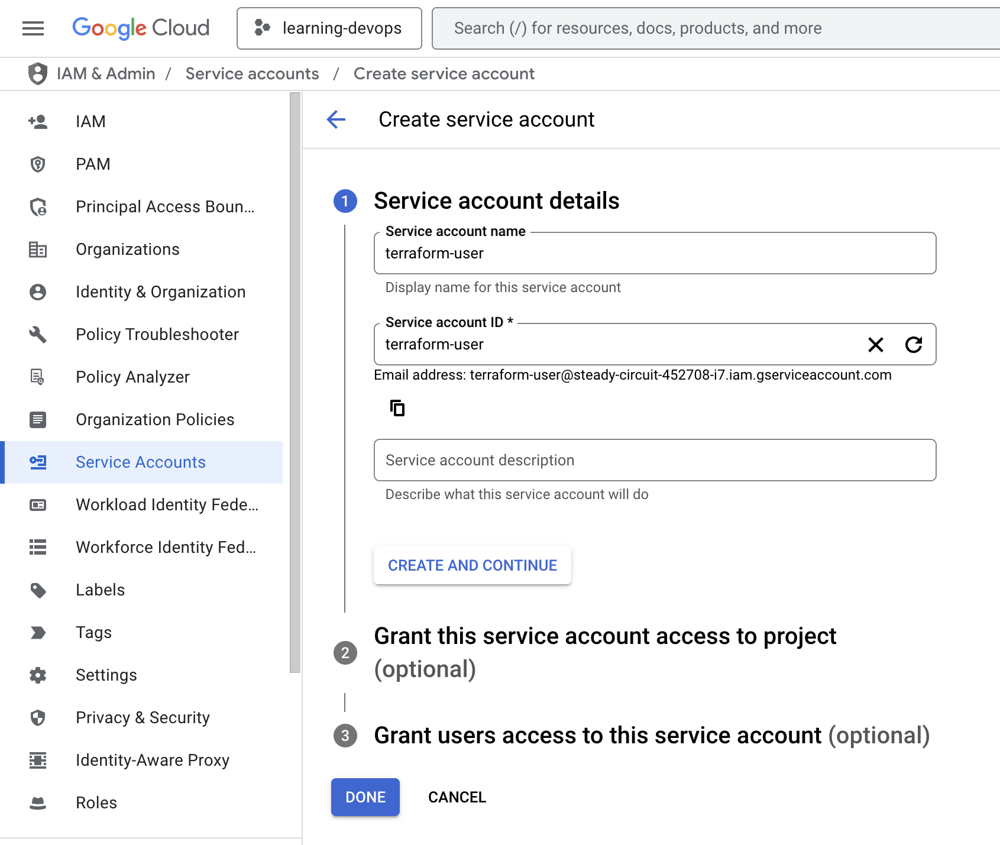

---

draft: false
authors:
  - me
date: 
    created: 2025-03-09
    updated: 2025-03-10
categories:
    - devops
tags:
    - devops
    - gcp
    - terraform
    - vm

comments: true

---

# Hands-On Terraform :material-terraform:

Hi! I will hands on Terraform to create **a** VM on GCP or **multiple** VM instances. This is a simple project to get started with Terraform.

:warning: For more details code: [:simple-github: terraform-tutorial](https://github.com/agfianf/terraform-tutorial)

<!-- more -->

!!! info "Project Challenge"
    
    1. Buatlah 1 `main.tf` untuk membuat 1 instance GCP menggunakan Terraform
    2. Jelaskan step by stepnya!


## Overview


Terraform will create a VM instance on GCP. The VM instance will be created in a VPC network with a firewall rule to allow HTTP and SSH access. The VM instance will have a startup script that installs Nginx and starts the service.

This is order the way Terraform:

1. Create a VPC network
2. Create a subnet
3. Create a firewall rule to allow HTTP and SSH access
4. Create a VM instance. Attach the firewall rule to the VM instance
5. Create a startup script to install Nginx and start the service

## Pre-requisites

### GCP Account
- [Terraform](https://www.terraform.io/downloads.html) installed on your local machine.

### Setup IAM Account Service Key

!!! warning "Warning"

    You can skip this step if you already have a service account key.

??? abstract "Details"

    1. Go to IAM & Admin > Service Accounts. Click on Create Service Account.
        

    2. Fill in the details for the service account. Select the role as below:
        
        

    3. Create a JSON key for the service account. This will download a JSON file to your local machine.
        


## Introduction to Terraform

Terraform is an open-source infrastructure as code (IaC) tool that allows you to define and provision infrastructure using a declarative configuration language. It enables you to manage cloud resources, such as virtual machines, networks, and storage, in a consistent and repeatable manner.

| Command | Description |
|---------|-------------|
| `terraform init` | Initializes a Terraform working directory by downloading the necessary provider plugins and setting up the backend configuration. |
| `terraform validate` | Validates the configuration files in the directory, checking for syntax errors and other issues. But this command rarely used. |
| `terraform fmt` | Formats the configuration files to a canonical format and style, making them easier to read and maintain. |
| `terraform plan` | Creates an execution plan, showing what actions Terraform will take to reach the desired state defined in the configuration files. |
| `terraform apply` | Applies the changes required to reach the desired state of the configuration. It creates or updates resources as needed. |
| `terraform destroy` | Destroys the resources created by Terraform, removing them from the cloud provider. |

### Install Terraform


## Explain the Project Structure


```bash
└── 📁 projects/
    ├── 📁 files/
    │   ├── secret-access.json      # 🔑: Credentials file for accessing GCP.
    │   └── startup.sh              # 📜: Bash script to initialize the VM instances.
    ├── main.tf                     # 📄: Main configuration file for creating VM instances.
    ├── network.tf                  # 📄: Configures the network and firewall rules.
    ├── output.tf                   # 📄: Outputs from the Terraform execution.
    ├── providers.tf                # 📄: Specifies the required providers and their versions.
    ├── terraform.tfstate
    ├── terraform.tfstate.backup
    └── variables.tf                # 📄: Defines variables used in the Terraform scripts.
```

For more details code: [:simple-github: terraform-tutorial](https://github.com/agfianf/terraform-tutorial)


## Overview the Terraform Code

Creating a VM instance using Terraform involves several steps. Below is a step-by-step explanation of the process:

1. Define the provider (GCP) and the required version in `providers.tf`.
2. Define the network and firewall rules in `network.tf`.
3. Define the VM instance in `main.tf`.
4. Tidy up all variables in `variables.tf`.
5. Define the output in `output.tf` for the instance name and external IP address.
6. Initialize Terraform using `terraform init`.
7. Validate the configuration using `terraform validate`.
8. Format the configuration using `terraform fmt`.
9. Create an execution plan using `terraform plan`.
10. Apply the changes using `terraform apply`.
11. Destroy the resources using `terraform destroy`.


**List of terraform block**

Terraform blocks are the building blocks of a Terraform configuration. They define the resources, providers, and variables used in the configuration. Below is a list of common Terraform blocks and their descriptions:

| Term | Description |
|------|-------------|
| `terraform` | The main command-line tool for managing infrastructure as code. |
| `provider` | A plugin that allows Terraform to interact with a specific cloud provider (e.g., GCP, AWS, Azure). |
| `variable` | A placeholder for values that can be passed to the Terraform configuration, allowing for dynamic and reusable code. |
| `resource` | A block that defines a specific piece of infrastructure to be managed by Terraform (e.g., a VM instance, a network, etc.). |
| `output` | A block that defines the output values from the Terraform execution, allowing you to see important information after applying the configuration. |

### variables.tf

#### How `variable` works? 

It is a file that contains the variables used in the Terraform scripts. It allows you to define the values for the variables in one place, making it easier to manage and update them. Basic form to define a variable is:

```python
variable "variable_name" {
  description = "Description of the variable"
  # if string no need to define type, but if number, list, map, etc. you need to define the type
  # type      = number
  default     = "string_value"
}
```

- `variable_name`: The name of the variable.
- `description`: A brief description of the variable.
- `type`: The type of the variable (string, number, list, etc.).

#### How we use it? 

just use `var.<variable_name>`. For example:

```python
resource "xxx" "xxx" {
  xxxx        = var.variable_name
  # or
  yyyy         = "${var.instance_name}-${count.index}"
}
```

???+ quote "variables.tf"

    For this project, we will create a file called `variables.tf` to define the variables used in the Terraform scripts. The variables will include the project ID, region, zone, instance name, machine type, instance count, OS image type, VPC name, subnet name, and subnet IP range.

    ```python linenums="1" title="variables.tf"
    # -- Provider
    variable "project_id" {
      description = "Project ID for the GCP project"
      default     = "<my-project-id>"
    }

    variable "region" {
      description = "Region for the VM instance"
      default     = "asia-southeast1"

    }

    variable "zone" {
      description = "Zone for the VM instance"
      default     = "asia-southeast1-a"
    }

    # -- VM Instance

    variable "instance_name" {
      description = "Name of the VM instance"
      default     = "server"
    }

    variable "machine_type" {
      description = "Tipe mesin untuk VM"
      default     = "e2-micro" # can do vertical scaling
    }

    variable "instance_count" {
      description = "Count of VM instances to create"
      type        = number
      default     = 1 # can do horizontal scaling
    }

    variable "type_os_image" {
      description = "Tipe OS image untuk VM"
      default     = "ubuntu-os-cloud/ubuntu-minimal-2404-lts-amd64"
    }

    # VPC
    variable "vpc_name" {
      description = "Name of the VPC"
      default     = "vpc-wakanda"
    }

    variable "subnet_name" {
      description = "Name of the subnet"
      default     = "vpc-wakanda-subnet"
    }

    variable "subnet_ip_range" {
      description = "IP range for the subnet"
      default     = "10.128.0.0/20"

    }
    ```


### providers.tf

This file contains the provider configuration for Terraform:

- First, `terraform` block specifies the required version of Terraform and the required providers. Here, i am using the Google provider.
- Second, `provider` block specifies the configuration for the Google provider. This includes the project ID, region, zone, and credentials file for accessing GCP.

???+ quote "providers.tf"

    ```python linenums="1" title="providers.tf"

    terraform {
      required_version = "~> 1.11.0" # (1)
      required_providers {
        google = {
          source  = "hashicorp/google"
          version = "~> 6.24.0"
        }
      }
    }

    provider "google" {
      project     = var.project_id
      region      = var.region
      zone        = var.zone
      credentials = file("files/secret-access.json") # (2)
    }
    ```

    1. Specify the required version of Terraform and the Google provider. `~>` means "greater than or equal to 1.11.0 but less than 2.0.0".
    2. Specify the credentials file for accessing GCP. This file should be downloaded from the GCP console when creating a service account.
    
    The `project_id`, `region`, and `zone` variables are defined in `variables.tf`.


### network.tf

This file contains the network configuration for the VM instance. It creates a VPC network, a subnet, and firewall rules to allow HTTP and SSH access to the VM instance.

- Why we need to create a VPC network? Because we need to create a private network for the VM instance. This is important for security and isolation. The VPC network will be used to create a subnet, which will be used to assign IP addresses to the VM instance.
- The firewall rules will allow HTTP and SSH access to the VM instance. This is important for accessing the VM instance and for running web applications.
- After creating the VPC network, we will create a subnet. The subnet will be used to assign IP addresses to the VM instance. The subnet will be created in the same region as the VM instance.
- Here we use `resource` block to create the VPC network, subnet, and firewall rules. The `resource` block specifies the type of resource to create (e.g., `google_compute_network`, `google_compute_subnetwork`, `google_compute_firewall`) and the configuration for the resource.

???+ quote "network.tf"

    ```python linenums="1" title="network.tf"

    resource "google_compute_network" "vpc_vm" {
      name                    = var.vpc_name
      auto_create_subnetworks = false
    }

    resource "google_compute_subnetwork" "vpc_subnet_vm" {
      name          = var.subnet_name
      ip_cidr_range = var.subnet_ip_range
      region        = var.region
      network       = google_compute_network.vpc_vm.id
    }

    # create firewall rule for ssh access
    resource "google_compute_firewall" "allow_ssh" {
      name    = "allow-ssh"
      network = google_compute_network.vpc_vm.id

      allow {
        protocol = "tcp"
        ports    = ["22"]
      }

      # artinya, semua ip dianggap boleh masuk
      source_ranges = ["0.0.0.0/0"] 
      target_tags   = ["ssh-access"]
    }

    # create http 80 firewall
    resource "google_compute_firewall" "allow_http" {
      name    = "allow-http"
      network = google_compute_network.vpc_vm.id

      allow {
        protocol = "tcp"
        ports    = ["80"]
      }

      # artinya, semua ip dianggap boleh masuk
      source_ranges = ["0.0.0.0/0"]
      target_tags   = ["http-access"]
    }
    ```


### main.tf

This file contains the main configuration for creating the VM instance. It uses the `google_compute_instance` resource to create the VM instance. The `google_compute_instance` resource specifies the configuration for the VM instance, including the machine type, boot disk, network interface, and metadata.

???+ quote "main.tf"

    ```python linenums="1" title="main.tf"
    # Create a VM instance
    resource "google_compute_instance" "vm_instance" {
      # Create multiple instances based on the instance_count variable
      count        = var.instance_count
      name         = "${var.instance_name}-${count.index}"
      machine_type = var.machine_type
      zone         = var.zone

      # VM instance metadata and labels
      labels = {
        environment = "development"
        managed_by  = "terraform"
      }

      # Boot disk configuration. Use the specified OS image
      boot_disk {
        initialize_params {
          image = var.type_os_image
          size  = 10
        }
      }

      # Network interface configuration
      network_interface {
        # Connect to our custom VPC subnet
        subnetwork = google_compute_subnetwork.vpc_subnet_vm.id

        # Request an ephemeral external IP
        access_config {
          # Ephemeral public IP
        }
      }

      tags = [
        tolist(google_compute_firewall.allow_http.target_tags)[0],
        tolist(google_compute_firewall.allow_ssh.target_tags)[0],
      ]

      # VM metadata for SSH keys, startup scripts, etc.
      metadata = {
        ssh-keys       = file("~/.ssh/id_rsa.pub")
        startup-script = file("files/startup.sh")
      }

      # Ensure VPC is created before instances
      depends_on = [
        google_compute_subnetwork.vpc_subnet_vm
      ]
    }
    ```


Here is a breakdown of the `main.tf` file:

| Element | Description |
|---------|-------------|
| `resource "google_compute_instance" "vm_instance"` | Creates a VM instance on GCP |
| `count` | Specifies number of VM instances to create based on `instance_count` variable |
| `name` | Sets VM instance name using `instance_name` variable and appends index for uniqueness |
| `machine_type` | Defines the VM hardware configuration using `machine_type` variable |
| `zone` | Specifies the datacenter location using `zone` variable |
| `labels` | Key-value pairs for resource organization and filtering |
| `boot_disk` | Configures the primary disk using `type_os_image` variable for OS selection |
| `network_interface` | Connects VM to the VPC subnet created in `network.tf` |
| `access_config` | Assigns an ephemeral external IP address to the VM. If you want to use a static IP, you can create a static IP and assign it here |
| `tags` | Applies firewall rule target tags for network access control |
| `metadata` | Includes SSH keys and startup script for VM initialization |
| `depends_on` | Ensures VPC subnet is created before VM instance |


### output.tf

This file contains the output configuration for the Terraform execution. This output will print/show (debug) at the end of the execution. The output will include the VPC ID, subnet name, instance names, and external IP addresses of the VM instances.


???+ quote "output.tf"

    ```python linenums="1" title="output.tf"
      # Output the ID of the created VPC 
    output "vpc_id" {
      description = "The ID of the VPC"
      value       = google_compute_network.vpc_vm.id
    }

    # Output the name of created subnet
    output "subnet_name" {
      description = "The name of the subnet"
      value       = google_compute_subnetwork.vpc_subnet_vm.name
    }

    # Output the names of all created VM instances
    output "instance_names" {
      description = "Names of all created VM instances"
      value       = google_compute_instance.vm_instance[*].name
    }

    # Output the external IPs of all created VM instances
    output "instance_external_ips" {
      description = "External IPs of all created VM instances"
      value       = [for i in google_compute_instance.vm_instance : i.network_interface[0].access_config[0].nat_ip]
    }
    ```


## Excecute Terraform

### Initialize Terraform
```bash
terraform init
```

### Validate the configuration
```bash
terraform validate
```

### Plan the execution

=== "command"

    ```bash
    terraform plan
    ```
=== "output"

    ```bash
    ... 

    Plan: 5 to add, 0 to change, 0 to destroy.

    ...

    ```

    Here is the breakdown of the output:

    `Plan: 5 to add, 0 to change, 0 to destroy.` means that Terraform will create 5 resources (VPC, subnet, firewall rules, and VM instance).


### Apply the changes

=== "command"

    ```bash
    terraform apply
    ```

=== "output"

    ```bash
    ...

    Do you want to perform these actions?
      Terraform will perform the actions described above.
      Only 'yes' will be accepted to approve.

      Enter a value: yes

    google_compute_network.vpc_vm: Creating...
    google_compute_network.vpc_vm: Still creating... [10s elapsed]
    google_compute_network.vpc_vm: Still creating... [20s elapsed]
    google_compute_network.vpc_vm: Creation complete after 23s [id=projects/steady-circuit-452708-i7/global/networks/vpc-wakanda]
    google_compute_subnetwork.vpc_subnet_vm: Creating...
    google_compute_firewall.allow_ssh: Creating...
    google_compute_firewall.allow_http: Creating...
    google_compute_firewall.allow_http: Still creating... [10s elapsed]
    google_compute_subnetwork.vpc_subnet_vm: Still creating... [10s elapsed]
    google_compute_firewall.allow_ssh: Still creating... [10s elapsed]
    google_compute_firewall.allow_http: Creation complete after 13s [id=projects/steady-circuit-452708-i7/global/firewalls/allow-http]
    google_compute_firewall.allow_ssh: Creation complete after 13s [id=projects/steady-circuit-452708-i7/global/firewalls/allow-ssh]
    google_compute_subnetwork.vpc_subnet_vm: Still creating... [20s elapsed]
    google_compute_subnetwork.vpc_subnet_vm: Still creating... [30s elapsed]
    google_compute_subnetwork.vpc_subnet_vm: Creation complete after 33s [id=projects/steady-circuit-452708-i7/regions/asia-southeast1/subnetworks/vpc-wakanda-subnet]
    google_compute_instance.vm_instance[0]: Creating...
    google_compute_instance.vm_instance[0]: Still creating... [10s elapsed]
    google_compute_instance.vm_instance[0]: Still creating... [20s elapsed]
    google_compute_instance.vm_instance[0]: Still creating... [30s elapsed]
    google_compute_instance.vm_instance[0]: Creation complete after 39s [id=projects/steady-circuit-452708-i7/zones/asia-southeast1-a/instances/server-0]

    Apply complete! Resources: 5 added, 0 changed, 0 destroyed.

    Outputs:

    instance_external_ips = [
      "34.87.128.87",
    ]
    instance_names = [
      "server-0",
    ]
    subnet_name = "vpc-wakanda-subnet"
    vpc_id = "projects/steady-circuit-452708-i7/global/networks/vpc-wakanda"
    ```

    Here is the breakdown of the output:

    - 1st, `vpc_vm` creating first, then `vpc_subnet_vm`, and then `allow_http` and `allow_ssh` firewall rules.
    - 2nd, `vm_instance` is created last.
    - 3rd, The output shows the VPC ID, subnet name, instance names, and external IP addresses of the VM instances as defined in `output.tf`.


???+ success "Success"

    Here i show that the instance is created successfully. You can see the VM instance in the GCP console. You can access the VM instance using SSH and check if Nginx is running.
    
    
    
    

    I can access NGINX using the external IP address of the VM instance. You can see the my custom page.
    { width=250 }
    

### Destroy the resources

=== "command"

    ```bash
    terraform destroy
    ```

=== "output"

    ```bash

    google_compute_instance.vm_instance[0]: Destroying... [id=projects/steady-circuit-452708-i7/zones/asia-southeast1-a/instances/server-0]
    google_compute_instance.vm_instance[0]: Still destroying... [id=projects/steady-circuit-452708-i7/zones/asia-southeast1-a/instances/server-0, 10s elapsed]
    google_compute_instance.vm_instance[0]: Still destroying... [id=projects/steady-circuit-452708-i7/zones/asia-southeast1-a/instances/server-0, 20s elapsed]
    google_compute_instance.vm_instance[0]: Still destroying... [id=projects/steady-circuit-452708-i7/zones/asia-southeast1-a/instances/server-0, 30s elapsed]
    google_compute_instance.vm_instance[0]: Still destroying... [id=projects/steady-circuit-452708-i7/zones/asia-southeast1-a/instances/server-0, 40s elapsed]
    google_compute_instance.vm_instance[0]: Still destroying... [id=projects/steady-circuit-452708-i7/zones/asia-southeast1-a/instances/server-0, 50s elapsed]
    google_compute_instance.vm_instance[0]: Still destroying... [id=projects/steady-circuit-452708-i7/zones/asia-southeast1-a/instances/server-0, 1m0s elapsed]
    google_compute_instance.vm_instance[0]: Destruction complete after 1m3s
    google_compute_firewall.allow_ssh: Destroying... [id=projects/steady-circuit-452708-i7/global/firewalls/allow-ssh]
    google_compute_subnetwork.vpc_subnet_vm: Destroying... [id=projects/steady-circuit-452708-i7/regions/asia-southeast1/subnetworks/vpc-wakanda-subnet]
    google_compute_firewall.allow_http: Destroying... [id=projects/steady-circuit-452708-i7/global/firewalls/allow-http]
    google_compute_firewall.allow_ssh: Still destroying... [id=projects/steady-circuit-452708-i7/global/firewalls/allow-ssh, 10s elapsed]
    google_compute_firewall.allow_http: Still destroying... [id=projects/steady-circuit-452708-i7/global/firewalls/allow-http, 10s elapsed]
    google_compute_subnetwork.vpc_subnet_vm: Still destroying... [id=projects/steady-circuit-452708-i7/regio...theast1/subnetworks/vpc-wakanda-subnet, 10s elapsed]
    google_compute_firewall.allow_ssh: Destruction complete after 11s
    google_compute_firewall.allow_http: Destruction complete after 11s
    google_compute_subnetwork.vpc_subnet_vm: Still destroying... [id=projects/steady-circuit-452708-i7/regio...theast1/subnetworks/vpc-wakanda-subnet, 20s elapsed]
    google_compute_subnetwork.vpc_subnet_vm: Destruction complete after 21s
    google_compute_network.vpc_vm: Destroying... [id=projects/steady-circuit-452708-i7/global/networks/vpc-wakanda]
    google_compute_network.vpc_vm: Still destroying... [id=projects/steady-circuit-452708-i7/global/networks/vpc-wakanda, 10s elapsed]
    google_compute_network.vpc_vm: Still destroying... [id=projects/steady-circuit-452708-i7/global/networks/vpc-wakanda, 20s elapsed]
    google_compute_network.vpc_vm: Still destroying... [id=projects/steady-circuit-452708-i7/global/networks/vpc-wakanda, 30s elapsed]
    google_compute_network.vpc_vm: Destruction complete after 33s

    Destroy complete! Resources: 5 destroyed.
    ```

    Here is the breakdown of the output:

    1. `vm_instance` is destroyed first, then `allow_ssh` and `allow_http` firewall rules.
    2. `vpc_subnet_vm` is destroyed next, and finally `vpc_vm` is destroyed last.


## What if I change the instance count?
```python
variable "instance_count" {
  ...
  default     = 1 # i change here
}
```

to

```python
variable "instance_count" {
  ...
  default     = 3 # do with 3 instance?
}
```
### Result 3 Instance

After running `terraform plan` and `terraform apply`, you will see the following output:

```bash
    ...
    Plan: 7 to add, 0 to change, 0 to destroy.
    ...
```

It means that Terraform will create 7 resources (1 VPC, 1 subnet, 2 firewall rules, and 3 VM instances).

???+ success "Success"

    1. List of VM Instances
    

    2. Access all nginx. Can see the IP address of the VM instance
    

    3. Inside one of the VM instance, you can see the nginx running
    
