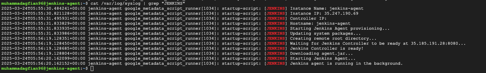

---

draft: false
authors:
  - me
date: 
    created: 2025-03-25
    updated: 2025-03-25
categories:
    - devops
tags:
    - devops
    - gcp
    - jenkins
    - terraform
    - ci/cd
    - cloud
    - automation

comments: true

---

# Hands-on with Jenkins :fontawesome-brands-jenkins:

Hi!

Today i will hands-on jenkins from installation using terraform to implementation create one job. I will show how to install Jenkins on GCP using Terraform and create a simple job. This post is part of my DevOps learning journey. I will share my experience and knowledge about DevOps tools and practices. :fist: 😃


<!-- more -->

## {==Introduction==}

Jenkins is one of the most popular open-source automation servers. Mostly used for CI/CD pipelines integration with various tools and services. It is highly extensible and can be used for a wide range of automation tasks.

- **Techstack:** :fontawesome-brands-jenkins: Jenkins, :material-terraform: Terraform, :material-google-cloud: GCP, :simple-git: Git
- **Terraform Code:** [:fontawesome-brands-square-github: provisioning-jenkins](https://github.com/agfianf/terraform-tutorial/tree/main/projects/002-provisioning-jenkins)

## {==Overview Project==}


In the overview above, you can see we're using 2 VM instances: Jenkins Controller and Jenkins Agent. Typically, you could use just 1 VM instance for both Jenkins Controller and Agent. However, we're using 2 separate instances to make our setup more scalable and flexible. This approach allows us to easily add or remove agents as needed based on our workload requirements.

We will create 2 VMs on GCP using Terraform:

- **Jenkins Controller**: This is the main server that runs Jenkins and manages the CI/CD pipeline.
- **Jenkins Agent**: This is a worker node that runs the jobs defined in the pipeline.


## {==Create VM Instances on GCP==}

I have created a VM on GCP using Terraform. Howeever, i will not go into details of Terraform in this post. You can refer to my code [:fontawesome-brands-square-github: repository](https://github.com/agfianf/terraform-tutorial/tree/main/projects/002-provisioning-jenkins) for the Terraform code.


## {==Install Jenkins via Terraform on GCP==}

At this stage, i will first install the Jenkins Controller. After the VM instance is successfully created, the startup script we defined in Terraform will be executed automatically. We'll use this startup script to install Jenkins and its dependencies. Here's the startup script that installs Jenkins:


??? quote "startup_controller.sh"
    
    This script will be executed on the Jenkins Controller VM. It will install Jenkins and its dependencies. The script mainly does the following:

    - Install Pre-requeste Java 21: [Java Support Policy](https://www.jenkins.io/doc/book/platform-information/support-policy-java/)
    - Install Docker
    - Install Jenkins
    - Add jenkins user to docker group and restart jenkins service


    ```bash title="startup_controller.sh" linenums="1"
    #!/bin/bash

    INSTANCE_NAME=$(curl -H "Metadata-Flavor: Google" http://metadata.google.internal/computeMetadata/v1/instance/name)
    INSTANCE_IP=$(curl -H "Metadata-Flavor: Google" http://metadata.google.internal/computeMetadata/v1/instance/network-interfaces/0/access-configs/0/external-ip)
    HOSTNAME=$(hostname)

    echo "Instance Name: $INSTANCE_NAME"
    echo "Instance IP: $INSTANCE_IP"
    echo "Hostname: $HOSTNAME"

    echo "Starting Jenkins provisioning..."

    # Installing pre-requisites for Jenkins
    echo "Updating system packages..."
    apt-get update
    apt-get install -y --no-install-recommends apt-transport-https \
        ca-certificates \
        curl \
        software-properties-common \
        git \
        wget \
        openjdk-21-jdk # (1)

    # install docker # (2)
    echo "Installing Docker..."
    curl -fsSL https://download.docker.com/linux/ubuntu/gpg | sudo gpg --dearmor -o /usr/share/keyrings/docker-archive-keyring.gpg
    echo "deb [arch=$(dpkg --print-architecture) signed-by=/usr/share/keyrings/docker-archive-keyring.gpg] https://download.docker.com/linux/ubuntu \
    $(lsb_release -cs) stable" | sudo tee /etc/apt/sources.list.d/docker.list > /dev/null
    apt-get update
    apt-get install -y docker-ce docker-ce-cli containerd.io
    usermod -aG docker $USER

    echo "Installing Jenkins..."
    wget -O /usr/share/keyrings/jenkins-keyring.asc https://pkg.jenkins.io/debian-stable/jenkins.io-2023.key
    echo "deb [signed-by=/usr/share/keyrings/jenkins-keyring.asc]" https://pkg.jenkins.io/debian-stable binary/ | sudo tee \
    /etc/apt/sources.list.d/jenkins.list > /dev/null

    apt-get update
    apt-get install -y jenkins
    systemctl enable jenkins

    usermod -aG docker jenkins # (3)
    systemctl restart jenkins # (4)

    echo "Jenkins is installed and running."
    ```

    1. Before installing Jenkins, we need to install Java 21 as a prerequisite. We will use OpenJDK 21.
    2. We will install Docker on the Jenkins Controller VM. This is optional, but it is recommended to use Docker for running Jenkins jobs.
    3. We will add the jenkins user to the docker group so that jenkins can run docker commands.
    4. Restart Jenkins service after adding jenkins user to docker group.

After executing you can see the status of jenkins using `systemctl status jenkins` command. The result as image below:


!!! warning "Not create agent instance at the same time"

    Here, we **can't** running terraform to directly create instance for controller and agent **at the same time**. This is because the agent will need to connect to the controller using `name-agent` and `secret` that need to be setup first on Controller. So we need to create the controller instance first and then create the agent instance.

    My way, is comment the agent instance in the terraform code and run terraform apply. After the controller instance is created, i will uncomment the agent instance and run terraform apply again with take name agent and secret that already created in the controller instance. This will create the agent instance and connect it to the controller instance. This is the bash script to create agent instance on controller:


    ??? quote "startup_agent.sh"
        
        This script will be executed on the Jenkins Agent VM. It will install Java 21 and other dependencies. The script mainly does the following:

        - Install Pre-requeste Java 21: [Java Support Policy](https://www.jenkins.io/doc/book/platform-information/support-policy-java/)
        - Install Git
        - Install wget
        - Install curl
        - Download agent.jar from Jenkins Controller
        - Start Jenkins Agent using WebSocket


        ```bash title="startup_agent.sh" linenums="1"
        #!/bin/bash

        # Fetch metadata dari GCP
        INSTANCE_NAME=$(curl -H "Metadata-Flavor: Google" http://metadata.google.internal/computeMetadata/v1/instance/name)
        INSTANCE_IP=$(curl -H "Metadata-Flavor: Google" http://metadata.google.internal/computeMetadata/v1/instance/network-interfaces/0/access-configs/0/external-ip)
        HOSTNAME=$(hostname)

        echo "[JENKINS] Instance Name: $INSTANCE_NAME"
        echo "[JENKINS] Instance IP: $INSTANCE_IP"
        echo "[JENKINS] Controller IP: $CONTROLLER_IP"
        echo "[JENKINS] Hostname: $HOSTNAME"

        echo "[JENKINS] Starting Jenkins Agent provisioning..."

        # Update dan install dependencies
        echo "[JENKINS] Updating system packages..."
        apt-get update
        apt-get install -y --no-install-recommends \
            openjdk-21-jdk \
            git \
            wget \
            curl

        # Controller dan agent details dari Terraform template
        CONTROLLER_IP="${controller_ip}"
        CONTROLLER_URL="http://$${CONTROLLER_IP}:8080"
        AGENT_NAME="${agent_name}"
        AGENT_SECRET="${agent_secret}"

        # Buat remote root directory
        echo "[JENKINS] Creating remote root directory..."
        mkdir -p /home/jenkins/agent-workspace
        chmod 755 /home/jenkins/agent-workspace

        # Tunggu controller siap (port 8080)
        echo "[JENKINS] Waiting for Jenkins Controller to be ready at $CONTROLLER_IP:8080..."
        until curl -s "$${CONTROLLER_URL}" --output /dev/null --write-out "%%{http_code}" | grep -qE "^(200|403)"; do
        echo "[JENKINS] Controller not ready yet, waiting 10 seconds..."
        sleep 10
        done
        echo "[JENKINS] Jenkins Controller is ready!"

        # Download agent.jar
        echo "[JENKINS] Downloading agent.jar..."
        wget -O /home/jenkins/agent.jar "$${CONTROLLER_URL}/jnlpJars/agent.jar"

        # Simpan secret ke file
        echo "$${AGENT_SECRET}" > /home/jenkins/secret-file

        # Jalankan agent dengan WebSocket
        echo "[JENKINS] Starting Jenkins Agent..."
        java -jar /home/jenkins/agent.jar -url "$${CONTROLLER_URL}/" -secret @/home/jenkins/secret-file -name "$${AGENT_NAME}" -webSocket -workDir "/home/jenkins/agent-workspace" &

        echo "[JENKINS] Jenkins agent is running in the background."
        ```


## {==Setup Jenkins==}

### 1. Setup Controller

After the Jenkins Controller VM is created and Jenkins is installed, we can access Jenkins using the external IP address of the VM. The default port for Jenkins is `8080`. You can access Jenkins using the following URL:

```bash
http://<EXTERNAL_IP>:8080
```

**1. Unlock Jenkins**

- After accessing the URL, you will see the following screen. You need to unlock Jenkins using the initial admin password. The password is stored in the file `/var/lib/jenkins/secrets/initialAdminPassword` on the Jenkins Controller VM. You can get the password using the following command:
    
    ```bash title="terminal"
    sudo cat /var/lib/jenkins/secrets/initialAdminPassword
    ```

    
    

**2. Install Suggested Plugins**

- After unlocking Jenkins, you will see the following screen. You can install the suggested plugins or select the plugins you want to install. For this tutorial, we will install the suggested plugins.

    
    

**3. Create First Admin User**

- After installing the plugins, you will see the following screen. You can create your first admin user or skip this step. For this tutorial, we will create a first admin user.

    

**4. Instance Configuration**

- After creating the first admin user, you will see the following screen. You can configure the instance name and URL. For this tutorial, we will use the default settings.

    

Good! Now we have successfully installed Jenkins on GCP using Terraform.


### 2. Setup Agent

This is a Jenkins configuration page for setting up a node (agent) to connect to the Jenkins controller:


**Key Fields:**

- **Name**: `agent-1`  
  The unique identifier for this agent in Jenkins.
- **Labels**: `gcp-agent-ubuntu`  
  Labels are used to categorize the agent. Jobs can be configured to run on agents with specific labels. Here, the agent is tagged as a GCP VM-based Ubuntu agent. We can use this label to run jobs on this agent.

**Connection Details**

- **Launch Method**: Launch agent by connecting it to the controller  
  The agent will initiate the connection to the Jenkins controller (not the controller connecting to the agent).
- **Remote root directory**: `/home/jenkins/agent-workspace`  
  The directory on the agent where Jenkins will store its workspace and job-related files.




## {==Plugins==}


In this process I installed 2 plugins:

- **Docker Pipeline Plugin:** 
    - This plugin provides a set of steps to build and run Docker containers in Jenkins pipelines. It allows you to use Docker as a build environment and run **your jobs inside Docker containers**.
- **Pipeline: Stage View Plugin**
    - This plugin provides a visual representation of the stages in your pipeline. It allows you to see the progress of your pipeline and the status of each stage.

## {==Create a First Job==}

**1. Create a Pipeline Job**

- After installing the plugins, you will see the following screen. You can create a new job by clicking on the "New Item" button. Here i fill the form by selecting "Pipeline" and enter the name of the job. For this tutorial, we will create a job called `check-disk`.
    

**2. Create a script to check disk space**

- Then we need to write a script to **check disk space**. We will use the `sh` step to run the script. The script will check the disk space and print the result to the console. Here is the script:
    ```groovy title="Jenkinsfile" linenums="1"
    pipeline {
        agent {
            node {
                label 'gcp-agent-ubuntu' // (1)
                customWorkspace '/home/jenkins/agent-workspace' // (2)
            }
        }
        stages {
            stage('Hello') {
                steps {
                    // (3)
                    // (4)
                    sh ''' 
                        echo "Starting the job..."
                        df -h
                        sleep 30
                        echo "job has be done."
                    '''
                }
            }
        }
    }
    ```

    1. We will use the `gcp-agent-ubuntu` agent to run the job. This is the name of the Jenkins Agent VM that we created earlier.
    2. We will use the `/home/jenkins/agent-workspace` directory as the workspace for the job. This is the directory where the job will run.
    3. The `df -h` command will check the disk space and print the result to the console.
    4. The `sleep 30` command will wait for 30 seconds before finishing the job. This is just to simulate a long-running job.

    

    I **save** the script and click on the **Build Now** button to run the job. We can see the job status on the left side of the screen.

**3. Console Output of the Job**

- After executing the job, we can see the console output of the job. We can see the output of the `df -h` command and the status of the job. The job will run on the Jenkins Agent VM and print the result to the console. Here is the console output:

    

**4. See log history of the job via Stage View Plugin**

- After executing the job few times, we can see the log history of the job, this is provide by `Stage View Plugin`. We can see the status of each stage and the time taken for each stage. This is a very useful feature to monitor the progress of the job and troubleshoot any issues.
    

## {==Conclusion==}

Today i learned how to:

- install Jenkins Controller and Jenkins Agent on GCP using Terraform
- install Jenkins plugins to enhance Jenkins functionality
- create a simple job to check disk space

However **still much 🔥** to learn about Jenkins and its features. I will continue to explore Jenkins and its capabilities in the next posts.

Thank you for reading this post. I hope you find it helpful. If you have any questions or feedback, please feel free to leave a comment below. I will be happy to help you.