---

draft: false
authors:
  - me
date: 
    created: 2025-04-13
    updated: 2025-04-13
categories:
    - devops
tags:
    - devops
    - gitlab
    - gcp
    - terraform
    - ci/cd
    - cloud
    - automation

comments: true

---

# Hands-On Gitlab CI/CD

Hi! Today i will hands-on for implementing gitlab CI/CD. First i will try to **install self-hosted gitlab server**. Second, i will **create simple fastapi-app** and that deployed instance here. All instances will be deployed on GCP and will be managed using Terraform. Last, i will **create CI/CD pipeline** to deploy fastapi-app to GCP using gitlab ci/cd.

<!-- more -->

## Introduction
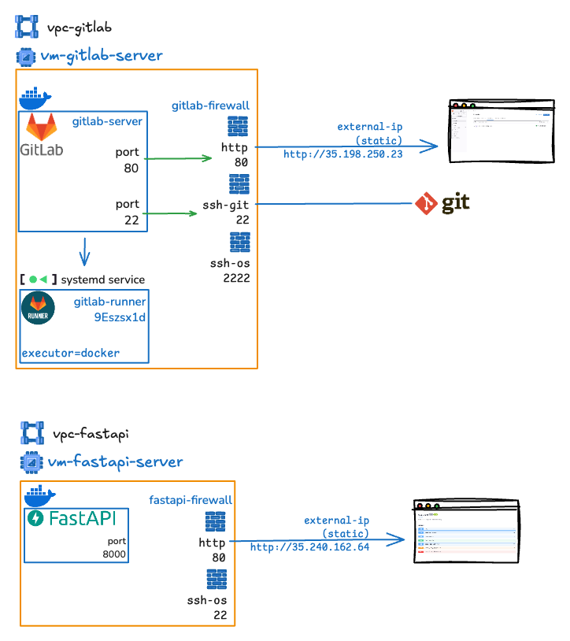
The diagram illustrates two separate infrastructures: one for a GitLab server (`vpc-gitlab`) and another for a FastAPI server (`vpc-fastapi`). Both setups are hosted in virtual private clouds (VPCs) with Docker containers, firewalls, and specific port mappings for external access. Here's a breakdown of each:

### 1. **GitLab Infrastructure (`vpc-gitlab`)**
This server is designed to host a self-managed GitLab instance, which includes a GitLab server and a GitLab Runner for CI/CD pipelines. It is set up to allow external access through specific ports.

- **Components:**
    - **GitLab Server (`vm-gitlab-server`):**
        - Runs a GitLab Server instance inside a Docker container (`gitlab/gitlab-ce:latest`).
        - Runs a Gitlab Runner using systemd service and uses Docker as the executor for GitLab Runner, which handles CI/CD pipelines.
        - Exposes two services:
            - **HTTP:** Port 80 internally, mapped to external port 80.
            - **SSH:** 
                - Port 22 internally, mapped to external port 22 for `ssh-git` 
                - Port 2222 for `ssh-os` so that the server can be accessed via SSH.
    - **Firewall (`gitlab-firewall`):**
        - Sits between the GitLab server and external access.
        - Filters traffic to ensure only allowed ports (80, 22, 2222) are accessible.
    - **External Access:**
        - The GitLab instance is accessed via a static external IP (`35.198.250.23`).
        - HTTP traffic (e.g., web interface) goes through port 80.
        - Git operations (e.g., cloning, pushing) use SSH on port 22.
        - Additional SSH access (likely for OS-level operations) is on port 2222.
    - **Systemd Service:**
        - A `systemd` service (`gitlab-runner`) manages the GitLab Runner, ensuring it runs persistently.
        - The GitLab Runner is configured to automatically start on boot 

- **Workflow:**

    - External users access the GitLab web interface via `http://35.198.250.23:80`.
    - Developers interact with Git repositories using SSH (`ssh-git`) on port 22.
    - Admins may access the server itself via SSH (`ssh-os`) on port 2222 for maintenance.


### 2. **FastAPI Infrastructure (`vpc-fastapi`)**
This server is designed as target deployment for CI/CD Pipeline fastapi-app. It runs a FastAPI application and is set up to allow external access through specific ports.

- **Components:**

    - **FastAPI Server (`vm-fastapi-server`):**
        - Runs a FastAPI application inside a Docker container.
        - Exposes two services:
        - **HTTP:** Port 8000 internally, mapped to external port 80.
        - **SSH (for OS access):** Port 22 internally, mapped to external port 22.
    - **Firewall (`fastapi-firewall`):**
        - Filters traffic, allowing only ports 80 and 22 for external access.
    - **External Access:**
        - The FastAPI application is accessed via a static external IP (`35.240.162.64`).
        - HTTP traffic (e.g., API requests) goes through port 80.
        - SSH access for server management is on port 22.

- **Workflow:**

    - External users interact with the FastAPI application via `http://35.240.162.64:80`.
    - Admins can access the server via SSH on port 22 for maintenance.


## Install Self-hosted Gitlab
!!! warning "Warning"
    if you directly use gitlab.com, you can skip this section.

In this section, I will install self-hosted GitLab CI/CD. I will use GCP as the cloud provider and Terraform to manage the infrastructure. I will use the following resources:

- 1x GCP VM instance `e2-standard-2` (used as GitLab server and GitLab runner)
- 1x VPC network
- 1x subnet
- 1x firewall rule
- 1x static IP address

The code for terraform can be found [:fontawesome-brands-square-github: provisioning gitlab-server](https://github.com/agfianf/terraform-tutorial/tree/main/projects/003-self-hosted-gitlab).

??? quote "startup_gitlab.sh"
    The following script is used to install GitLab server on GCP VM instance. It will be executed when the VM instance is created. The script will install Docker, Docker Compose, and GitLab server using Docker.
    
    ```bash title="startup_gitlab.sh" linenums="1"
    #!/bin/bash

    # Fetch metadata dari GCP
    INSTANCE_NAME=$(curl -H "Metadata-Flavor: Google" http://metadata.google.internal/computeMetadata/v1/instance/name)
    INSTANCE_IP=$(curl -H "Metadata-Flavor: Google" http://metadata.google.internal/computeMetadata/v1/instance/network-interfaces/0/access-configs/0/external-ip)
    HOSTNAME=$(hostname)

    echo "[GITLAB] Instance Name: $INSTANCE_NAME"
    echo "[GITLAB] Instance IP: $INSTANCE_IP"
    echo "[GITLAB] Hostname: $HOSTNAME"

    # https://about.gitlab.com/install/#ubuntu
    # Update sistem
    echo "[GITLAB] Updating system..."
    apt-get update && apt-get upgrade -y

    # Install dependencies
    echo "[GITLAB] Installing dependencies..."
    apt-get install -y curl ca-certificates gnupg nano

    # Ubah port SSH VM ke 2222
    echo "[GITLAB] Configuring SSH to use port 2222..."
    sed -i 's/#Port 22/Port 2222/' /etc/ssh/sshd_config
    if ! systemctl restart ssh; then
    echo "[GITLAB] Failed to restart SSH, retrying..."
    sleep 5
    systemctl restart ssh
    fi

    # install docker
    echo "[GITLAB] Installing Docker..."
    curl -fsSL https://download.docker.com/linux/ubuntu/gpg | sudo gpg --dearmor -o /usr/share/keyrings/docker-archive-keyring.gpg
    echo "deb [arch=$(dpkg --print-architecture) signed-by=/usr/share/keyrings/docker-archive-keyring.gpg] https://download.docker.com/linux/ubuntu \
    $(lsb_release -cs) stable" | sudo tee /etc/apt/sources.list.d/docker.list > /dev/null
    sudo apt-get update
    sudo apt-get install -y docker-ce docker-ce-cli containerd.io

    usermod -aG docker $USER

    # Install Docker Compose
    echo "[GITLAB] Installing Docker Compose..."
    curl -L "https://github.com/docker/compose/releases/latest/download/docker-compose-$(uname -s)-$(uname -m)" -o /usr/local/bin/docker-compose
    chmod +x /usr/local/bin/docker-compose


    # Buat direktori untuk GitLab
    echo "[GITLAB] Creating GitLab directories..."
    mkdir -p /srv/gitlab/config /srv/gitlab/data /srv/gitlab/logs

    echo "[GITLAB] Creating docker-compose.yml"
    cat << EOF > /srv/gitlab/docker-compose.yml
    services:
    gitlab:
        container_name: gitlab-server
        image: 'gitlab/gitlab-ce:latest'
        restart: always
        hostname: '$HOSTNAME'
        environment:
        GITLAB_OMNIBUS_CONFIG: |
            external_url 'http://$INSTANCE_IP'
            gitlab_rails['gitlab_shell_ssh_port'] = 22
        ports:
        - 80:80
        - 22:22 # SSH GIT di port 22
        volumes:
        - '/srv/gitlab/config:/etc/gitlab'
        - '/srv/gitlab/logs:/var/log/gitlab'
        - '/srv/gitlab/data:/var/opt/gitlab'
        shm_size: '256m'
    EOF

    # Jalankan Docker Compose
    echo "[GITLAB] Starting GitLab with Docker Compose..."
    cd /srv/gitlab
    sudo systemctl restart ssh
    source ~/.bashrc
    sudo docker-compose up -d

    echo "[GITLAB] Waiting for GitLab to start..."
    sleep 600 # wait for 5 minutes
    sudo docker-compose logs gitlab-server

    echo "[GITLAB] password root:"
    sudo docker exec -it gitlab-server grep 'Password:' /etc/gitlab/initial_root_password

    echo "[GITLAB] Installation completed!"
    ```

### Setup GitLab Server
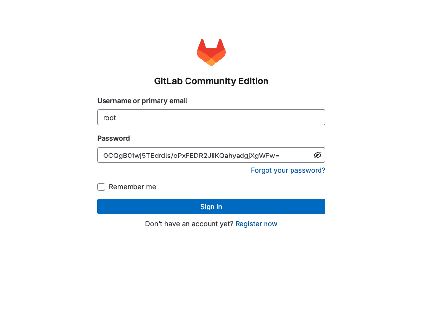

after installing GitLab server, and got root password:


- create user gitlab-admin
    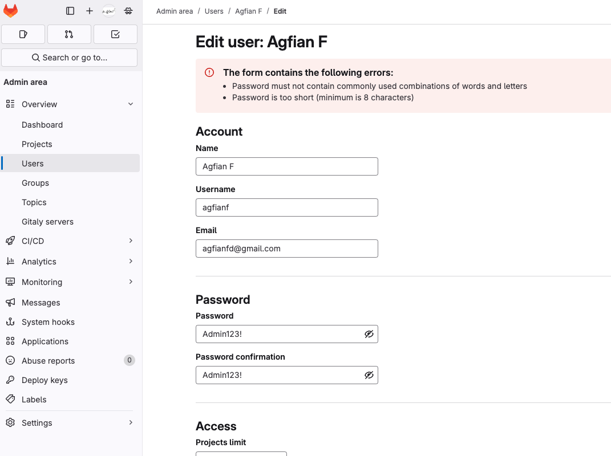

- create project fastapi-app
    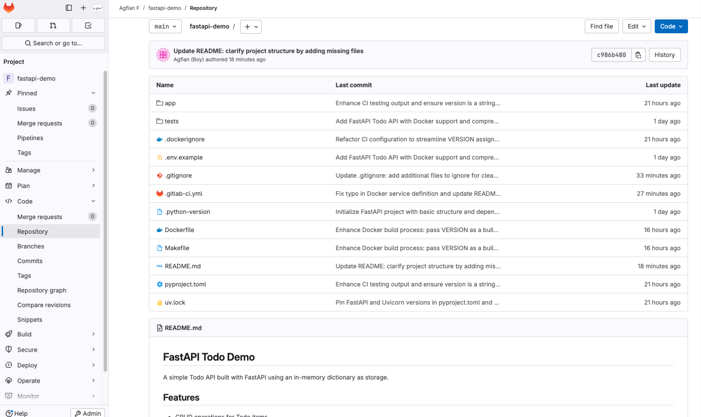

### Setup Gitlab Runner

- create GitLab runner
    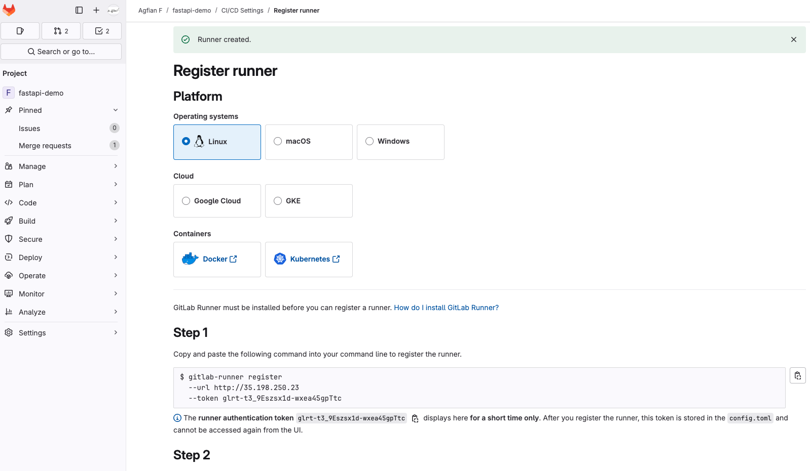

- register GitLab runner
    ```bash title="Register GitLab Runner" linenums="1"
    muhammadagfian96@gitlab-server:~$ cat /home/muhammadagfian96/.gitlab-runner/config.toml 
    concurrent = 1
    check_interval = 0
    connection_max_age = "15m0s"
    shutdown_timeout = 0

    [session_server]
    session_timeout = 1800

    [[runners]]
    name = "gitlab-server"
    url = "http://35.198.250.23"
    id = 1
    token = "glrt-t3_9Eszsx1d-wxea45gpTtc"
    token_obtained_at = 2025-04-14T03:47:50Z
    token_expires_at = 0001-01-01T00:00:00Z
    executor = "docker"
    [runners.cache]
        MaxUploadedArchiveSize = 0
        [runners.cache.s3]
        [runners.cache.gcs]
        [runners.cache.azure]
    [runners.docker]
        tls_verify = false
        image = "python:3.12-slim"
        privileged = false
        disable_entrypoint_overwrite = false
        oom_kill_disable = false
        disable_cache = false
        volumes = ["/var/run/docker.sock:/var/run/docker.sock", "/cache"]
        shm_size = 0
        network_mtu = 0
    ```
- create systemd service
    ```bash title="systemd service" linenums="1"
    sudo nano /etc/systemd/system/gitlab-runner-custom.service
    ```

    ```bash title="systemd service" linenums="1"
    [Unit]
    Description=GitLab Runner Custom
    After=network.target

    [Service]
    ExecStart=/usr/bin/gitlab-runner run --config /home/muhammadagfian96/.gitlab-runner/config.toml
    Restart=always
    User=muhammadagfian96

    [Install]
    WantedBy=multi-user.target
    ```
    to run the service, run the following command:
    ```bash title="systemd service" linenums="1"
    sudo systemctl daemon-reexec
    sudo systemctl daemon-reload
    sudo systemctl enable gitlab-runner-custom
    sudo systemctl start gitlab-runner-custom
    sudo systemctl status gitlab-runner-custom
    ```
    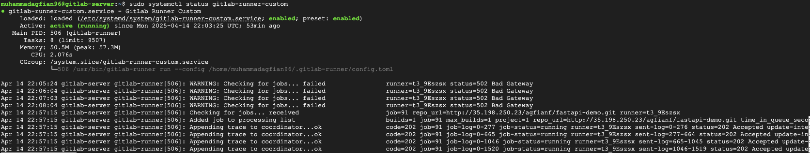
    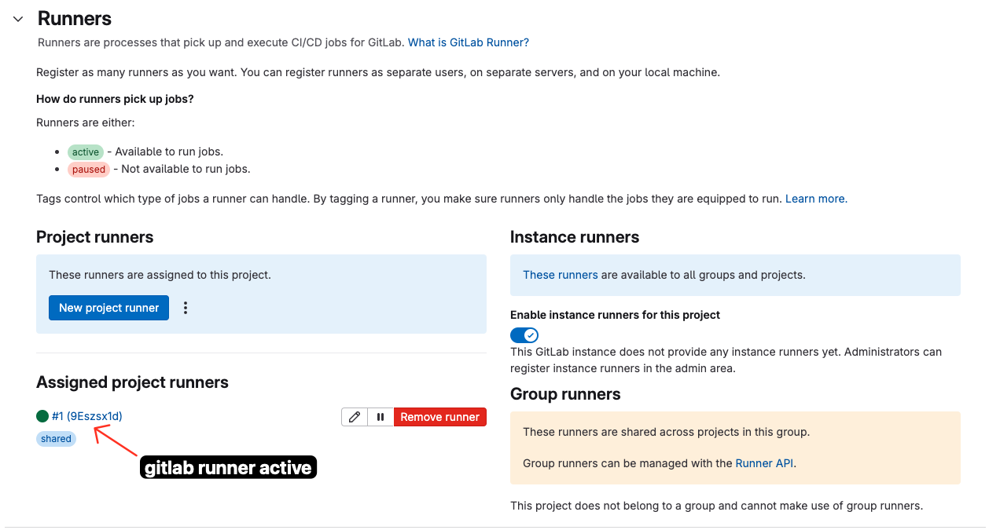


## Create Simple FastAPI App
This is a simple fastapi app that will be deployed to GCP. This fullcode [:fontawesome-brands-square-github: fastapi-todo-demo](https://github.com/agfianf/fastapi-todo-demo)

### Project Structure

```
fastapi-demo/
├── app/
│   └── main.py       # FastAPI application
├── tests/
│   └── test_main.py  # Tests for the API
├── Dockerfile        # Dockerfile for building the image
├── .gitignore
├── .gitlab-ci.yml    # GitLab CI/CD pipeline configuration
├── pyproject.toml    # Project configuration
├── Makefile          # Makefile for build and test commands
└── README.md         # This file
```

### API Endpoints

- `GET /` - Root will redirect to the API documentation `/docs`
- `GET /hostname` - Get the hostname of the server
- `POST /todos` - Create a new todo
- `GET /todos` - List all todos
- `GET /todos/{todo_id}` - Get a specific todo
- `PUT /todos/{todo_id}` - Update a todo
- `DELETE /todos/{todo_id}` - Delete a todo

### Makefile
the Makefile is used to build and test the application. The following are the commands that can be run using the Makefile:
```makefile title="Makefile" linenums="1"

...
# Run tests
test:
	uv run pytest

# Build the Docker image
build:
	docker build --build-arg VERSION=$(VERSION) -t $(IMAGE_NAME):$(VERSION) .

# Login to Docker registry
docker-login:
	@echo "Logging in to Docker registry..."
	@echo "Username is $(DOCKER_USERNAME) and registry is $(DOCKER_REGISTRY)";
	@if [ -z "$(DOCKER_PASSWORD)" ]; then \
		echo "DOCKER_PASSWORD is not set. Please set it in your environment or .env file."; \
		docker login $(DOCKER_REGISTRY) -u $(DOCKER_USERNAME); \
	else \
		echo "$(DOCKER_PASSWORD)" | docker login $(DOCKER_REGISTRY) -u $(DOCKER_USERNAME) --password-stdin; \
	fi

# Tag and push the Docker image to registry
docker-push: docker-login build
	docker tag $(IMAGE_NAME):$(VERSION) $(DOCKER_REGISTRY)/$(DOCKER_USERNAME)/$(IMAGE_NAME):$(VERSION)
	docker push $(DOCKER_REGISTRY)/$(DOCKER_USERNAME)/$(IMAGE_NAME):$(VERSION)
...
```

example to build and push the Docker image to Docker Hub:
```bash title="Build and Push Docker Image" linenums="1"
make docker-login
make build
make docker-push
```

## Run FastAPI App
This is Todo API - Swagger UI:
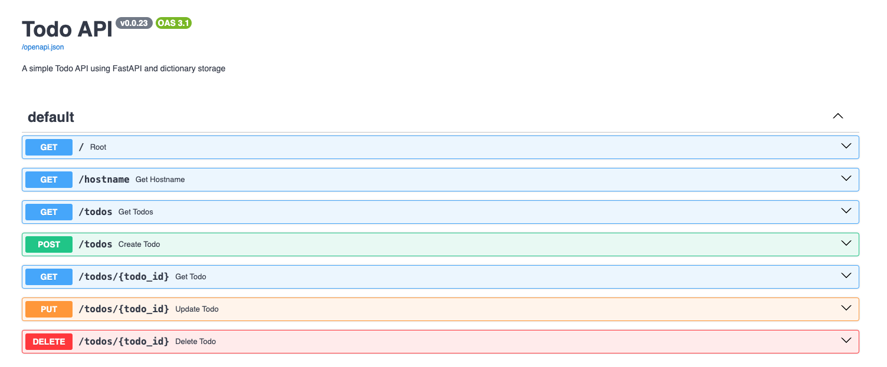


## Create CI/CD Pipeline


### Prepare Your Deployment Server

The following code is the startup script that will be used to install Docker and docker-compose on the GCP VM instance. It will be executed when the VM instance is created. The script will install Docker and docker-compose only and test the Docker installation by running a hello-world container.

??? quote "startup_fastapi.sh"

    ```bash title="startup_fastapi.sh" linenums="1"
    #!/bin/bash

    # Fetch metadata from GCP
    INSTANCE_NAME=$(curl -H "Metadata-Flavor: Google" http://metadata.google.internal/computeMetadata/v1/instance/name)
    INSTANCE_IP=$(curl -H "Metadata-Flavor: Google" http://metadata.google.internal/computeMetadata/v1/instance/network-interfaces/0/access-configs/0/external-ip)
    HOSTNAME=$(hostname)

    echo "[APP] Instance Name: $INSTANCE_NAME"
    echo "[APP] Instance IP: $INSTANCE_IP"
    echo "[APP] Hostname: $HOSTNAME"

    # Update system
    echo "[APP] Updating system packages..."
    apt-get update && apt-get upgrade -y

    # Install prerequisites
    echo "[APP] Installing prerequisites..."
    apt-get install -y apt-transport-https ca-certificates curl software-properties-common gnupg lsb-release

    # install docker
    echo "[APP] Installing Docker..."
    curl -fsSL https://download.docker.com/linux/ubuntu/gpg | sudo gpg --dearmor -o /usr/share/keyrings/docker-archive-keyring.gpg
    echo "deb [arch=$(dpkg --print-architecture) signed-by=/usr/share/keyrings/docker-archive-keyring.gpg] https://download.docker.com/linux/ubuntu \
    $(lsb_release -cs) stable" | sudo tee /etc/apt/sources.list.d/docker.list > /dev/null
    sudo apt-get update
    sudo apt-get install -y docker-ce docker-ce-cli containerd.io

    sudo usermod -aG docker $USER
    sudo chmod 666 /var/run/docker.sock

    # Install Docker Compose
    echo "[APP] Installing Docker Compose..."
    curl -L "https://github.com/docker/compose/releases/latest/download/docker-compose-$(uname -s)-$(uname -m)" -o /usr/local/bin/docker-compose
    chmod +x /usr/local/bin/docker-compose

    # Test Docker with a simple hello-world container
    echo "[APP] Running a test container..."
    docker run --rm hello-world

    # End of script
    ```


### Create Variables
Go to your GitLab project, and then go to `Settings > CI/CD > Variables` and create the following variables:
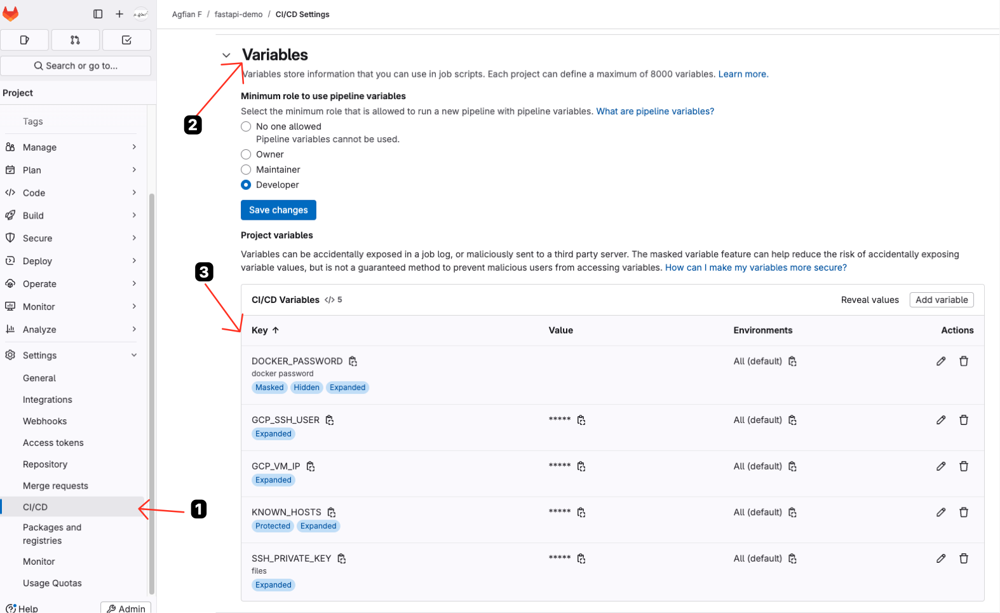

### Create GitLab CI/CD files
The following code is the GitLab CI/CD pipeline that will be used to build and deploy the application.

There are 3 stages in this pipeline:

- **test:**
    
    Test it will triggered when there is a merge request or tags with the name of `v*.*.*`.
    this stage will run by installing the depedency using `uv sync` and run the test using `make test`

- **build:**  
    
    Build the application and create a Docker image triggered when only tags with the name of `v*.*.*`.
    This stage will install make and build the Docker image using `make build` and push the Docker image to Docker Hub using `make docker-push`.

- **deploy:**
    
    Deploy the Docker image to GCP VM instance triggered when only tags with the name of `v*.*.*`.
    This stage will install SSH client and SSH to GCP VM instance using `ssh` command. Then will ssh to GCP VM instance and login to Docker Hub using `docker login` and pull the Docker image from Docker Hub using `docker pull`. After that, it will stop and remove the old container and run the new container using `docker run`.


??? quote ".gitlab-ci.yml"
    The following code is the GitLab CI/CD pipeline that will be used to build and deploy the application.

    ```yaml title=".gitlab-ci.yml" linenums="1"
    stages:
    - test    # stage pengujian code
    - build   # stage build and push image Docker to registry
    - deploy  # stage deployment to GCP VM

    variables:
    IMAGE_NAME: fastapi-todo-demo
    DOCKER_USERNAME: syinx # better to use gitlab-ci variable
    DOCKER_IMAGE: docker.io/$DOCKER_USERNAME/$IMAGE_NAME
    DOCKER_REGISTRY: docker.io
    APP_PORT: 8000

    # Job untuk test
    test:
    stage: test
    image: python:3.12
    tags:
        - shared
    script:
        - VERSION="${CI_COMMIT_TAG:-latest}"  # Menentukan versi, default: latest
        - echo "Version=$VERSION"
        - pip install uv  # Meng-install dependency yang diperlukan
        - uv sync --all-groups --all-extras  # Sinkronisasi dependensi
        - ls -la  # Menampilkan daftar file untuk debugging
        - make test  # Menjalankan unit test
    rules:
        - if: '$CI_PIPELINE_SOURCE == "merge_request_event"'
        when: always
        - if: '$CI_COMMIT_TAG =~ /^v[0-9]+\.[0-9]+\.[0-9]+$/'
        when: always
        - when: never

    # Job untuk build dan push Docker image
    build_and_push:
    stage: build
    image: docker:24.0.5
    tags:
        - shared
    services:
        - docker::24.0.5-dind
    variables:
        DOCKER_TLS_CERTDIR: "/certs"
    before_script:
        - echo "$DOCKER_PASSWORD" | docker login --username $DOCKER_USERNAME --password-stdin
    script:
        - apk add --no-cache make  # Meng-install make jika belum terinstall
        - docker --version  # Mengecek versi docker
        - VERSION="${CI_COMMIT_TAG:-latest}"  # Tentukan versi image
        - export VERSION=$VERSION
        - echo "Version=$VERSION"
        - make build  # Membangun image Docker
        - make docker-push  # Push image ke registry
    rules:
        - if: '$CI_COMMIT_TAG =~ /^v[0-9]+\.[0-9]+\.[0-9]+$/'
        when: always
        - when: never

    # Job untuk deploy ke VM GCP
    deploy_to_gcp:
    stage: deploy
    image: alpine:latest
    tags:
        - shared
    before_script:
        - apk update && apk add openssh-client  # Meng-install SSH client
        - echo "Memulai SSH agent untuk koneksi secure" 
        - eval $(ssh-agent -s)  # Inisiasi SSH agent
        - mkdir -p ~/.ssh
        - chmod 700 ~/.ssh
        - echo "$SSH_PRIVATE_KEY" > ~/.ssh/id_rsa  # Menyimpan private key untuk autentikasi
        - chmod 600 ~/.ssh/id_rsa
        - echo "$KNOWN_HOSTS" >> ~/.ssh/known_hosts  # Menambahkan known hosts agar SSH tahu server tepercaya
        - cat ~/.ssh/known_hosts  # Debug: Tampilkan known hosts
    script:
        - VERSION="${CI_COMMIT_TAG:-latest}"
        - echo "Version=$VERSION"
        - echo "Mulai deployment ke GCP VM dengan IP=$GCP_VM_IP"
        # SSH (Secure Shell) digunakan untuk membuat koneksi yang terenkripsi ke VM,
        # sehingga perintah deployment bisa berjalan dengan aman.
        - |
        ssh -i ~/.ssh/id_rsa -o StrictHostKeyChecking=no $GCP_SSH_USER@$GCP_VM_IP "
            echo 'Pulling latest Docker image...'
            VERSION='${CI_COMMIT_TAG:-latest}'
            echo '$DOCKER_PASSWORD' | docker login -u '$DOCKER_USERNAME' --password-stdin
            docker pull '$DOCKER_IMAGE:$VERSION'
            docker stop '$IMAGE_NAME' || true
            docker rm '$IMAGE_NAME' || true
            docker run -d --name '$IMAGE_NAME' -p 80:'$APP_PORT' '$DOCKER_IMAGE:$VERSION'
            echo 'Deployment selesai di VM http://$GCP_VM_IP:80'
        "
        - echo "Deployment selesai."
    rules:
        - if: '$CI_COMMIT_TAG =~ /^v[0-9]+\.[0-9]+\.[0-9]+$/'
        when: always
        - when: never
    ```


### Result
1. This is the list of history of the pipeline
    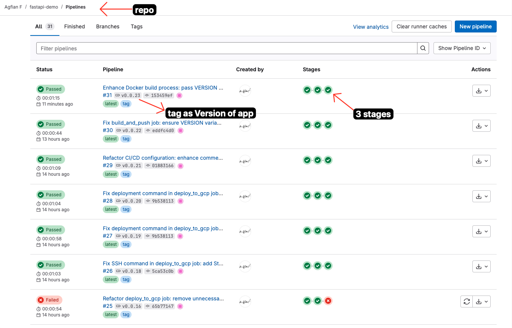
2. This is the detail of the successful pipeline. Showing the stages and jobs that run successfully.
    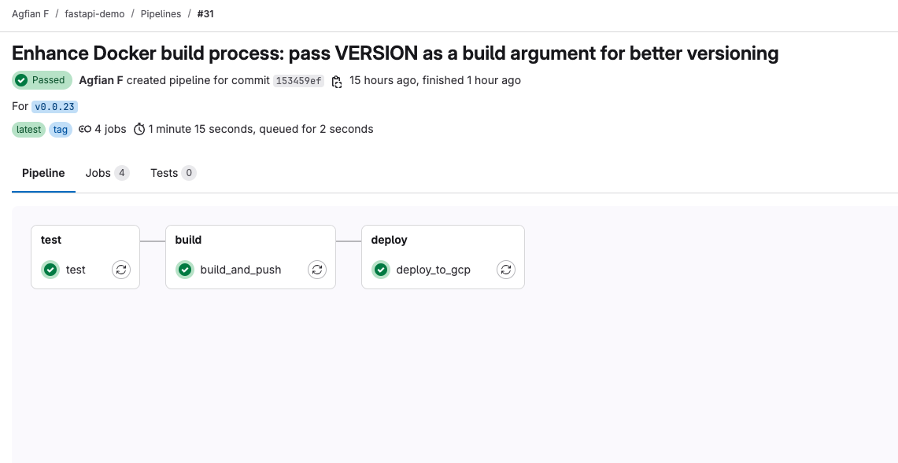
3. This is the detail of the one of the job `deploy_to_gcp`. Showing the SSH connection to GCP VM instance and run the command to pull the Docker image from Docker Hub and run the container.
    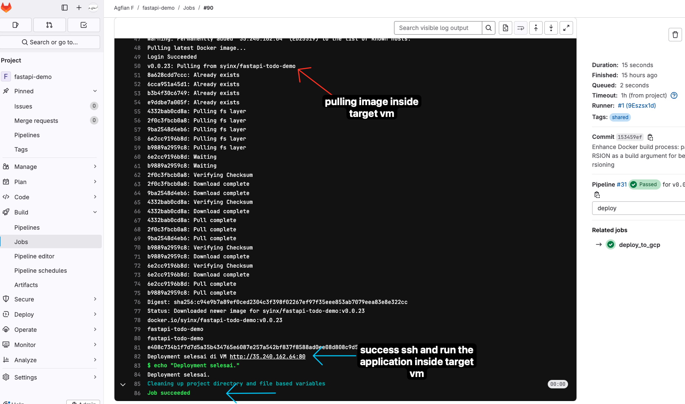

