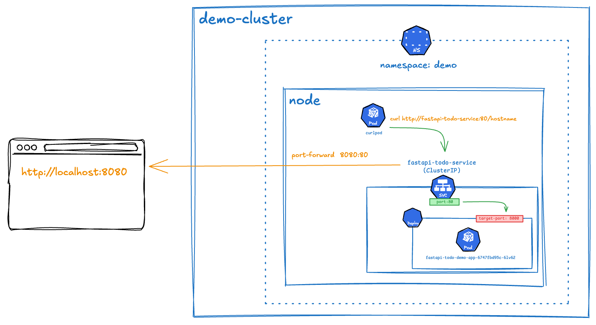
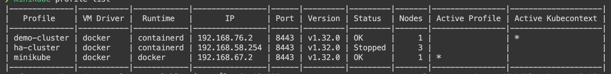
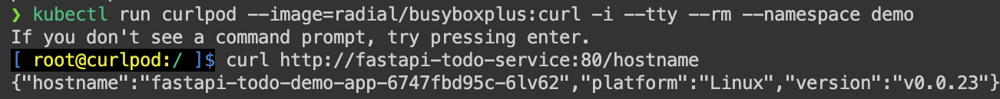
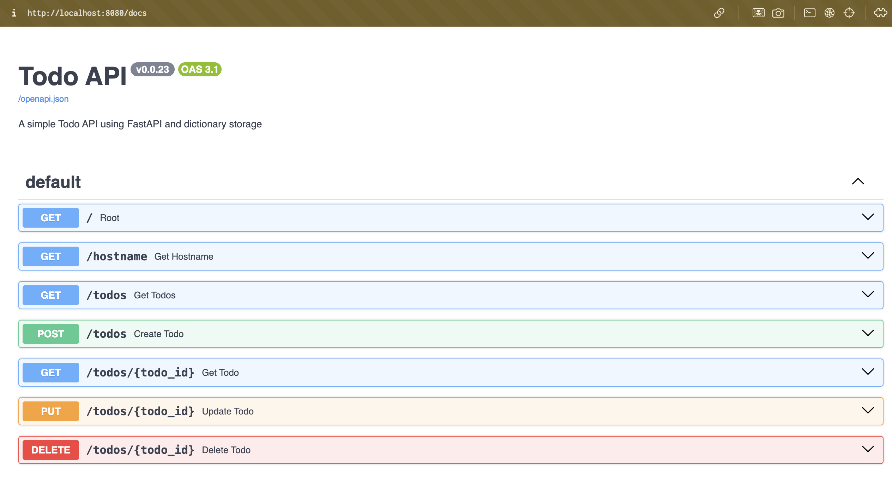
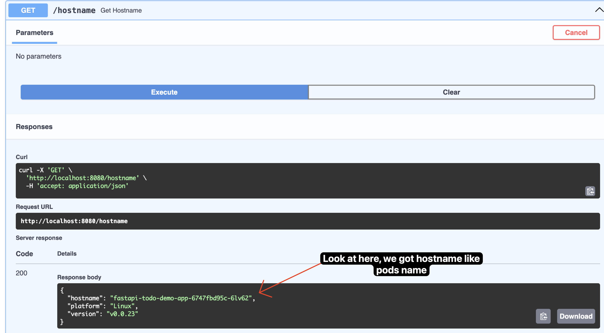

---

draft: false
authors:
  - me
date: 
    created: 2025-04-22
    updated: 2025-04-22
categories:
    - devops
tags:
    - devops
    - fastapi
    - kubernetes
    - deployment
    - docker

comments: true

---

# Hands-on FastAPI Simple Deployment with Kubernetes


Hi! back to my blog, today i will show you how to deploy a simple FastAPI that already pushed to Docker Hub and run it on Kubernetes. So let's get started!

<!-- more -->

## Overview


The diagram illustrates the flow of a request to access a FastAPI application deployed in a Kubernetes cluster using Minikube:

1. **Localhost**: A request is made to `http://localhost:8080` (e.g., via a browser or curl).
2. **Port-Forwarding**: The kubectl port-forward command forwards the request from localhost:8080 to port 80 of the fastapi-todo-service in the demo namespace.
3. **Service** (`fastapi-todo-service`): This Service, of type ClusterIP, listens on port 80 and routes the traffic to the target port 8000 on the Pod.
4. **Pod** (`fastapi-todo-demo-app`): The Pod, named `fastapi-todo-demo-app-6747fbd95c-6lv62`, runs the FastAPI application on port 8000, handling the request.
5. **Namespace** (`demo`): The Service and Pod are isolated within the demo namespace in the demo-cluster Minikube cluster, ensuring separation from other resources.
6. **Minikube Cluster** (`demo-cluster`): The entire setup runs on a Minikube cluster, a single-node Kubernetes environment on your machine.

This flow demonstrates how port-forwarding enables local access to the FastAPI application running inside the Kubernetes cluster.

## Prerequisites

I am using MacOS and using `OrbStack` as my docker engine, you can use Docker Desktop or any other docker engine that you prefer. After that, i will install these tools:

### Installation
#### `minikube`
Minikube is a tool that makes it easy to run Kubernetes locally. Minikube runs a single-node Kubernetes cluster inside a VM on your laptop. But you can run multiple nodes using docker in docker (DinD).

#### `kubectl`
`kubectl` is a command line tool for interacting with Kubernetes clusters. It allows you to run commands for example, to deploy applications, inspect and manage cluster resources, and view logs.

#### `kubens`
`kubens` is a command line utility that allows you to switch between Kubernetes `namespaces` quickly and easily. It is a part of the `kubectl` plugin ecosystem and is designed to work with `kubectl` to make it easier to manage multiple namespaces in a Kubernetes cluster.

for example, if you have multiple namespaces in your Kubernetes cluster, you can use `kubens` to switch between them without having to type the full namespace name each time. This can save you time and reduce the risk of errors when working with multiple namespaces.

!!! warning "Optional" 
    
    **Optional**, kubens simplifies namespace switching.

#### `kubectx`
`kubectx` is a command line utility that allows you to switch between Kubernetes contexts easily. It is also part of the `kubectl` plugin ecosystem and helps manage multiple Kubernetes clusters.

for example, if you have multiple Kubernetes clusters (e.g., a development cluster and a production cluster), you can use `kubectx` to switch between them quickly without having to type the full context name each time. This can save you time and reduce the risk of errors when working with multiple clusters.

!!! warning "Optional" 
    
    **Optional**, kubectx simplifies context switching.

### Application

I have a simple FastAPI application that i will deploy to Kubernetes. The application is a simple REST API that returns a greeting message. You can find the code in this [:fontawesome-brands-square-github: fastapi-todo-demo](https://github.com/agfianf/fastapi-todo-demo)

and i have pushed the image to Docker Hub with the name `syinx/fastapi-todo-demo:v0.0.23`. You can see here [fastapi-todo-demo](https://hub.docker.com/repository/docker/syinx/fastapi-todo-demo/general)


## Create a Kubernetes Cluster

Now we will create a Kubernetes cluster using `minikube`. However this is shortlisted commands.

| Command                                                                                       | Description                                                                                            |
|-----------------------------------------------------------------------------------------------|--------------------------------------------------------------------------------------------------------|
| `minikube profile list`                                                                       | List all minikube profiles.                                                                            |
| `minikube start`                                                                              | Start the default cluster profile (`minikube`).                                                        |
| `minikube start --driver=docker --container-runtime=containerd --profile <name-profile>`      | Start a cluster with a custom profile name using Docker as the driver and containerd as the runtime.   |
| `minikube start --ha --driver=docker --container-runtime=containerd --profile <name-profile>` | Start a cluster with a custom profile name in high availability (HA) mode using Docker and containerd. |
| `minikube status`                                                                             | Check the status of the default cluster.                                                               |
| `minikube status -p <name-profile>`                                                           | Check the status of a cluster with a custom profile name.                                              |
| `minikube stop -p <name-profile>`                                                             | Stop a cluster with a custom profile name.                                                             |
| `minikube delete -p <name-profile>`                                                           | Delete a cluster with a custom profile name.                                                           |
| `minikube logs -p <name-profile>`                                                             | View logs for a cluster with a custom profile name.                                                    |
| `minikube node add <name-node> -p <name-profile>`                                                    | Add a node to a cluster with a custom profile name.                                                     |
| `minikube node delete <name-node> -p <name-profile>`                                               | Delete a node from a cluster with a custom profile name.                                               |
| `minikube node add --control-plane <name-node> -p <name-profile>` | Add a control plane node to a cluster with a custom profile name.                                      |
| `minikube node delete --control-plane <name-node> -p <name-profile>` | Delete a control plane node from a cluster with a custom profile name.                                 |


```bash title="terminal"
minikube start --driver=docker --container-runtime=containerd --profile demo-cluster

# output ---
# 😄  [demo-cluster] minikube v1.35.0 on Darwin 15.4 (arm64)
# ✨  Using the docker driver based on user configuration
# 📌  Using Docker Desktop driver with root privileges
# 👍  Starting "demo-cluster" primary control-plane node in "demo-cluster" cluster
# 🚜  Pulling base image v0.0.46 ...
# 🔥  Creating docker container (CPUs=2, Memory=4000MB) ...
# 📦  Preparing Kubernetes v1.32.0 on containerd 1.7.24 ...
#     ▪ Generating certificates and keys ...
#     ▪ Booting up control plane ...
#     ▪ Configuring RBAC rules ...
# 🔗  Configuring CNI (Container Networking Interface) ...
# 🔎  Verifying Kubernetes components...
#     ▪ Using image gcr.io/k8s-minikube/storage-provisioner:v5
# 🌟  Enabled addons: storage-provisioner, default-storageclass
# 🏄  Done! kubectl is now configured to use "demo-cluster" cluster and "default" namespace by default
```

```bash title="terminal"
minikube profile list
```


///caption
output of `minikube profile list` command shows the list of all minikube profiles. The output shows the name of the profile, the status of the profile, the driver used, and the Kubernetes version and the active profile.
///


```bash title="terminal"
minikube status -p demo-cluster

# output ---
# demo-cluster
# type: Control Plane
# host: Running
# kubelet: Running
# apiserver: Running
# kubeconfig: Configured
```

## Create a Namespace on Your Cluster Profile

Just imagine you have a folder. That's namespace. You can create multiple folders in your home directory. Each folder can contain files and subfolders. Similarly, in Kubernetes, a namespace is a way to organize and manage resources within a cluster. It allows you to create multiple isolated environments within the same cluster, making it easier to manage resources and avoid naming conflicts.

- Create a namespace called `demo` on your cluster profile

    ```bash title="terminal"
    kubectl config use-context demo-cluster # select the cluster profile
    kubectl create namespace demo
    ```
    **or**
    
    ```bash title="terminal"
    kubectx demo-cluster
    # output ---
    # Switched to context "demo-cluster".
    kubectl create namespace demo
    # kubectl create ns demo 
    # The shorthand ns is often used for namespace in kubectl commands
    # output ---
    # namespace/demo created
    ```

- See the list of namespaces

    ```bash title="terminal"
    kubectl get ns
    # output ---
    # NAME              STATUS   AGE
    # default           Active   15m
    # demo              Active   65s
    # kube-node-lease   Active   15m
    # kube-public       Active   15m
    # kube-system       Active   15m
    ```

- Switch to the `demo` namespace using `kubens`

    ```bash title="terminal"
    kubens demo
    # output ---
    # Context "demo-cluster" modified.
    # Active namespace is "demo".
    ```

## Create a Deployment and Service object

### Deployment
Deployment is one of the commonly used in Kubernetes. It is a higher-level abstraction that manages the deployment and scaling of a set of pods. A deployment allows you to define the desired state of your application, such as the number of replicas, the container image to use, and the ports to expose.

```yaml title="fastapi-todo-demo-deployment.yaml" linenums="1"
apiVersion: apps/v1
kind: Deployment
metadata:
  namespace: demo
  name: fastapi-todo-demo-app
  labels:
    app.kubernetes.io/name: fastapi-todo-demo-app
    app.kubernetes.io/instance: fastapi-todo-demo-app
spec:
  selector:
    matchLabels:
      app.kubernetes.io/name: fastapi-todo-demo-app
      app.kubernetes.io/instance: fastapi-todo-demo-app
  template:
    metadata:
      labels:
        app.kubernetes.io/name: fastapi-todo-demo-app
        app.kubernetes.io/instance: fastapi-todo-demo-app
    spec:
      containers:
      - name: fastapi-todo
        image: syinx/fastapi-todo-demo:v0.0.23
        resources:
          limits:
            memory: "128Mi"
            cpu: "500m"
          requests:
            memory: "64Mi"
            cpu: "250m"
        ports:
        - containerPort: 8000

```

??? quote "More Explanation"

    The YAML above defines a `Deployment` object named `fastapi-todo-demo-app` in the `demo` namespace. Here’s a breakdown of each part:

    - **`apiVersion: apps/v1`**  
    Specifies the Kubernetes API version used for this object. For Deployments, `apps/v1` is the standard version, supporting features like pod management and scaling.

    - **`kind: Deployment`**  
    Indicates that this is a Deployment object, which manages a set of pods and ensures they match the desired state.

    - **`metadata`**  
    Contains metadata about the Deployment, such as its name and namespace:
        - `namespace: demo`: Places the Deployment in the `demo` namespace, isolating it from other resources in the cluster.
        - `name: fastapi-todo-demo-app`: Assigns a unique name to the Deployment.
        - `labels`: Key-value pairs (`app.kubernetes.io/name` and `app.kubernetes.io/instance`) used to identify and organize the Deployment. These labels can be used by other Kubernetes objects (e.g., Services) to reference this Deployment.

    - **`spec`**  
    Defines the desired state of the Deployment:
    
        - **`selector`**  
            Specifies which pods this Deployment manages using a label selector:
            - `matchLabels`: Matches pods with the labels `app.kubernetes.io/name: fastapi-todo-demo-app` and `app.kubernetes.io/instance: fastapi-todo-demo-app`. This ensures the Deployment controls only the pods it creates.
        - **`template`**  
            Defines the pod template used to create pods managed by this Deployment:
            - `metadata.labels`: Assigns the same labels (`app.kubernetes.io/name` and `app.kubernetes.io/instance`) to the pods, ensuring they match the `selector`.
            - **`spec`**  
            Describes the pod’s configuration:
            - `containers`: A list of containers to run in each pod. Here, there’s one container:
                - `name: fastapi-todo`: A unique name for the container.
                - `image: syinx/fastapi-todo-demo:v0.0.23`: Specifies the Docker image to use, pulled from Docker Hub.
                - **`resources`**  
                Defines resource requests and limits to control the container’s CPU and memory usage:
                    - `limits`: Caps the maximum resources the container can use (`128Mi` memory and `500m` CPU, where `500m` is half a CPU core).
                    - `requests`: Specifies the minimum resources the container needs (`64Mi` memory and `250m` CPU). Requests help Kubernetes schedule pods efficiently.
                - **`ports`**  
                Lists the ports the container exposes:
                    - `containerPort: 8000`: Indicates the container listens on port 8000, where the FastAPI application runs.


### Service

Service is an object acts as a gateway, enabling network access to a group of pods (containers) within a cluster.


```yaml title="fastapi-todo-demo-service.yaml" linenums="1"
apiVersion: v1
kind: Service
metadata:
  namespace: demo
  name: fastapi-todo-service
spec:
  selector:
    app.kubernetes.io/name: fastapi-todo-demo-app
    app.kubernetes.io/instance: fastapi-todo-demo-app
  ports:
    - protocol: TCP
      port: 80
      targetPort: 8000
  type: ClusterIP
```

??? quote "More Explanation"
   
    The YAML above defines a `Service` object named `fastapi-todo-service` in the `demo` namespace. Here’s a breakdown of each part:

    - **`apiVersion: v1`**  
    Specifies the Kubernetes API version used for this object. For Services, `v1` is the standard version.

    - **`kind: Service`**  
    Indicates that this is a Service object, which provides network access to pods.

    - **`metadata`**  
    Contains metadata about the Service:
        - `namespace: demo`: Places the Service in the `demo` namespace.
        - `name: fastapi-todo-service`: Assigns a unique name to the Service.

    - **`spec`**  
    Defines the desired state of the Service:
        - **`selector`**  
            Specifies which pods this Service targets using a label selector:
            - `app.kubernetes.io/name: fastapi-todo-demo-app` and `app.kubernetes.io/instance: fastapi-todo-demo-app`: Matches pods with these labels, linking the Service to the pods created by the Deployment.
        - **`ports`**  
            Defines the port configuration for the Service:
            - `protocol: TCP`: Specifies that the Service uses the TCP protocol.
            - `port: 80`: The port where the Service is accessible within the cluster.
            - `targetPort: 8000`: The port on the target pods where traffic is forwarded (the FastAPI app listens on port 8000).
        - **`type: ClusterIP`**  
            Specifies the type of Service:
            - `ClusterIP`: The default Service type, assigning a cluster-internal IP address. This makes the Service accessible only within the cluster, ideal for internal communication between pods.
            - Other types (not used here):
                - `NodePort`: Exposes the Service on a static port on each node’s IP, useful for external access during development.
                - `LoadBalancer`: Exposes the Service externally via a cloud provider’s load balancer, common in production cloud environments.
                - `ExternalName`: Maps the Service to an external DNS name without proxying, used for integrating external services.

### Alternative

or, you can combine both YAMLs into a single file (`fastapi-todo-demo.yaml`) and apply them together. **Here i will use this to continue the tutorial.**

```yaml title="fastapi-todo-demo.yaml" linenums="1"
apiVersion: apps/v1
kind: Deployment
metadata:
  namespace: demo
  name: fastapi-todo-demo-app
  labels:
    app.kubernetes.io/name: fastapi-todo-demo-app
    app.kubernetes.io/instance: fastapi-todo-demo-app
spec:
  selector:
    matchLabels:
      app.kubernetes.io/name: fastapi-todo-demo-app
      app.kubernetes.io/instance: fastapi-todo-demo-app
  template:
    metadata:
      labels:
        app.kubernetes.io/name: fastapi-todo-demo-app
        app.kubernetes.io/instance: fastapi-todo-demo-app
    spec:
      containers:
      - name: fastapi-todo
        image: syinx/fastapi-todo-demo:v0.0.23
        resources:
          limits:
            memory: "128Mi"
            cpu: "500m"
          requests:
            memory: "64Mi"
            cpu: "250m"
        ports:
        - containerPort: 8000
---
apiVersion: v1
kind: Service
metadata:
  namespace: demo
  name: fastapi-todo-service
spec:
  selector:
    app.kubernetes.io/name: fastapi-todo-demo-app
    app.kubernetes.io/instance: fastapi-todo-demo-app
  ports:
    - protocol: TCP
      port: 80
      targetPort: 8000
  type: ClusterIP
```

## Apply the Configuration
```bash title="terminal"
kubectl apply -f fastapi-todo-demo.yaml

# output ---
# deployment.apps/fastapi-todo-demo-app created
# service/fastapi-todo-service created
```

or when you have separate YAML files, you can apply them separately:

```bash title="terminal"
kubectl apply -f fastapi-todo-demo-deployment.yaml
kubectl apply -f fastapi-todo-demo-service.yaml
```

## Check the Deployment

```bash title="terminal"
# remember we are already in demo namespace with kubens "demo"
kubectl get pods -owide

# output ---
# NAME                                     READY   STATUS    RESTARTS   AGE   IP           NODE           NOMINATED NODE   READINESS GATES
# fastapi-todo-demo-app-6747fbd95c-6lv62   1/1     Running   0          75s   10.244.0.3   demo-cluster   <none>           <none>
```


## Check the service
```bash title="terminal"
kubectl get services -owide

# output ---
# NAME                   TYPE        CLUSTER-IP       EXTERNAL-IP   PORT(S)   AGE    SELECTOR
# fastapi-todo-service   ClusterIP   10.111.118.189   <none>        80/TCP    2m7s   app.kubernetes.io/instance=fastapi-todo-demo-app,app.kubernetes.io/name=fastapi-todo-demo-app
```

**Verify the deployment and service**

Since the service is of type `ClusterIP`, it is **only accessible from within the cluster**. To verify that the service is working correctly, you can use a temporary pod with curl to access the service. So, basically we create a pod with the same cluster and namespace as the service.

```bash title="terminal"
kubectl run curlpod --image=radial/busyboxplus:curl -i --tty --rm --namespace demo
```

///caption
we curl name of the service `fastapi-todo-service` and the port `80` to access the service. The output shows that the service is working correctly and returning the expected response from the FastAPI application.
///

## Check the logs
```bash title="terminal"
### Check the logs

```bash title="terminal"
kubectl logs fastapi-todo-demo-app-6747fbd95c-6lv62 # remember pod regularly change
# or using label selector
kubectl logs -l app.kubernetes.io/name=fastapi-todo-demo-app 

# output ---
# kubectl logs fastapi-todo-demo-app-6747fbd95c-6lv62
# INFO:     Started server process [1]
# INFO:     Waiting for application startup.
# INFO:     Application startup complete.
# INFO:     Uvicorn running on http://0.0.0.0:8000 (Press CTRL+C to quit)
```

### Check the deployment with `port-forward`

port-forwarding is a way to access a service running in a Kubernetes cluster from your local machine. It allows you to forward traffic from a local port to a port on a pod or service in the cluster.

```bash title="terminal"
kubectl port-forward service/fastapi-todo-service 8080:80

# output ---
# Forwarding from 127.0.0.1:8080 -> 8000
# Forwarding from [::1]:8080 -> 8000
# (running ... don't close this terminal if you want to access the service)
```




## Conclusion

in this blog post, i have shown you how to deploy a simple FastAPI application to Kubernetes using `minikube`. I have also shown you how to create a deployment object and a service object to expose the application. You can use this as a starting point for deploying your own applications to Kubernetes.

!!! question

    Next, how to do auto scaling and load balancing? Stay tuned!

---

*If you have any questions or feedback, please leave a comment below. Thank you for reading!*

## References
- [Kubernetes Service](https://medium.com/@bregman.arie/kubernetes-services-the-practical-guide-8ea8f9b754a2)