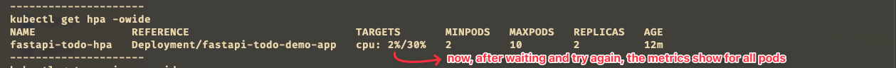

---

draft: false
authors:
  - me
date: 
    created: 2025-05-02
    updated: 2025-05-02
categories:
    - devops
tags:
    - devops
    - fastapi
    - kubernetes
    - deployment
    - docker

comments: true

---

# Hands On Auto Scaling FastAPI with Kubernetes

Hi! Today we will learn how to do auto-scaling with Kubernetes. We will use a FastAPI application as an example.

<!-- more -->
## Overview

**Overview Architecture**


In this project, we have 1 fastapi application and we will deploy it to Kubernetes with deployment object. Then, we create loadbalancer service to expose the application. to access that in local we need to tunnel the service using `minikube tunnel`. After we deploy the application, we will create a Horizontal Pod Autoscaler (HPA) to scale the application based on CPU usage. We will use `locust` to generate load to the application and see how the HPA works.


**Overview FastAPI Application**


```python title="FastAPI one of Endpoint" linenums="1"
...
@app.get("/performance/cpu", tags=["performance"])
def cpu_intensive():
    # Simulasi beban CPU
    n = 1_000_000
    for _ in range(n):
        random.random()
    return {"status": "completed"}
...
```

This endpoint will use to test the CPU usage. This code will generate random number 1 million times. This code will be used to test the CPU usage.


## Resources


- [:fontawesome-brands-square-github: fastapi-todo-demo](https://github.com/agfianf/fastapi-todo-demo) | [:simple-docker: syinx/fastapi-todo-demo](https://hub.docker.com/repository/docker/syinx/fastapi-todo-demo/general)
    
    this repo contains the FastAPI application that we will use in this project. We shiped the image to Docker Hub with the name `syinx/fastapi-todo-demo:v0.0.24`. You can pull the image from Docker Hub and run it locally.

- [:fontawesome-brands-square-github: fastapi-kubernetes/003-hpa-deployment](https://github.com/agfianf/fastapi-kubernetes/tree/main/003-hpa-deployment)
    
    this repo contains the `deployment.yaml` and `hpa.yaml` files for this project.

## Setup Kubernetes on Local Machine

### Active Minikube
First, we need to start minikube and choose our profile and namespace. This is the command to start i use for this section:
```bash title="list commands minikube" linenums="1"
# 01-start-minikube:
minikube start

# 02-list-profile-minikube:
minikube profile list

# 03-set-profile-to-demo-cluster:
# @echo "Creating a new minikube cluster..."
minikube start -p demo-cluster
# @echo "Minikube cluster started."
kubectx demo-cluster
minikube profile list
	
# 04-set-namespace-to-demo:
kubectl get ns
kubens demo
kubectl config view --minify --output 'jsonpath={..namespace}'
```

This is following screenshot result of the commands above:


///caption
we can see we set the profile to `demo-cluster` and set the namespace to `demo`. We see profile list there are 3 profiles: (`demo-cluster`, `ha-cluster`, `minikube`). Then **Active Profile** is sign with `*` and **Active Kubecontext** with `*`.
///


///caption
namespace use is `demo`
///

???+ question "What is **Active Profile** and **Active Kubecontext**?"
    - **Active Profile**: is the profile that is currently active in minikube. This profile will be used to run the minikube cluster.
    - **Active Kubecontext**: is the context that is currently active in kubectl. This context will be used to run the kubectl commands.


### Install Metrics Server for HPA
Before we can use HPA, we need to install metrics server. This is needed to gather and provide resource usage metrics like CPU and Memory Utilization. HPA will use this metrics to scale the application. This is the command to install metrics server:

???+ warning "Warning"
    
    Make sure your profile is active in `demo-cluster` and namespace is `demo`


```bash title="install-metrics-server" linenums="1"
# 06-install:
# echo "Installing metrics server..."
# echo "This may take a few seconds..."
# echo "---------------------"
minikube addons list
minikube addons enable metrics-server
```

Verify by running this command:
```bash title="check-metrics-server" linenums="1"
kubectl get pods -n kube-system | grep metrics
kubectl top nodes
```

You will see the output like this:


///caption
The picture show that **metrics-server is running** and we can see the nodes of the cluser usage for  `CPU (cores): 211m (2% utilization)` and `Memory (bytes): 696Mi (8% utilization)`.
///

???+ warning "If that solution not work, try this"
    

    ```bash title="install-metrics-server" linenums="1"
    # if not installed, run the following command
    # do this if 06-install fails
    # 06.1-install-metrics-server:
    kubectl apply -f https://github.com/kubernetes-sigs/metrics-server/releases/latest/download/components.yaml
    ```
    If you see errors about TLS, edit the deployment and add `--kubelet-insecure-tls` to the container args:

    ```bash
    # spec > template > spec > containers > args. Add:
    # - --kubelet-insecure-tls
    # wait 10-20 seconds and check the metrics server
    # 06.2-edit-container-metrics:
    kubectl -n kube-system edit deployment metrics-server
    ```

    ```yaml title="edit container metrics"
    ...
          labels:
        k8s-app: metrics-server
    spec:
      containers:
      - args:
        - --cert-dir=/tmp
        - --secure-port=10250
        - --kubelet-preferred-address-types=InternalIP,ExternalIP,Hostname
        - --kubelet-use-node-status-port
        - --kubelet-insecure-tls # <-- add this line
        - --metric-resolution=15s
    ...
    ```

    Wait 10-20 seconds, then check metrics again and verify by running this command:
    
    ```bash title="check-metrics-server" linenums="1"
    kubectl get pods -n kube-system | grep metrics
    kubectl top nodes
    ```


### Deploy FastAPI Application

Now, we already set metrics server and we can deploy the FastAPI application. We will use `kubectl apply` to deploy the application via declarative way. We will use `deployment.yaml` and `hpa.yaml` files to deploy the application.

???+ quote "deployment.yaml"

    ```yaml title="003-deployment.yaml" linenums="1"
    apiVersion: apps/v1
    kind: Deployment
    metadata:
      namespace: demo
      name: fastapi-todo-demo-app
      labels:
        app.kubernetes.io/name: fastapi-todo-demo-app
        app.kubernetes.io/instance: fastapi-todo-demo-app
    spec:
      selector:
        matchLabels:
          app.kubernetes.io/name: fastapi-todo-demo-app
          app.kubernetes.io/instance: fastapi-todo-demo-app
      template:
        metadata:
          labels:
            app.kubernetes.io/name: fastapi-todo-demo-app
            app.kubernetes.io/instance: fastapi-todo-demo-app
        spec:
          containers:
          - name: fastapi-todo
            image: syinx/fastapi-todo-demo:v0.0.24
            resources:
              limits: # (1) 1
                memory: "256Mi"
                cpu: "500m"
              requests: # (2) 2
                memory: "128Mi"
                cpu: "250m"
            env:
              - name: VERSION
                value: "hpa-v24"
            ports:
            - containerPort: 8000 # (3) 3

    ---
    apiVersion: v1
    kind: Service
    metadata:
      namespace: demo
      name: fastapi-todo-service
    spec:
      selector:
        app.kubernetes.io/name: fastapi-todo-demo-app
        app.kubernetes.io/instance: fastapi-todo-demo-app
      ports: # (4) 4
        - protocol: TCP
          port: 8123
          targetPort: 8000
      type: LoadBalancer # (5) 5
    ```

    1. `limits` is the maximum resources that the container can use. If the container exceeds this limit, it will be terminated and restarted. Here we set the limit to `256Mi` for memory and `500m` for CPU. This should be more than `requests` value.
    2. `requests` is the minimum resources that the container needs to run. If the container does not have this resources, it will not be scheduled. Here we set the request to `128Mi` for memory and `250m` for CPU. This should be less than `limits` value.
    3. `containerPort` is the port that the container will listen on. Here we set the port to `8000` because FastAPI will run on this port.
    4. `port` is the port that the service will listen on. Here we set the port to `8123` because we want to access the application on this port.
    5. `type: LoadBalancer` is the type of service that we want to create. Here we set the type to `LoadBalancer` because we want to expose the application to the internet. This will create a load balancer in the cloud provider and assign a public IP address to it.

    **Notes:**

    1. `limits` is the maximum resources that the container can use. If the container exceeds this limit, it will be terminated and restarted. Here we set the limit to `256Mi` for memory and `500m` for CPU. This should be more than `requests` value.
    2. `requests` is the minimum resources that the container needs to run. If the container does not have this resources, it will not be scheduled. Here we set the request to `128Mi` for memory and `250m` for CPU. This should be less than `limits` value.
    3. `containerPort` is the port that the container will listen on. Here we set the port to `8000` because FastAPI will run on this port.
    4. `port` is the port that the service will listen on. Here we set the port to `8123` because we want to access the application on this port.
    5. `type: LoadBalancer` is the type of service that we want to create. Here we set the type to `LoadBalancer` because we want to expose the application to the internet. This will create a load balancer in the cloud provider and assign a public IP address to it.


???+ quote "hpa.yaml"

    ```yaml title="003-hpa-deploy-fastapi-app.yaml" linenums="1"
    apiVersion: autoscaling/v2
    kind: HorizontalPodAutoscaler
    metadata:
      name: fastapi-todo-hpa
      namespace: demo
    spec:
      scaleTargetRef: # (1) 1
        apiVersion: apps/v1
        kind: Deployment
        name: fastapi-todo-demo-app
      minReplicas: 2 # (2) 2
      maxReplicas: 10 # (3) 3
      metrics:
        # (4) 4
        # - type: Resource
        #   resource:
        #     name: memory
        #     target:
        #       type: Utilization
        #       averageUtilization: 50
        - type: Resource
          resource: 
            name: cpu
            target:
              type: Utilization
              averageUtilization: 30
      behavior:
        scaleDown: # (5) 5
          stabilizationWindowSeconds: 10
          policies:
          - type: Percent
            value: 100
            periodSeconds: 10
    ```

    1. `scaleTargetRef` is the target that we want to scale. Here we set the target to `fastapi-todo-demo-app` deployment.
    2. `minReplicas` is the minimum number of replicas that we want to run. Here we set the minimum replicas to `2`.
    3. `maxReplicas` is the maximum number of replicas that we want to run. Here we set the maximum replicas to `10`.
    4. `metrics` is the metrics that we want to use to scale the application. Here we set the metrics to `cpu` utilization. We can also use `memory` utilization by uncommenting the code and if we do that, the HPA will scale the application based on memory usage **and** CPU usage.
    5. `behavior` is the behavior of the HPA when scaling down. Here we set the stabilization window to `10` seconds and the policy to `100%` of the replicas. This means that if the HPA wants to scale down, it will wait for `10` seconds before scaling down and it will scale down `100%` of the replicas.

    **Notes**

    1. `scaleTargetRef` is the target that we want to scale. Here we set the target to `fastapi-todo-demo-app` deployment.
    2. `minReplicas` is the minimum number of replicas that we want to run. Here we set the minimum replicas to `2`.
    3. `maxReplicas` is the maximum number of replicas that we want to run. Here we set the maximum replicas to `10`.
    4. `metrics` is the metrics that we want to use to scale the application. Here we set the metrics to `cpu` utilization. We can also use `memory` utilization by uncommenting the code and if we do that, the HPA will scale the application based on memory usage **and** CPU usage.
    5. `behavior` is the behavior of the HPA when scaling down. Here we set the stabilization window to `10` seconds and the policy to `100%` of the replicas. This means that if the HPA wants to scale down, it will wait for `10` seconds before scaling down and it will scale down `100%` of the replicas.

For running that, we need to run this command:

```bash title="deploy-fastapi-app" linenums="1"
# deployment ------
kubectl apply -f 003-deployment.yaml
kubectl apply -f 003-hpa-deploy-fastapi-app.yaml
```

## Check Running the Application
This section only check the application is running and the service is created. We can check the deployment and service by running this command:

```bash title="check-deployment" linenums="1"
kubectl get pods -owide

kubectl get hpa -owide

kubectl get services -owide

kubectl top pod

kubectl top nodes
```

The output will look like this:




## Tunneling the Service
To access the service, we need to tunnel the service using `minikube tunnel`. This will create a load balancer in the cloud provider and assign a public IP address to it. The command and result can see below (in screenshot):

1. Tunnelling the service

2. curl the service via localhost:


## Test Auto Scaling
The service already running and we can access the service via `localhost:8123`. Now we can test the auto scaling using `locust`. We will use `locust` to generate load to the application and see how the HPA works. We will use `locust` to generate load to the application and see how the HPA works. We will use `locust` to generate load to the application and see how the HPA works.

??? quote "locustfile.py"
    
    ```python title="locustfile.py" linenums="1"
    from locust import HttpUser, between, task


    class LoadTest(HttpUser):
        wait_time = between(1, 3)

        @task(1)
        def test_root(self):
            self.client.get("/system/hostname")

        @task(2)
        def test_cpu(self):
            self.client.get("/performance/cpu")

        # @task(1)
        # def test_memory(self):
        #     self.client.get("/performance/memory")
    ```

    to run the locust, we need to run this command:

    ```bash title="run-locust" linenums="1"
    # This command runs a load test using Locust against your FastAPI app.
    # -f locustfile.py: Specifies the locust test file.
    # --host http://localhost:8123: Sets the target host (your FastAPI service).
    # --users 5: Simulates 5 concurrent users.
    # --spawn-rate 10: Spawns users at a rate of 10 per second.
    # --run-time 1m: Runs the test for 1 minute.
    # --headless: Runs Locust in the terminal (no web UI).
    uv run locust -f locustfile.py \
    --host http://localhost:8123 \
    --users 50 \
    --spawn-rate 10 \
    --run-time 2m \
    --headless
    ```

Here my setup for watching the HPA. I have 4-5 terminal windows:

1. `Terminal 1`: watching the pods and update every 1 second
2. `Terminal 2`: watching the hpa and update every 1 second
3. `Terminal 3`: tunneling the service
4. `Terminal 4`: running locust
5. `Terminal 5`: watching kubctl top pods and update every 1 second

Here the screenshot of the setup:

///caption
this is the setup for watching the HPA. Sorry for the background!
///


This is live demo of demo i upload to my youtube channel. You can watch the video below:

<p style="text-align:center">
  <iframe width="640" height="380" src="https://www.youtube.com/embed/GC9pNG4daGQ?si=EDun35zS_Ft43O1F" title="Video FastAPI X Kubernetes AutoScaling" frameborder="0" allow="accelerometer; autoplay; clipboard-write; encrypted-media; gyroscope; picture-in-picture; web-share" referrerpolicy="strict-origin-when-cross-origin" allowfullscreen></iframe>
</p>
[https://www.youtube.com/watch?v=GC9pNG4daGQ](https://www.youtube.com/watch?v=GC9pNG4daGQ)

For short, this is the timeline of the video:

- 1:44 pods already scale up
- 3:45 pods already scale down


///caption
just in case the video not work, this is the gif of the video.
///

**Scale Up**


**Scale Down**


## Stop the Application
Alright! We already test the auto scaling and we can stop the application. We can stop the application by running this command:


## Conclusion
In this project, we have learned how to deploy FastAPI application to Kubernetes and how to use HPA to scale the application based on CPU usage. We also learned how to use `locust` to generate load to the application and see how the HPA works. This is a simple project but it is very useful for learning Kubernetes and HPA.

Thanks for reading!