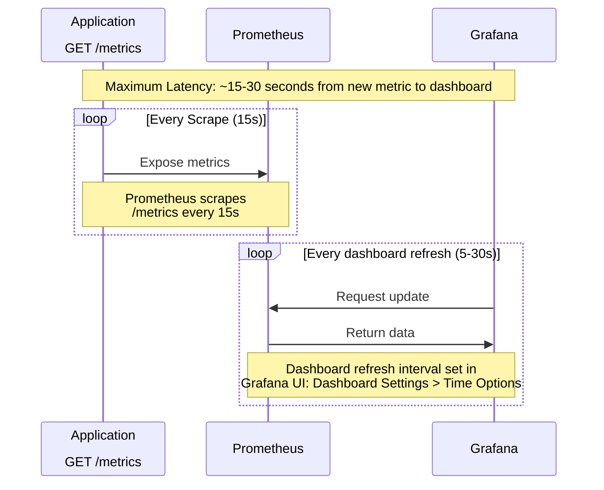
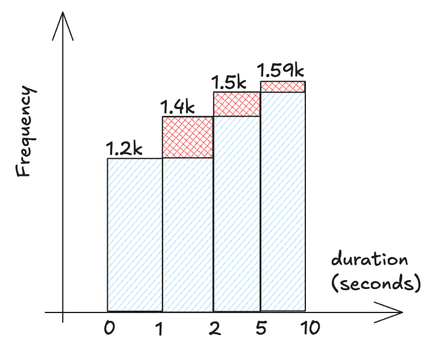
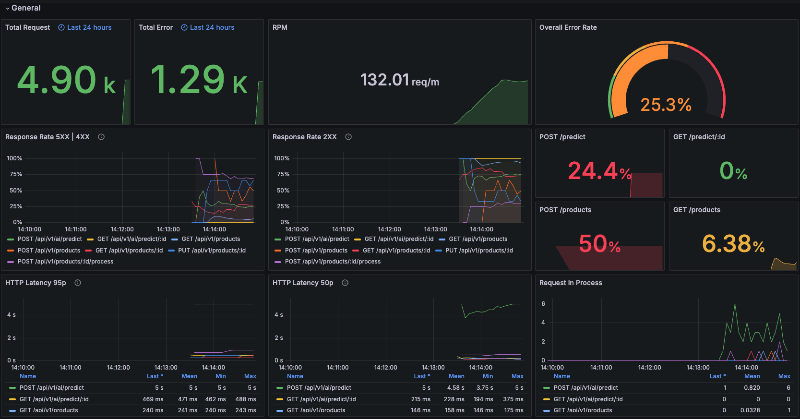
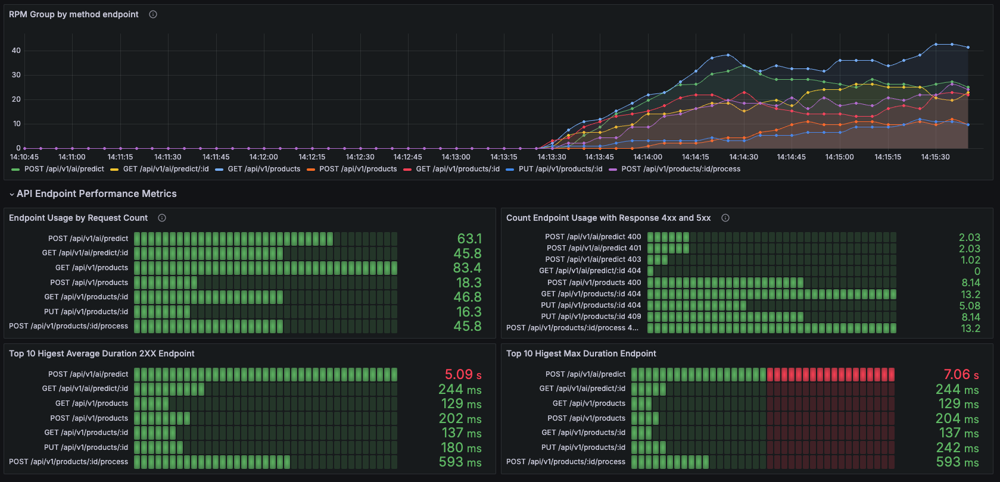

---

draft: true 
date: 
    created: 2025-02-19
    updated: 2025-02-21
categories:
    - fastapi
tags:
    - fastapi
    - prometheus
    - grafana

comments: true

---

# Instrumenting the application with RED metrics.

!!! info "TLDR;"

    _RED Metrics is a set of metrics used to monitor the performance of applications/services, focusing on user experience. Not for measuring resource usage like CPU, memory, or disk utilization._

## Introduction

I often build PoC AI application using FastAPI and not yet think too much about the performance of the application. You know at that stage we just hope it works. Until finally we release it to some users, all sorts of problems pop up and we struggle to figure out whtas going wrong. Is it because of resource bottleneck? How many times the endpoint is hit until it reaches the bottleneck? Or is there something wrong with our code? This makes it difficult to control because we don't know what is the problem.

One way to control the performance of the application is to measure the performance of the application. As my teacher said, _"If we can't measure it, we can't manage it"_

There are many ways to measure the performance of our application, one of them is by using RED Metrics.

<!-- more -->

## What is RED Metrics?

RED metrics provide a user-centric view of your application's performance. The acronym RED stands for:

- **R**ate: How many requests your application is receiving per unit of time (Request Rate).
- **E**rrors: How many of those requests are failing (Failed Requests).
- **D**uration: How long it takes to process a request (Latency).

!!! quote "Quote"
    _"The RED Method is a **good proxy to how happy your customers** will be. If you’ve got a high error rate, that’s basically going through to your users and they’re getting page load errors. If you’ve got a high duration, your website is slow. So these are really good metrics for building meaningful alerts and measuring your SLA”_

    - **Tom Wilkie - Grafana Labs**

Unlike metrics that focus on CPU, memory, or disk usage, RED metrics are all about the user experience. They help you understand how your application is performing from the user's perspective, which is crucial for ensuring a smooth and reliable experience.

## What is the Benefit of RED Metrics?

it help us to monitoring our application health. Generally, monitoring is important to detect early issues, analyze and can be used to make decisions e.g. scaling up or down, error handling, etc. Have monitoring is a highly recommended.

## How it Works?

Prometheus and Grafana are two popular open-source tools used for monitoring and visualization. They work together to provide a comprehensive monitoring solution. This system has 3 main components:

- **Application**: The application exposes metrics at the `/metrics` endpoint.
- **Prometheus**: A time series database that scrapes the `/metrics` endpoint every 15 seconds (default, yeah you can configure it but will come with some trade off).
- **Grafana**: A visualization tool that queries Prometheus and displays the metrics on a dashboard. You can build type of graph/chart you want.




For short, the service expose endpoint `GET /metrics` and prometheus side will have configuration to scrape the endpoint every 15 seconds, and then grafana will query the prometheus every 5-30 seconds and you can see the metrics on the grafana dashboard.

??? abstract "More Details"
    ### Sequence Diagram

    ```mermaid
    sequenceDiagram
        participant App as Application<br><br>GET /metrics
        participant Scr as Prometheus<br><br>Scraper
        participant TSDB as Prometheus<br><br>TimeSeriesDB
        participant PE as Prometheus<br><br>PromQL Engine
        participant DS as Grafana<br><br>Datasource
        participant QP as Grafana<br><br>Query Panel
        participant U as Grafana<br><br>Dashboard

        Note over App,U: Maximum Latency: ~15-30 seconds from new metric to dashboard
        
        loop Every Scrape (15s)
            App->>Scr: Expose metrics
            Note over App,Scr: Prometheus scrapes <br>/metrics every 15s
            Note over App,Scr: Config:<br>prometheus.yml (scrape_interval)
            
            Scr->>TSDB: Store metrics
            Note over Scr,TSDB: Stores as time series<br> with timestamps & labels
        end
        
        loop Every dashboard refresh (5-30s)
            QP->>DS: Request update
            DS->>PE: Send PromQL query
            PE->>TSDB: Fetch data
            TSDB-->>PE: Return time series
            PE-->>DS: Return processed data
            DS-->>QP: Return formatted data
            QP-->>U: Update visualization
            Note over QP,U: Dashboard refresh interval set in<br>Grafana UI: Dashboard Settings > Time Options
        end
    ```

    ### Understanding Prometheus and Grafana Metrics Flow

    The sequence diagram above illustrates how metrics data flows from your application to the end user's Grafana dashboard. Here's a detailed explanation of each component and process:

    #### Core Components

    - Application /metrics: Your application exposes metrics in Prometheus format at the /metrics endpoint
    - Prometheus: Acts as a time series database and collection service
    - Grafana: Visualization platform that queries Prometheus and displays metrics
    #### Data Flow Process

    - Metrics Collection (Scraping):

        - Prometheus scrapes /metrics endpoint every 15 seconds (default)
        - This interval is configurable in `prometheus.yml`:

            ```yaml
            global:
                scrape_interval: 15s
            ```

    - Data Storage:

        - Scraped metrics are stored in Prometheus's TimeSeriesDB
        - Data includes timestamps and labels for efficient querying

    - Dashboard Updates:

        - Grafana periodically requests updates based on dashboard refresh settings
        - Refresh interval (5-30s) can be configured in:
            - Dashboard Settings > Time Options > Refresh
        - Each refresh triggers new PromQL queries to Prometheus

    ## Important Timing Considerations

    - New metrics take 15-30 seconds maximum to appear on dashboards
    - This latency comes from:
        - Waiting for next scrape cycle (up to 15s)
        - Dashboard refresh interval (5-30s)

    ## Configuration Tips

    - For Development/Testing:
        
        ```yaml
        # prometheus.yml
        global:
        scrape_interval: 5s  # Faster updates, more resource intensive
        ```

    - For Production:
        
        ```yaml
        # prometheus.yml
        global:
        scrape_interval: 15s  # Default, good balance
        ```

    - Grafana Dashboard:

        - Set refresh to match your monitoring needs:
            - Real-time monitoring: 5s
            - General metrics: 30s
            - Resource usage: 1m+

    This setup provides a robust monitoring pipeline while allowing flexibility in configuration based on specific needs.

## How to Implement RED Metrics on FastAPI?

#### ⤷ Install the Required Libraries

```text
fastapi==0.115.8
prometheus-client==0.21.1
uvicorn==0.34.0
```

#### ⤷ Create the RED Metrics helper middleware

for the sake of simplicity, i will only show the important part i explain. We will use `prometheus_client` to expose the metrics, and `fastapi.middleware` to create a middleware.

=== "Intro Prometheus Client"

    in `prometheus_client` we have 3 main tools to collect the metrics:

    - **Counter**: 
        - A counter is a cumulative metric that represents a single numerical value that **only ever goes up**. It can be reset to zero on restart.
        - Use a Counter to count requests, errors, or any other event that should only increase.

    - **Histogram**:
        - A histogram samples observations (usually things like request durations or response sizes) and counts them in configurable buckets.
        - Use a Histogram to measure the duration of requests, response sizes, etc.
        - The histogram is a powerful tool for measuring the distribution of values. 

        ??? example "Example Case"
            - For example case measure the duration of requests. We can set of buckets to measure the duration of requests and can set for example:

            { width="300" align="right"}

            - The buckets set like this:

            | Bucket      | Description                                   |
            |-------------|-----------------------------------------------|
            | ≤ 1 second  | Very Fast (requests completed in 1 second or less) |
            | ≤ 2 seconds | Fast (requests completed in 2 seconds or less)      |
            | ≤ 5 seconds | Moderate (requests completed in 5 seconds or less)   |
            | ≤ 10 seconds| Slow (requests completed in 10 seconds or less)     |   
            
            - Example case request:

            | Request | Duration (seconds) |
            |---------|-------------------|
            | A       | 0.8              |
            | B       | 1.5              |
            | C       | 1.7              |
            | D       | 2.5              |
            | E       | 7.5              |

            - So the prometheus will make the buckets like this:

            | Bucket      | Count | Requests       |
            |-------------|-------|----------------|
            | ≤ 1 second  | 1     | A             |
            | ≤ 2 seconds | 3     | A, B, C       |
            | ≤ 5 seconds | 4     | A, B, C, D    |
            | ≤ 10 seconds| 5     | A, B, C, D, E |     

    - **Gauge**:
        - A gauge is a metric that represents a single numerical value that **can arbitrarily go up and down**.
        - Use a Gauge to measure the number of active requests, memory usage, cpu usage, etc. 


=== "Define the metrics"

    ```python
    # middleware_metrics.py

    from prometheus_client import Counter, Histogram, Gauge

    REQUEST_COUNTER = Counter(
        name="http_requests_total", # (1)
        documentation="Total count of HTTP requests", # (2)
        labelnames=["method", "status_code", "path", "service"], # (3)
    )

    REQUEST_LATENCY = Histogram(
        name="http_request_duration_seconds",
        documentation="HTTP request latency in seconds",
        labelnames=["method", "status_code", "path", "service"],
        buckets=( # (4)
            # Set this based on your SLA
            # If your SLA is 99.9% requests under 300ms
            # Excellent
            0.005, 0.01, 0.025, 0.05, 0.075,
            # Good
            0.1, 0.25,
            # Moderate
            0.5, 0.75,
            # Poor
            1.0, 2.5, 5.0, INF,
        ),
    )

    ERROR_COUNTER = Counter(
        name="http_errors_total",
        documentation="Total count of HTTP errors (4xx-5xx)",
        labelnames=["method", "status_code", "path", "service"],
    )

    ACTIVE_REQUESTS = Gauge(
        name="http_requests_active",
        documentation="Number of currently active HTTP requests",
        labelnames=["method", "endpoint", "service"],
    )
    ```

    1. `name`: This is like naming a variable. We can use this name to `query` the metric in Prometheus or Grafana.
    2. `ddocumentation`: This is a description of the metric. It tells us what the metric is about.
    3. `labelnames`: These are like tags that help group your data. <br>For example, we can group the data by `method` (GET, POST, etc.), `status_code` (200, 404, etc.), `path` (/api/v1/users), and `service` (user-service).
    4. `buckets`: This is a list of buckets for the histogram. Each bucket represents a range of values. For example, if we set a bucket of 0.1, it means that any request that takes less than 0.1 seconds will be counted in that bucket.

=== "Create the middleware"

    ```python
    # middleware_metrics.py
    ...
    import time
    from collections.abc import Callable
    from fastapi import Request, Response
    from starlette.middleware.base import BaseHTTPMiddleware
    ...

    class PrometheusMetricsMiddleware(BaseHTTPMiddleware):
        ...
    
        async def dispatch(self, request: Request, call_next: Callable) -> Response:

            start_time = time.perf_counter() # (1)
        
            path = request.url.path
            method = request.method
            service_name = self.service_name

            ACTIVE_REQUESTS.labels(
                method=method,
                path=path,
                service=service_name,
            ).inc() # (5)

            response = await call_next(request) # API call here ...
            status_code = response.status_code

            ACTIVE_REQUESTS.labels(
                method=method,
                path=path,
                service=service_name,
            ).dec() # (6)

            if status_code >= 400:
                ERROR_COUNTER.labels(
                    method=method,
                    status_code=500,
                    path=path,
                    service=service_name,
                ).inc() # (2)
            
            REQUEST_COUNTER.labels(
                method=method,
                status_code=status_code,
                path=path,
                service=service_name,
            ).inc() # (3)


            duration = time.perf_counter() - start_time
            REQUEST_LATENCY.labels(
                method=method,
                status_code=status_code,
                path=path,
                service=service_name,
            ).observe(duration) # (4)

    ...
    ```

    1. Start the timer for calculating the duration.
    2. If the status code is >= 400, increment the error counter. Remember `Counter` only goes up.
    3. Increment the request counter.
    4. Add the duration to the histogram.
    5. Increment the active requests. Remember `Gauge` can go up and down.
    6. Decrement the active requests because request already finish. Remember `Gauge` can go up and down.


#### ⤷ Integrate the middleware to FastAPI

=== "metrics expose"

    ```python
    # middleware_metrics.py
    ...
    from fastapi import FastAPI, Request, Response
    from prometheus_client import generate_latest, CONTENT_TYPE_LATEST

    ...

    def expose_metrics_endpoint() -> Response:
        return Response(
            content=generate_latest(),
            media_type=CONTENT_TYPE_LATEST,
        )
    ```


=== "main.py"

    ```python
    from middleware_metrics import PrometheusMetricsMiddleware, expose_metrics_endpoint

    ...
    app = FastAPI(
        title="FastAPI RED Metrics",
        version="v0.0.1-local",
    )

    ...

    # Add routes
    app.include_router(route_example)

    # Add metrics endpoint
    app.add_middleware(middleware_class=PrometheusMetricsMiddleware)
    app.add_api_route(
        "/metrics",
        expose_metrics_endpoint,
        methods=["GET"],
        include_in_schema=False,
    )


    if __name__ == "__main__":
        import uvicorn

        print("running app")
        uvicorn.run(
            "main:app",
            host="0.0.0.0",
            port=8000,
            reload=True,  # set to False for production
        )
    ```

Run the Application:

```bash
python main.py
```

in case it looks too complicated, here is the full code:

??? quote "middleware_metrics.py"

    ```python
    import time
    from collections.abc import Callable

    from fastapi import Request, Response
    from prometheus_client import (
        CONTENT_TYPE_LATEST,
        Counter,
        Gauge,
        Histogram,
        generate_latest,
    )
    from prometheus_client.utils import INF
    from starlette.middleware.base import BaseHTTPMiddleware

    REQUEST_COUNTER = Counter(
        name="http_requests_total",
        documentation="Total count of HTTP requests",
        labelnames=["method", "status_code", "path", "service"],
    )

    # fmt: off
    REQUEST_LATENCY = Histogram(
        name="http_request_duration_seconds",
        documentation="HTTP request latency in seconds",
        labelnames=["method", "status_code", "path", "service"],
        buckets=(
            0.005, # 5ms
            0.01,  # 10ms
            0.025, # 25ms
            0.05,  # 50ms
            0.075, # 75ms
            0.1,   # 100ms
            0.25,  # 250ms
            0.5,   # 500ms
            0.75,  # 750ms
            1.0,   # 1s
            2.5,   # 2.5s
            5.0,   # 5s
            INF,
        ),
    )
    # fmt: on

    ERROR_COUNTER = Counter(
        name="http_errors_total",
        documentation="Total count of HTTP errors (4xx-5xx)",
        labelnames=["method", "status_code", "path", "service"],
    )

    ACTIVE_REQUESTS = Gauge(
        name="http_requests_active",
        documentation="Number of currently active HTTP requests",
        labelnames=["method", "path", "service"],
    )


    class PrometheusMetricsMiddleware(BaseHTTPMiddleware):
        async def dispatch(self, request: Request, call_next: Callable) -> Response:
            method = request.method
            path = request.url.path
            service_name = "fastapi_app"

            ACTIVE_REQUESTS.labels(
                method=method,
                path=path,
                service=service_name,
            ).inc()

            start_time = time.perf_counter()

            response = await call_next(request)

            duration = time.perf_counter() - start_time
            status_code = response.status_code

            REQUEST_COUNTER.labels(
                method=method,
                status_code=status_code,
                path=path,
                service=service_name,
            ).inc()

            REQUEST_LATENCY.labels(
                method=method,
                status_code=status_code,
                path=path,
                service=service_name,
            ).observe(duration)

            if status_code >= 400:
                ERROR_COUNTER.labels(
                    method=method,
                    status_code=status_code,
                    path=path,
                    service=service_name,
                ).inc()

            ACTIVE_REQUESTS.labels(
                method=method,
                path=path,
                service=service_name,
            ).dec()


    async def expose_metrics_path(request: Request) -> Response:
        return Response(
            generate_latest(),
            media_type=CONTENT_TYPE_LATEST,
        )
    ```

??? quote "main.py"

    ```python
    from fastapi import FastAPI
    from starlette.middleware.cors import CORSMiddleware

    from middleware_metrics import (
        PrometheusMetricsMiddleware,
        expose_metrics_path,
    )

    app = FastAPI(
        title="FastAPI RED Metrics",
        version="v0.0.1-local",
    )

    app.add_middleware(
        CORSMiddleware,
        allow_origins=["*"],
        allow_credentials=True,
        allow_methods=["*"],
        allow_headers=["*"],
    )

    app.add_middleware(PrometheusMetricsMiddleware)
    app.add_api_route(
        "/metrics",
        expose_metrics_path,
        methods=["GET"],
        include_in_schema=False,
    )

    if __name__ == "__main__":
        import uvicorn

        print("running app")
        uvicorn.run(
            "main:app",
            host="0.0.0.0",
            port=8000,
            reload=True,  # set to False for production
        )

    ```

#### ⤷ Sample Output `GET /metrics`

setiap kali kita panggil `GET /metrics` kita akan mendapatkan output seperti ini:
Every time we call `GET /metrics` we will get an output like this:

The output structure is like this:

```bash
# HELP <metric_name> <description>
# TYPE <metric_name> <type>
[nama_metric]{label1="value", label2="value", …} value
```

- `# HELP` is a description of about the metric. It tells us what the metric is about.
- `# TYPE` is the type of the metric. Metric type can be `counter`, `gauge`, `histogram`, or `summary`.

for example

```bash
# HELP http_requests_total Total count of HTTP requests
# TYPE http_requests_total counter
```

dan format

```
[nama_metric]{label1="value", label2="value", …} value
```

`http_requests_total{endpoint="/api/v1/products/:id",method="GET",service="fastapi-app--local",status_code="200"} 3.0`

- `http_requests_total` -> nama metric
- `endpoint`, `method`, `service`, `status_code` -> label
- `3.0` -> value

so, Total count of HTTP requests with endpoint `/api/v1/products/:id`, method `GET`, service `fastapi-app--local`, status code `200` is `3.0`

dalam artikel ini, kita menggunakan 3 tipe metric: Counter, Histogram, dan Gauge.

??? example "Sample Output"

    === "Counter"

        ```bash
        # HELP http_requests_total Total count of HTTP requests
        # TYPE http_requests_total counter
        http_requests_total{endpoint="/api/v1/products/:id",method="GET",service="fastapi-app--local",status_code="200"} 3.0
        http_requests_total{endpoint="/api/v1/products",method="GET",service="fastapi-app--local",status_code="200"} 6.0
        http_requests_total{endpoint="/api/v1/ai/predict",method="POST",service="fastapi-app--local",status_code="200"} 3.0
        http_requests_total{endpoint="/api/v1/products/:id/process",method="POST",service="fastapi-app--local",status_code="504"} 1.0
        ```

    === "Histogram"

        ```bash
        # HELP http_request_duration_seconds HTTP request latency in seconds
        # TYPE http_request_duration_seconds histogram
        ...
        http_request_duration_seconds_bucket{endpoint="/api/v1/ai/predict/:id",le="0.005",method="GET",service="fastapi-app--local",status_code="200"} 0.0
        http_request_duration_seconds_bucket{endpoint="/api/v1/ai/predict/:id",le="0.01",method="GET",service="fastapi-app--local",status_code="200"} 0.0
        http_request_duration_seconds_bucket{endpoint="/api/v1/ai/predict/:id",le="0.025",method="GET",service="fastapi-app--local",status_code="200"} 0.0
        http_request_duration_seconds_bucket{endpoint="/api/v1/ai/predict/:id",le="0.05",method="GET",service="fastapi-app--local",status_code="200"} 0.0
        http_request_duration_seconds_bucket{endpoint="/api/v1/ai/predict/:id",le="0.075",method="GET",service="fastapi-app--local",status_code="200"} 0.0
        http_request_duration_seconds_bucket{endpoint="/api/v1/ai/predict/:id",le="0.1",method="GET",service="fastapi-app--local",status_code="200"} 0.0
        http_request_duration_seconds_bucket{endpoint="/api/v1/ai/predict/:id",le="0.25",method="GET",service="fastapi-app--local",status_code="200"} 2.0
        http_request_duration_seconds_bucket{endpoint="/api/v1/ai/predict/:id",le="0.5",method="GET",service="fastapi-app--local",status_code="200"} 3.0
        http_request_duration_seconds_bucket{endpoint="/api/v1/ai/predict/:id",le="0.75",method="GET",service="fastapi-app--local",status_code="200"} 3.0
        http_request_duration_seconds_bucket{endpoint="/api/v1/ai/predict/:id",le="1.0",method="GET",service="fastapi-app--local",status_code="200"} 3.0
        http_request_duration_seconds_bucket{endpoint="/api/v1/ai/predict/:id",le="2.5",method="GET",service="fastapi-app--local",status_code="200"} 3.0
        http_request_duration_seconds_bucket{endpoint="/api/v1/ai/predict/:id",le="5.0",method="GET",service="fastapi-app--local",status_code="200"} 3.0
        http_request_duration_seconds_bucket{endpoint="/api/v1/ai/predict/:id",le="+Inf",method="GET",service="fastapi-app--local",status_code="200"} 3.0
        http_request_duration_seconds_count{endpoint="/api/v1/ai/predict/:id",method="GET",service="fastapi-app--local",status_code="200"} 3.0
        http_request_duration_seconds_sum{endpoint="/api/v1/ai/predict/:id",method="GET",service="fastapi-app--local",status_code="200"} 0.8044325950322673
        ...
        ```

        from this output we can see that:

        - Bucket Distribution: 
            - `http_request_duration_seconds_bucket`
            - `le` here means less than or equal to
            - the endpoint `/api/v1/ai/predict/:id` has:
                - 2 requests with duration < 0.25 second
                - 3 requests with duration < 0.5 second
                - 3 requests with duration < 0.75 second
                - and so on
        - `http_request_duration_seconds_count`: total number of requests process
        - `http_request_duration_seconds_sum`: total duration of requests process

        and you can just calculate the `average duration` of this endpoint by:
        
        ```bash
        = http_request_duration_seconds_sum / http_request_duration_seconds_count 
        = 0.8044325950322673 / 3.0 
        = 0.268 seconds / request
        ```

    === "Gauge"

        ```bash
        # HELP http_requests_active Number of currently active HTTP requests
        # TYPE http_requests_active gauge
        http_requests_active{endpoint="/api/v1/products/:id",method="GET",service="fastapi-app--local"} 0.0
        http_requests_active{endpoint="/api/v1/products",method="GET",service="fastapi-app--local"} 0.0
        http_requests_active{endpoint="/api/v1/ai/predict",method="POST",service="fastapi-app--local"} 0.0
        http_requests_active{endpoint="/api/v1/products/:id/process",method="POST",service="fastapi-app--local"} 0.0
        ```
        pada output ini kita bisa lihat bahwa `http_requests_active` adalah `0.0` karena tidak ada request yang aktif. Ini mirip dengan Counter, tapi ini bisa naik dan turun.

But you may notice that there are things that we don't set, but appear in the output.

??? quote "Default Metrics Output"

    ```bash
    # HELP python_gc_objects_collected_total Objects collected during gc
    # TYPE python_gc_objects_collected_total counter
    python_gc_objects_collected_total{generation="0"} 7217.0
    python_gc_objects_collected_total{generation="1"} 3167.0
    python_gc_objects_collected_total{generation="2"} 430.0
    # HELP python_gc_objects_uncollectable_total Uncollectable objects found during GC
    # TYPE python_gc_objects_uncollectable_total counter
    python_gc_objects_uncollectable_total{generation="0"} 0.0
    python_gc_objects_uncollectable_total{generation="1"} 0.0
    python_gc_objects_uncollectable_total{generation="2"} 0.0
    # HELP python_gc_collections_total Number of times this generation was collected
    # TYPE python_gc_collections_total counter
    python_gc_collections_total{generation="0"} 140.0
    python_gc_collections_total{generation="1"} 12.0
    python_gc_collections_total{generation="2"} 1.0
    # HELP python_info Python platform information
    # TYPE python_info gauge
    python_info{implementation="CPython",major="3",minor="12",patchlevel="9",version="3.12.9"} 1.0
    # HELP process_virtual_memory_bytes Virtual memory size in bytes.
    # TYPE process_virtual_memory_bytes gauge
    process_virtual_memory_bytes 6.8268032e+07
    # HELP process_resident_memory_bytes Resident memory size in bytes.
    # TYPE process_resident_memory_bytes gauge
    process_resident_memory_bytes 4.9651712e+07
    # HELP process_start_time_seconds Start time of the process since unix epoch in seconds.
    # TYPE process_start_time_seconds gauge
    process_start_time_seconds 1.74011031125e+09
    # HELP process_cpu_seconds_total Total user and system CPU time spent in seconds.
    # TYPE process_cpu_seconds_total counter
    process_cpu_seconds_total 6.33
    # HELP process_open_fds Number of open file descriptors.
    # TYPE process_open_fds gauge
    process_open_fds 24.0
    # HELP process_max_fds Maximum number of open file descriptors.
    # TYPE process_max_fds gauge
    process_max_fds 1.048576e+06
    ```

This is metrics that are automatically generated by `prometheus-client` which are automatically registered by default collectors. We can use it to monitoring our application performance. or if you just want to monitor the metrics that you define, you can disable it [this way](https://github.com/prometheus/client_python/issues/414#issuecomment-1041233838)


## Next Step

I think this is enoughtfor part 1, in the next part we will integrate with Prometheus and Grafana. However, There are many things to do next, such as:

- Integrate with Prometheus as Time Series Database
- Integrate with Grafana as Visualization
- Exclude some endpoints from metrics collection. for example, we don't want to collect `GET /metrics` , `GET /docs`, `GET /redoc`, etc.
- Replace the unique id with `:id` on the path (endpoint) to decrease cardinality. Cardinality is the number of unique values for a label. The more unique values, the more memory it will consume.
- Add alerts.
- _so on..._

!!! tip "For more details"
    
    Few of next step already implemented in [:octicons-mark-github-16: source code](https://github.com/agfianf/fastapi-RED-metrics). Please check the source code for more details.

Here some of the example dashboard:





## Reference:
- [Prometheus and Grafana](https://last9.io/blog/prometheus-and-grafana/)
- [Github FastAPI Observability](https://github.com/blueswen/fastapi-observability?tab=readme-ov-file#quick-start)
- [Instrumenting FastAPI Apps with Prometheus Metrics](https://kubernetestraining.io/blog/fastapi-prometheus-monitoring)
- [Prometheus Client](https://prometheus.github.io/client_python/instrumenting/counter/)