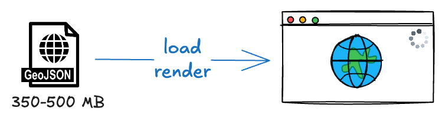
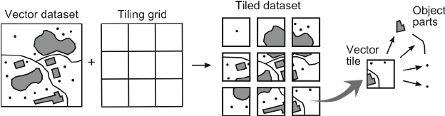
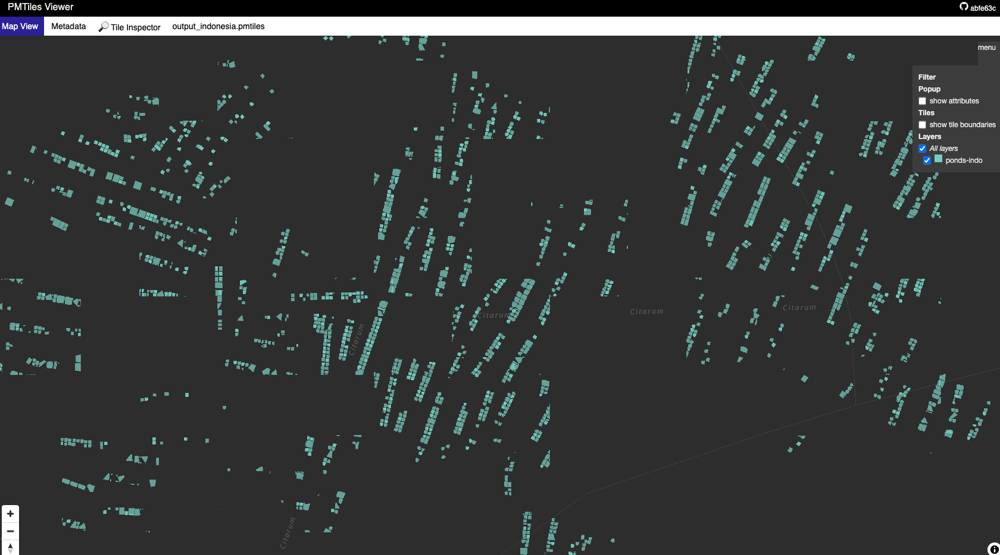

# Optimizing Satellite Maps: Efficiently Rendering 700K++ Object Polygons and Their Attributes

## Introduction
As an AI Engineer, I worked on object instance segmentation for satellite imagery and generating **700,000 polygons** stored in PostgreSQL with PostGIS. The final challenge came when our team was tasked with **_building a simple website to display these 700K polygons_**, complete with details like names and areas, based on six months of data collected by the Computer Vision model we’d been using.

<!-- more -->

## The Initial Problem: Bloated GeoJSON
Initially, I used HTML, JavaScript, and Leaflet to display the data. This worked fine for small-scale datasets, but when the data grew to 700,000 polygons (GeoJSON files ballooning to 350-500 MB), the browser slowed to a crawl. Loading times were long, rendering stuttered—even on localhost, my laptop’s performance tanked. This approach was clearly not scalable.


///caption
GeoJSON 350-500 MB in the browser: poor performance
///

This pushed me to search for a more efficient solution.

## First Experiment: Marker Clustering
I tried **Marker Clustering** with `Leaflet.markercluster`, grouping nearby polygons into a single marker that split apart when zooming in. For fewer than 50,000 polygons, this was fairly effective. But with 700K polygons, the real-time calculations still bogged down the browser. I decided it was time for a new approach.

## Understanding Digital Map Technology
After the solution above failed, I didn’t want to jump straight into finding another fix. Instead, I wanted to understand the fundamentals of how digital map technology works. Imagine a digital map as a stack of transparent sheets that can be rearranged at any time. Each sheet is a layer carrying different information, stacked together to create an interactive map. Here are its key components:


| Component       | Deskripsi                                    | Contoh                                                                                |
|:---------------|:---------------------------------------------|:--------------------------------------------------------------------------------------|
| Base Map Layer | The foundational layer of the map            | Road tiles from OpenStreetMap, satellite imagery from Google Maps                     |
| Feature Layers | Additional layers with specific data         | Polygons of regions, road lines, POI points (with properties like name or population) |
| User Interaction | How users engage with the map                | Click for info, hover for details, adjust layer order so polygons appear above roads  |
| Zoom Levels    | Detail levels that change with magnification | Low zoom: city outlines; High zoom: street names and small buildings                  |

Web maps use tiles—small data chunks pieced together like a puzzle:

1. **Raster Tiles:** Gambar statis (JPEG/PNG), cepat tapi besar.  
2. **Vector Tiles:** Data vektor, ringan dan fleksibel.

## Learning from the Best
!!! question "Pertanyaan"
    
    How do Google Maps or OpenStreetMap handle massive datasets?


///caption
Ilustrasi prinsip vector tiling
///

The answer: **vector tiles**. Data is split into tiles, **loaded based on the visible area and zoom level**. I proposed this approach to the team.


///caption
Ilustrate vector tiles serving
///

## Vector Tiles dan PMTiles
### GeoJSON vs Vector Tiles

| Feature               | GeoJSON                            | Vector Tiles                                                |
|:----------------------|:-----------------------------------|:------------------------------------------------------------|
| Format                | JSON text                          | Binary, chopped into **tiles**                              |
| Data Size             | 350-500 MB for 700K polygons       | 100-300 MB (depending on zoom/simplification configuration) |
| Loading Speed         | Slow, downloads everything at once | Fast, per tile based on **zoom** and area needed            |
| Bandwidth Efficiency  | Low                                | High                                                        |
| Rendering Performance | Heavy on the browser               | Light, *tile*-based rendering                               |

???+ success "Vector Tiles"
    
    I choose vector tiles. A demo on localhost was responsive—no lag like with GeoJSON.

### From PostGIS to PMTiles

Have 2 Options here:

1. **PostGIS ST_AsMVT:** *Tiles* real-time dari query.
2. **PMTiles:** *Pre-generate tiles* jadi file statis (via Tippecanoe).  


| Aspect       | PostGIS ST_AsMVT                  | PMTiles                    |
|:-------------|:----------------------------------|:---------------------------|
| Output Type  | Vector Tiles (*PBF*)              | *Vector Tiles* statis File |
| Speed        | Depends on query and size of data | Fast, pre-rendered         |
| Data Updates | Always *up-to-date*               | Requires regeneration      |
| Server Load  | High                              | Low                        |

### PMTiles vs MBTiles
Although I went with PMTiles, I also considered MBTiles. Both store vector tiles in different formats.


PMTiles are like a ZIP file, packing many vector tiles into a single file optimized for cloud access. MBTiles store vector tiles (or raster) in an SQLite database table, offering flexibility but with added overhead.

| Fitur    | PMTiles                                            | MBTiles                                                                         |
|:---------|:---------------------------------------------------|:--------------------------------------------------------------------------------|
| Server   | Serverless, can be read remotely over              | Typically requires a server for online use, accessed on disk for offline use    |
| Format   | Single-file archive format optimized for the cloud | SQLite-based database, typically stored locally or on a server                  |
| Use case | Designed to be read remotely over HTTP             | Designed for local disk access (offline) or server-based HTTP delivery (online) |


///caption
PMTiles Viewer. This is a demo of PMTiles loaded my data, can easyly to navigate
///

!!! success "PMTiles"

    I chose PMTiles because:

    1. Optimized for online use via HTTP.
    2. No need for frequent updates, regeneration is efficient.
    3. Relatively smaller size, lightweight in the cloud.

### Implementation with Martin Tile Server

I had multiple PMTiles since our data included various object types (e.g., region boundaries, satellite data, or polygons X, Y, Z). Initially, I thought serving several PMTiles would be a hassle. While PMTiles can be served directly via a static file server like S3, I needed extra features:

- **Authentication:** Data is sensitive, so access must be tightly controlled.
- **Caching:** For faster performance in frequently accessed areas.
- **Simple Endpoint:** One URL for all PMTiles, keeping it easy for clients.


In the end, I chose Martin—a fast, lightweight Rust-based tile server. Why Martin?

- **[Support Caching:](https://maplibre.org/martin/run-with-cli.html?highlight=caching#command-line-interface)** Martin supports caching to improve performance.
- **High Performance:** Blazing fast with a low memory footprint, perfect for large datasets like our 700,000 polygons.
- **PostGIS Integration:** Can act as a hybrid—serving static PMTiles and real-time PostGIS data if needed later.
- **Simple Endppoint:** [Composite Sources](https://maplibre.org/martin/sources-composite.html) -> One endpoint for multiple PMTiles, simplifying data consumption.
- **Authentication:** However, martin doesn’t support authentication out of the box. We had to implement a reverse proxy with Nginx to handle this.

Example with consume with Leaflet:

```javascript
...
L.vectorGrid
    .protobuf('http://localhost:7800/polygons/{z}/{x}/{y}', {
        vectorTileLayerStyles: {
            'polygons': { color: '#ff7800', fill: true, weight: 1 }
        }
    })
    .addTo(map);
...
```

When I tested this demo, the results were far smoother than GeoJSON—the map loaded instantly without delays, even with multiple layers.

## Results and Implementation Challenges
My demo succeeded in a development environment. The map with 700,000 polygons rendered without lag, a stark contrast to GeoJSON, which felt sluggish even on localhost. Unfortunately, I didn’t get to fully implement it due to a certain reason.

Since it was still an experiment, I don’t have precise performance metrics (e.g., loading time or memory usage). But qualitatively, the difference was night and day. Clearly.

## Valuable Lessons

Though this strayed a bit from AI, a product is always judged end-to-end. On my own initiative, I sought ways to make the AI-generated data usable (whether for analysis or visualization). I learned a lot about maps during this exploration:

- `Scalability:` Solutions must handle big data.
- `Experimentation:` Clustering’s failure led me to the best solution.
- `Communication:` Writing an RFC trained me to convey complex ideas.

If I get the chance, I’d love to continue this with performance metrics and integration into our computer vision pipeline. For now, this is my story of optimizing satellite maps—a small step toward a bigger solution.

## Next Up: Data Collection Adventure and Integrating Computer Vision into Maps

Optimizing rendering is only half the story. How did those 700,000 polygons collected? In my next project, I’ll share how we built a system to "mesh" specified regions from shapefiles, capture Google Maps satellite imagery via API, and predict objects with YOLO, all automated within a predefined grid. Stay tuned!

## Reference
- [Understanding Map Tile Grids and Zoom (Medium)](https://medium.com/tomtom-developers/understanding-map-tile-grids-and-zoom-levels-262b3cf644e2)
- [PMTilesViewer](https://pmtiles.io/)
- [PMTiles](https://protomaps.com/blog/pmtiles-v3-whats-new/)
- [Comparing PostGIS-backend Vectortile servers: tegola/martin/pg_tileserv](https://dev.to/mierune/comparing-postgis-backend-vectortile-servers-tegolamartinpgtileserv-5c6n)
- [Martin Github: Blazing fast and lightweight PostGIS, MBtiles and PMtiles tile server, tile generation, and mbtiles tooling.](https://github.com/maplibre/martin)
- [Web mapping: comparing vector tile servers from Postgres / PostGIS](https://medium.com/@frederic.rodrigo/web-mapping-comparing-vector-tile-servers-from-postgres-postgis-405055e69084)
- [Youtube: 2019 - Vector tile benchmark](https://www.youtube.com/watch?v=AcaVB_u5HTM)
- [pg_tileserv Github](https://github.com/CrunchyData/pg_tileserv)